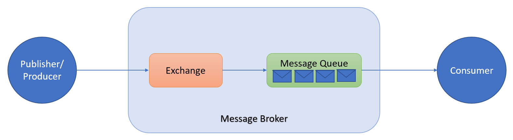
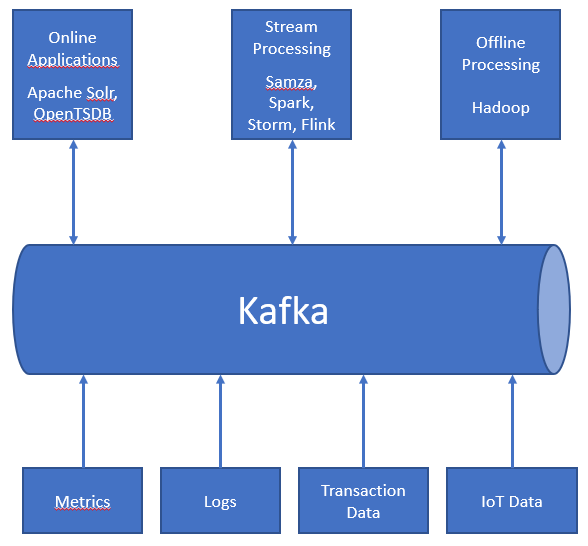
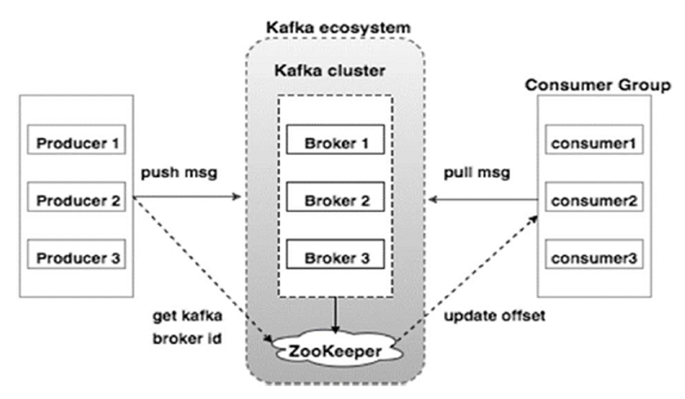
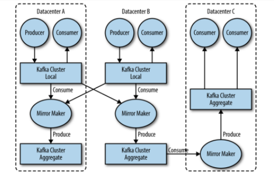
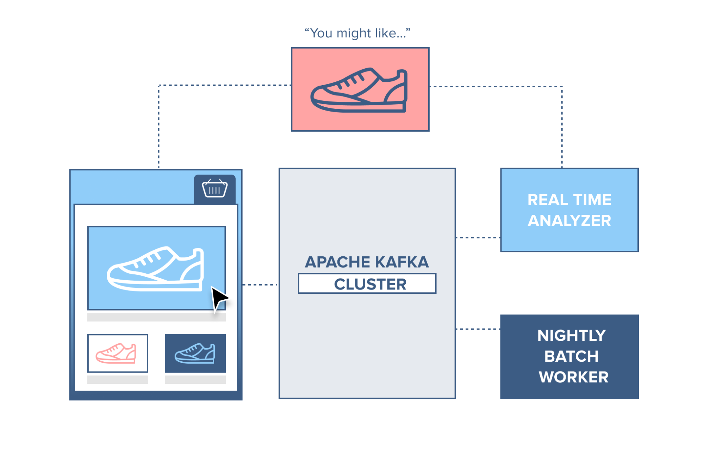

# Apache-Kafka
### Ausarbeitung für das Modul Datenbanktechnologien
### Autor

| Name               | Matrikelnummer | Hochschule  |
| :----------------- | :------------- | :---------  |
| Tina Heilig        | 70268368       | FH Ostfalia |

 **Betreut durch:**

Prof. Dr.-Ing. Nils Jensen und Nicolai Alex

Email: n.jensen\@ostfalia.de

Tel.: +49 5331-939-31550

## Inhaltsverzeichnis
[1 Einleitung](#1-einleitung)

[2 Geschichtlicher Abriss von Apache Kafka](#2-geschichtlicher-abriss-von-apache-kafka)

[3 Vorstellung und Übersicht von Apache Kafka](#3-vorstellung-und-übersicht-von-apache-kafka)

    [3.1 Grundlagen und Kernkomponenten](#3.1-grundlagen-und-kernkomponenten)
    [3.2 Nutzung von Kafka](#3.2-nutzung-von-kafka)
    [3.3 Technische Möglichkeiten](#3.3-technische-möglichkeiten)

[4 Architektur von Apache Kafka](#4-architektur-von-apache-kafka)

    [4.1 Apache Kafka Cluster Architektur](#4.1-apache-kafka-cluster-architektur)
    [4.2 Apache Kafka APIs](#4.2-apache-kafka-apis)
    [4.3 Vorteile der Kafka Architekturen](#4.3-vorteile-der-kafka-architekturen)

[5 Anwendungsbeispiele von Apache Kafka](#5-anwendungsbeispiele-von-apache-kafka)

    [5.1 Website activity tracking](#5.1-website-activity-tracking)
    [5.2 Webshop](#5.2-webshop)

[6 Anwendung von Apache Kafka und Avro](#6-anwendung-von-apache-kafka-und-avro)

[7 Fazit](#7-fazit)

[Literaturverzeichnis](#literaturverzeichnis)

 Abbildungsverzeichnis

[Abbildung 1: Message Broker (eigene Darstellung nach (Haunts, 2015))](#abbildung-1:-message-broker-(eigene-darstellung-nach-(haunts,-2015)))

[Abbildung 2: Data Ecosystem (eigene Darstellung nach (Neha Narkhede,
2017, S. 12))](#_Toc59301051)

[Abbildung 3: Apache Kafka - Cluster Architecture (Tutorials Point (I)
Pvt. Ltd., 2020)](#_Toc59301052)

[Abbildung 4: Multiple Datacenter Architecture (Neha Narkhede, 2017, S.
9)](#_Toc59301053)

[Abbildung 5: Apache Kafka - Partitions Topics (Johansson, 2020)](#_Toc59301054)

[Abbildung 6: Apache Kafka Webshop (Johansson, 2020)](#_Toc59301055)

## 1. Einleitung

Weltweit werden Unternehmen durch Daten in all ihren verschiedenen
Verwaltungsakten bewegt und gesteuert. Datengewinnung, -verwaltung, und
-auswertung sind mittlerweile maßgebliche Erfolgsfaktoren. Je schneller
und sauberer diese gewonnen und verwendet werden, desto höher sind die
Wettbewerbsvorteile. Jede gewonnene Information, kann ein
Schlüsselelement für das Unternehmen darstellen. Zusätzlich produzieren
all die verschiedenen Unternehmensapplikationen, eine Unmenge von Daten.
All diese Daten sollen, um nutzbar und effektiv zu sein, ohne
Datenverlust integriert werden. Kafka als technische Möglichkeit, die im
Vergleich zu traditioneller Middleware viele Konzepte vereint, um Daten
schnell und in großen Mengen zu und von den Unternehmen zu
transportieren, soll Gegenstand dieser Arbeit sein.

In Kapitel [2](#geschichtlicher-abriss-von-apache-kafka) soll zuerst der geschichtliche Abriss sowie der Begriff
Apache Kafka definiert werden, um aufzuzeigen, wo diese Open Source
Software ansetzt. Anschließend werden in Kapitel [3](#vorstellung-und-übersicht-von-apache-kafka) die Grundlagen und
Kernkomponenten behandelt, um die vielfältigen Einsatzmöglichkeiten und
die technischen Umsetzungsmöglichkeiten aufzuzeigen. Kapitel [4](#architektur-von-apache-kafka) geht dann
auf die Kafka APIs sowie die Architektur von Apache Kafka ein. Kapitel [5](#anwendungsbeispiele-von-apache-kafka)
beschreibt die Implementierung von Apache Kafka anhand zweier Beispiele.
In Kapitel [6](#anwendung-von-apache-kafka-und-avro) wird das Datenformat Apache Avro definiert und die
Zusammenarbeit von Kafka und Avro vorgestellt.

## 2. Geschichtlicher Abriss von Apache Kafka

Der amerikanische geschäfts- und beschäftigungsorientierte Onlinedienst
**LinkedIn** hat ursprünglich Apache Kafka entwickelt. **LinkedIn**
benötigte eine vollständige Neugestaltung der Infrastruktur, um das
exponentielle Wachstum der Mitglieder und die Komplexität der Plattform
unterbringen zu können. Um dies initial in den Griff zu bekommen,
migrierten sie ihre Daten zuerst von einer monolithischen[^1](#monolithische-Anwendung) auf eine
auf Microservices basierenden Anwendungsinfrastruktur. Mit Hilfe dieser
Änderung war es **LinkedIn** möglich, die Such-, Profil-,
Kommunikations- und anderen Plattformen effizienter zu gestalten und sie
exponentiell zu vergrößern. Es führte auch zur Schaffung eines zweiten
Ansatzes von Middle-Tier-Diensten[^2], um API-Zugriffe[^3] auf
Datenmodelle und Back-End-Dienste zu ermöglichen und einen konsistenten
Zugriff auf die Datenbanken von **LinkedIn** zu ermöglichen. Zunächst
entwickelten sie verschiedene benutzerdefinierte Datenpipelines für ihre
unterschiedlichen Streaming- und Warteschlangendaten. Die vielseitige
Anwendungsfälle von LinkedIn's Plattformen erstreckten sich von der
Verfolgung von Site-Ereignissen, wie beispielsweise Seitenaufrufen, bis
zum Sammeln aggregierter Protokolle von anderen Diensten. Weiterhin
stellen Datapipelines[^4] Warteschlangenfunktionen für LinkedIn's
InMail[^5] bereit. Um die Wartung einzelner Datapipelines zu vermeiden,
wurde in die Entwicklung einer einzigen Pub-Sub-Plattform[^6]
investiert. Dies war der Beginn von Apache Kafka. Apache Kafka wurde mit
einer einfachen, aber für einen hohen Durchsatz ausgelegten API für
Hersteller und Verbraucher sowie für eine von Anfang an skalierten
Architektur von LinkedIn entwickelt. (Gutierrez, 2016)

Die Architektur Apache Kafka stellte LinkedIn seit Anfang 2011 als Open
Source für die online oder auch offline Verwaltung von Informationen zur
Verfügung, 2012 wurde sie zum Teil der **Apache Software
Foundation**[^7]. Zwei Jahre später wurde aus LinkedIn heraus das
Unternehmen Confluent gegründet. Dieses hatte als Hauptaufgabe die
Weiterentwicklung von Apache Kafka. (Wikimedia Foundation Inc., 2020)

Im Allgemein ist Apache Kafka pattformunabhängig und somit an kein
Betriebssystem gebunden. Kafka ist in Scala und Java geschrieben. Laut
der offiziellen Apache Kafka Streaming-Plattform ist 2.6.0 die neueste
Version. (Apache Software Foundation , 2017)

## 3. Vorstellung und Übersicht von Apache Kafka

Bei einer Direktverbindung zwischen einer Datenquelle und einem
Datenempfänger entsteht das Problem, dass Daten ganz oder teilweise
verloren gehen könnten oder zu lange brauchen, um zugestellt zu werden.
Zusätzlich bereiten solche Datenverbindungen Schwierigkeiten bei den
erwarteten Datenformaten der Empfänger-Systeme. Dies bedeutet, dass der
Empfänger das gesendete Datenformate nicht erkennen und somit eine
Fehlerzustellung entstehen kann. Es ist eine Zwischenspeicherung der
Daten und entsprechende Übersetzungsvorbereitung für den Empfänger
nötig, um solche Probleme umgehen zu können.

### 3.1 Grundlagen und Kernkomponenten

Bevor in die Apache Kafka Welt eingetaucht wird, ist es wichtig den
Aspekt von „Publish/Subscribe" (Pub/Sub) Messaging zu betrachten.
Hierbei handelt es sich um eine Messaging-Anwendung, wo der Absender
(Herausgeber) eines Datenelements (Nachricht), es nicht speziell an
einen Empfänger weiterleitet. Anstelle dessen klassifiziert der
Herausgeber (Producer) die Nachricht und der Empfänger (Consumer)
vermerkt diese und ordnet sie bestimmten Nachrichtenklassen zu. Dieses
Pub/Sub Messaging wird oft an einen zentralen Punkt, auch Broker
genannt, geliefert und verwaltet. Dort werden diese Nachrichten über
einen Austausch (Exchange) als Postfach veröffentlicht. Dieser
Austausch-Punkt sendet mithilfe verschiedener Regeln die Nachricht dann
an eine Warteschlange (Message Queue), von wo aus diese an den Empfänger
(Consumer) weitergereicht wird. Der Broker stellt sicher, dass
Nachrichten (verschiedene Daten) an die richtigen Datenempfänger korrekt
und sicher übermittelt werden. (Neha Narkhede, 2017, S. 1-4)

<b>Abbildung 1: Message Broker (eigene Darstellung nach (Haunts, 2015))</b>

Apache Kafka ist so ein Pub/Sub Nachrichten System, das entwickelt
wurden ist, um Daten von einem/einer System/Application zu einem/einer
anderen sicher und schnell zuzustellen. Sie ist skalierbar,
fehlertolerant und ermöglicht Datenspeicherung. Zusätzlich ermöglicht
sie eine hohe Verfügbarkeit und Geschwindigkeit der Verarbeitung der
gespeicherten Daten. Apache Kafka realisiert zusätzlich auch eine
Echtzeit-Aggregierung[^8] der Daten. (Luber, 2018)

Die einzelnen Daten in Apache Kafka werden als Nachrichten bezeichnet.
Dies wird in der Datenbank Welt als Zeile oder Datensatz verstanden. Aus
Sicht von Kafka, werden diese Nachrichten als eine Reihe von Bytes
gesehen. Somit haben die erhaltenen Daten aus Sicht von Kafka kein
eingegrenztes Format. Die Nachrichten selbst können ein Byte mit
Metadaten[^9] umfassen, was sich auf einen Schlüssel (Key) bezieht,
welcher für Kafka das Protokoll bedeutet. Aus Entwicklersicht wird das
Protokoll als Anwendungsprotokoll verstanden, doch in Bezug auf Kafka
geht es um Protokolldatenstruktur (log data structure). Dieses Protokoll
oder Log ist lediglich eine zeitlich geordnete Folge von
Dateneinfügungen, bei denen die Daten, wie bereits erwähnt, beliebig
sein können. Dies ist grundlegend die Datenstruktur, auf der eine
Datenbank aufgebaut ist.

Für eine höhere Leistungsfähigkeit werden die Nachrichten zu Kafka in
Batches bzw. Stapeln geschrieben. Dieses Verfahren ermöglicht eine
sequenzielle automatische Datenverarbeitung einer Sammlung
klassifizierter Daten bzw. Daten gleichen Themas (in Kafka als Topics
bezeichnet) und Partition. Eine Sammlung von Daten in Batches stellt
sicher, dass nicht jede Nachricht eine Rundreise über das gesamte
Netzwerk durchführen muss und dadurch einen übermäßigen Datenüberhang
verursacht. Nichtdestotrotz muss die Größe der Batches komprimiert
werden, denn große Batches können viele Nachrichten übermitteln, was
viel Zeit in Anspruch nimmt. Die Komprimierung von Batches stellt eine
effiziente Datenübermittlung und -speicherung dar. Im Folgenden sind
einige Vorteile von Kafka aufgeführt (Tutorials Point (I) Pvt. Ltd.,
2020):

-   Zuverlässigkeit

-   Skalierbarkeit - Das Kafka-Messaging-System lässt sich ohne
    Ausfallzeiten problemlos skalieren.

-   Haltbarkeit - Kafka verwendet das verteilte Festschreibungsprotokoll
    (distributed commit log). Dies bedeutet, dass Nachrichten so schnell
    wie möglich und dauerhaft auf der Festplatte gespeichert werden.

-   Leistung - Kafka bietet einen hohen Durchsatz beim Pub/Sub
    Messaging. Es behält eine stabile Leistung bei, selbst wenn viele
    Terabyte große Nachrichten gespeichert werden

### 3.2 Nutzung von Kafka

Apache Kafka kann in vielen verschiedenen Anwendungsfällen benutzt
werden. Kafka wird am häufigsten zum Streaming von Daten in Echtzeit in
andere Systeme verwendet. Bekannte Anwendungsfälle sind beispielsweise
(Apache Software Foundation , 2017):

-   Messaging

-   Website-Aktivitäts-Tracking -- Dient zur Verfolgung der
    Benutzeraktivität von Publish-Subscribe-Feeds (Seitenaufrufe,
    Suchvorgänge oder andere Aktionen, die Benutzer ausführen können) in
    Echtzeit. Die gesammelten Daten unterstützen Echtzeitverarbeitung,
    Echtzeitüberwachung und Laden in Apache Hadoop[^10] oder
    Offline-Data-Warehousing-Systeme zur Offline-Verarbeitung und
    Berichterstellung. Für jede Benutzerseitenansicht werden viele
    Aktivitätsnachrichten generiert und somit werden umfangreiche
    Aktivitätsverfolgungen benötigt.

-   Metriken -- Kafka dient auch oft zur Betriebsüberwachung, was das
    Aggregieren von Statistiken aus verteilten Anwendungen beinhält, um
    zentralisierte Feeds mit Betriebsdaten zu erstellen

-   Protokollaggregation -- Kafka sammelt physische Protokolldateien von
    Servern und legt sie an einem zentralen Ort (bspw. Dateiserver) zur
    Verarbeitung ab.

-   Stream-Verarbeitung -- Kafka beschäftigt sich vorwiegend mit
    Streaming. Der Begriff wird aber auch in Zusammenhang mit der
    Zuordnung oder Reduzierung der Verarbeitung in Hadoop gebracht.
    Typischerweise verlässt sich Hadoop auf Aggregation von Daten über
    einen langen Zeitraum, was Stunden oder auch Tage beinhalten kann.
    Die Stream-Verarbeitung gestaltet Daten in Echtzeit so schnell, wie
    Nachrichten erstellt werden. Mit Stream-Frameworks können Benutzer
    kleine Anwendungen für den Betrieb von Kafka-Nachrichten schreiben,
    Aufgaben ausführen, z. B. Metriken zählen, Nachrichten für eine
    effiziente Verarbeitung durch andere Anwendungen partitionieren oder
    Nachrichten mithilfe von Daten aus mehreren Quellen transformieren.
    (Neha Narkhede, 2017, S. 13)

-   Event Sourcing - Speichern eines Stroms von Ereignissen (Events),
    die sich auf das Ansammeln des „aktuellen" Status der Entitäten
    beziehen, die im System verwendet werden. Solche Entitäten können
    Benutzer, Bestellungen, Produkte usw. sein. Jedes Event beschreibt
    eine Statusänderung, die an der Entität aufgetreten ist.

-   Commit Log -- Ein Log ist im Wesentlichen eine Speicherzelle für
    zeitliche gegliederte Einträge, wobei jeder Eintrag mit einer
    eindeutigen Eintragsnummer (Timestamp) als Primärschlüsse versehen
    wird. (Cloudera, Inc, 2016). Commit Log gibt die Möglichkeit, die
    Datenbankänderungen in Kafka mitzuschreiben, zu überwachen und
    Live-Updates zu erhalten. (Neha Narkhede, 2017, S. 13)

Kafka ermöglicht eine Zusammenarbeit mit verschiedenen
Streaming-Frameworks, wie Spark, Storm, HBase oder Flink, um
Streaming-Daten in Echtzeit aufzunehmen, zu analysieren und zu
verarbeiten.

 <b>Abbildung 2: Data Ecosystem (eigene Darstellung nach (Neha Narkhede, 2017, S. 12))</b>

Das Kreislaufsystem für das Datenökosystem (Data Ecosystem) wird mit
Hilfe von Apache Kafka bereitgestellt (siehe Abbildung 2). Diese stellt
sicher, dass Nachrichten zwischen den verschiedenen Mitgliedern der
Infrastruktur übertragen werden und bietet für alle Clients eine
konsistente Schnittstelle. In Verbindung mit einem System zur
Bereitstellung von Nachrichtenschemata benötigen der Herausgeber
(Producer) der Nachricht und der Empfänger (Consumer) keine enge
Kopplung oder direkte Verbindungen jeglicher Art mehr. Komponenten
können hinzugefügt und entfernt werden, wenn Geschäftsfälle erstellt und
aufgelöst werden. Somit müssen die Herausgeber sich keine weiteren
Gedanken darüber machen, wer die Daten verwendet oder wie viele
Anwendungen verwendet werden. (Neha Narkhede, 2017, S. 11)

### 3.3 Technische Möglichkeiten

Kafka wurde so konzipiert, sodass es als einheitliche Plattform für die
Verarbeitung aller Echtzeit-Datenfeeds fungieren kann. Um dies zu
ermöglichen, wurden folgende Aspekte berücksichtigt (Apache Software
Foundation , 2017):

-   Hoher Durchsatz, um Ereignisströme mit hohem Volumen tragen zu
    können

-   Sicherer Umgang mit großen Datenrückständen, um alternierende
    Datenladevorgänge von Offline-Systemen tragen zu können

-   Verarbeitung der Zustellung mit geringer Latenz, um herkömmlichere
    Messaging-Anwendungsfälle zu behandeln

-   Partitionierte und verteilte Echtzeitverarbeitung, um aktuelle Daten
    erstellen zu können

-   Sicherstellung der Datenbereitstellung/-übertragung in andere
    Datensysteme mittels Fehlertoleranz bei Maschinenausfällen.

Um die Basis-Funktionalitäten von Kafka nutzen zu können, muss zuerst
Java, ZooKeeper und Kafka Basic auf dem durchführenden Betriebssystem
vorhanden sein. ZooKeeper wird in Kapitel 4 erklärt. (Tutorials Point
(I) Pvt. Ltd., 2020)

## 4.  Architektur von Apache Kafka 

### 4.1 Apache Kafka Cluster Architektur

Ein Cluster-Rechnerverbund stellt die Architektur von Apache Kafka dar.
Ein Cluster in Sinne der Kafka-Cluster, besteht aus einer Vielzahl von
Brokern, Themen, dazugehörigen Producern und Partitionen. Ein
Kafka-Cluster-Verbund dient durch zwei oder mehr miteinander verbundene
Cluster der Vereinfachung der Arbeit der Producer und Consumer. So ein
Verbund hat die Vorteile, dass Typen von Data isoliert werden können,
mehrere Datacenter möglich sind und durch die Data Isolation die
Sicherheitsmaßnahmen eingehalten werden können. Die Data Isolierung
durch mehrere Cluster dient der Trennung verschiedener Data-Arten unter
verschiedenen Brokern. Daten werden in das Topic innerhalb des Clusters
geschrieben und direkt in den Cluster eingelesen. Die wichtigsten
Sicherheitsmaßnahmen von Kafka betreffen die Datenerhaltung. Um die
Daten oder Nachrichten vor Verlusten zu sichern, hilft die Aufbau
mehrerer Datacenter, die die Daten untereinander kopieren. Dieser
Kopier-Vorgang ermöglicht eine Datenwiederherstellung, falls ein Server-
oder Systemsturz stattfinden sollte. Weiterhin ermöglicht dieser einen
problemlosen Zugriff an allen Standorten für die Online-Anwendungen auf
Benutzer-Aktivitäten. (Jaiswal, 2018)

Die Broker werden in Kafka als der Kafka-Server gesehen, die
typischerweise als Vielzahl gemeinsam arbeiten. Dies hat den Vorteil,
dass die Last dadurch verteilt und ausgeglichen wird. Somit ist es den
Brokerinstanzen möglich, riesige Datenmengen (Terrabyte pro Sekunde) zu
verarbeiten, ohne die Leistung zu beeinträchtigen. Weiterhin dient der
Server auch den Consumern auf Abrufanforderungen für Partitionen zu
reagieren und mit Nachrichten zu antworten. In einem Kafka-Cluster
werden Topics in Partitionen aufgeteilt und auch über Broker hinweg
repliziert. Tausende von Partitionen und Millionen von Nachrichten,
abhängig von der spezifischen Hardware und ihren jeweiligen
Leistungsmerkmalen, können ohne großen Aufwand allein durch einen
einzelnen Broker pro Sekunde verarbeitet werden. Eine Partition kann
zwar mehreren Brokern zugewiesen werden, doch eine Partition gehört nur
einem einzelnen Broker im Cluster. Der ausgewählten Broker wird als
Leiter der Partition bezeichnet. Die Zuweisungsmöglichkeit Partition zu
mehreren Brokern, ermöglicht beim Auftritt von Brokerfehlern die
Übernahme der Partitionsführung. Die Verbindung zum führenden Broker auf
der jeweiligen Partition, muss mit den Consumern und Producern, die auf
dieser Partition arbeiten, ebenfalls bestehen. Eine weitere Rolle namens
Controller ist für administrative Vorgänge verantwortlich, wie der
Zuweisung von Partitionen an Broker und der Überwachung auf
Brokerfehler. Retention, die für dauerhafte Speicherung von Nachrichten
über einen bestimmten Zeitraum verantwortlich ist, ist ein weiteres
wesentliches Merkmal der Apache Kafka. Für diese Retention werde die
Kafka-Broker mit einer Standardeinstellung von Themen konfiguriert. Eine
Aufbewahrungsfrist der Nachrichten kann sich entweder auf einen
bestimmten Zeitraum (beispielsweise Anzahl von Tage) erstrecken oder auf
die Größe der Topic beziehen (wenn die Topic eine bestimmte Größe in
Bytes erreicht hat). Nach der Erreichung diese Grenzwerte werden die
Nachrichten als abgelaufen markiert und folglich gelöscht. Für die
Aufbewahrungskonfiguration benötigt dieses Verfahren eine jederzeit
verfügbare Mindestmenge. (Neha Narkhede, 2017, S. 8)

 <b>Abbildung 3: Apache Kafka - Cluster Architecture (Tutorials Point (I) Pvt. Ltd., 2020)</b>

Die Cluster Architecture von Apache Kafka hat 4 Hauptakteure. Zu den bis
jetzt bereits erwähnten Broker, Producer und Consumer ist der
**ZooKeeper** zu betrachten. Seine Aufgabe ist die Verwaltung und
Koordination der Kafka-Broker. Der **ZooKeeper** dient als Informant der
Producer und Consumer über die Veränderungen bezüglich des Brokers.
Solche Veränderungen könnten Erneuerung oder auch Ausfall des Brokers
sein, was den Producer und den Consumer beim Treffen einer Entscheidung
beeinflusst, ob sie ihre Aufgaben auf einen anderen Broker verlagern
sollen. (Tutorials Point (I) Pvt. Ltd., 2020)

### 4.2 Apache Kafka APIs

Für die Datenintegration und Stream-Verarbeitung hat Kafka fünf
Kern-APIs zur Verfügung:

-   Producer-API: ermöglicht das Senden eines Datenstroms von
    Datensätzen zu einen oder mehreren Kafka-Themen im Kafka-Cluster.

-   Consumer-API: erlaubt Applikationen die Datenströme im Kafka-Cluster
    zu lesen und den Stream, der für die erstellten Datensätze zuständig
    ist, zu verarbeiten.

-   Streams-API: agiert als Stream Prozessor, wo Datenströme von
    Eingabetopic in Ausgabetopic seitens der Applikationen umgewandelt
    werden können.

-   Connect-API: Es können Konnektoren (Connectors) implementiert
    werden, die von einem Quelldatensystem nach Kafka oder von Kafka in
    ein Sekundärdatensystem kontinuierlich verbinden und somit aktuelle
    Daten ermöglichen (Bsp. der Connector zu einer relationalen
    Datenbank erfasst je nach Administration jede Änderung an einer
    Tabelle) (DataFlair Web Services Pvt Ltd, 2020)

-   Admin-API: unterstützt das Verwalten und Überprüfen von Topics,
    Brokern, ACLs (Access Control List) und anderen Kafka-Objekten.

Alle API-Funktionen werden von Kafka über ein sprachunabhängiges
Protokoll bereitgestellt. Das Protokoll wiederum verfügt über Clients in
unterschiedlichen Programmiersprachen. Kafka konzentriert sich
vorwiegend auf Java-Clients, wenn es sich um das Hauptprojekt handelt,
ansonsten werden Open Source-Projekte zur Verfügung gestellt. (Apache
Software Foundation, 2017)

### 4.3 Vorteile der Kafka Architekturen

Die verschiedenen Architekturen von Kafka bieten hohe Leistung,
Skalierbarkeit, Zuverlässigkeit und Notfallwiederherstellung als vier
wichtige Vorteile.

Leistungsstarke, sequenzielle Schreibvorgänge werden von Kafka zur
Verfügung gestellt. Kafka ist auch in der Lage, Topics in Partitionen
für hoch skalierbare Lese- und Schreibvorgänge aufzuteilen.
Infolgedessen ermöglicht Kafka Lese- und Schreibrechte mit
exponentieller Geschwindigkeit für mehrere Producer und Consumer
gleichzeitig. Der Verteilung der Speicherung der Topics auf mehreren
Servern, ermöglicht die Nutzung von verknüpfter Leistung mehrerer
Festplatten.

Diese Speicherverteilung stellt eine beliebig skalierbare Leistung zur
Verfügung und macht eine effiziente Architektur somit möglich.

MirrorMaker ist ein Kafka-Dienstprogramm mit einer umfassenden Disaster
Recovery-Lösung. MirrorMaker wurde für die Replizierung der gesamten
Kafka-Cluster entwickelt, was auch bei Katastrophen einen nahtlosen
Betrieb für die Kafka-Bereitstellung aufrechthält. Anders als bei
Standard-Failover-Replikationen, wird in einem Kafka-Cluster diese
Funktionalität als Spiegelung bezeichnet. (Michael Carter, 2020)

 <b>Abbildung 4: Multiple Datacenter Architecture (Neha Narkhede, 2017, S. 9)</b>

## 5. Anwendungsbeispiele von Apache Kafka

### 5.1 Website activity tracking

LinkedIn's Hauptziel mit der Entwicklung von Kafka war die Verfolgung
von Website-Aktivitäten, wie Suchen, Seitenaufrufe, Hochladen und
weitere Benutzertätigkeiten. Es ist oft eine immense Menge an
Durchsatzvolumen für die Aktivitätsverfolgung nötig. Grund dafür ist,
dass jede Benutzeraktivität Nachrichten erzeugt.

Folgendes Beispiel bezieht sich auf eine einfache Website. Die Benutzer
haben die Möglichkeit, verschiedene Aktivitäten auf der Website
durchzuführen, unteranderem Blog-Artikel zu erstellen, zu ergänzen,
Elemente auf der Website zu selektieren (Mausklick tätigen),
verschiedene Dateien hochzuladen und letztendlich die Artikel zu
veröffentlichen. Bei jeder Benutzertätigkeit auf der Website wird
jeweils ein Ereignis, auch genannt Tracking-Ereignis, und Informationen
darüber insgesamt als Datensatz aufgezeichnet. Dieser Datensatz wird
einem bestimmten Kafka-Topic („click" und „upload") zugeordnet.

Die Benutzer-ID ist der zentrale Punkt des Partitionierungssetups. Die
Partitionsnummern entsprechen auch der Benutzer ID, wo beispielsweise
Partition 0 zu Benutzer ID 0 zugeordnet wird. In diesem Beispiel wird
das zugeordnete Topic \"Klicken\" unter den jeweiligen Brokern in drei
Partitionen auf zwei verschiedenen Computern aufgeteilt. Jede Partition
kann auch als Benutzer verstanden werden. Mögliche Tätigkeiten könnten
folgendermaßen aussehen:

-   Benutzer-ID 0 wird einem Benutzer zugeordnet, der auf eine
    Schaltfläche der Website klickt.

-   Die betroffene Partition 0 bekommt von der Webanwendung einen
    Datensatz im Topic \"Klicken\" veröffentlicht.

-   Mit der Abhängigkeit des Datensatzes an sein
    Festschreibungsprotokoll, wird der Nachrichtenoffset erhöht.

-   Nachrichten aus dem Klick-Topic sind seitens Consumer abrufbar und
    die dazugehörige Überwachungsnutzung der Consumer wird in Echtzeit
    angezeigt. Wenn der Consumer den **Offset**[^11] auf einen früheren
    Offset setzt (der Beginn des Datensatzes wird auf einen früheren
    Datensatz gesetzt), hat er die Möglichkeit, die zuvor verbrauchten
    Nachrichten wiederzugeben. (Johansson, 2020)

Folgende Darstellung bildet den beschriebenen Vorgang ab.

 <b>Abbildung 5: Apache Kafka - Partitions Topics (Johansson, 2020)</b>

### 5.2 Webshop

Folgendes Beispiel bezieht sich auf einen Webshop, der die
Funktionalitäten für die Verfolgung von Website-Aktivitäten als Produkte
auf dieser Website abbildet. Hier werden alle Aktivitäten der Consumer
erfasst und jeweils an den betreffenden Kafka-Cluster zugestellt.
Daraufhin werden diese gesammelten Daten ausgewertet und dem Consumer
alternative zu ihm passenden Produkte in Echtzeit auf dem Webshop
empfohlen.

Der **Nightly Batch Worker** führt über Nacht einen sogenannten
Stapeljob durch, wo auch Daten bezüglich des „Customer Geschmacks" im
System erfasst und als E-Mail mit Produktwerbung an den Kunden versendet
werden.

Folgende Darstellung bildet den beschriebenen Vorgang ab:

 <b>Abbildung 6: Apache Kafka Webshop (Johansson,2020)</b>

## 6. Anwendung von Apache Kafka und Avro

Kafka in Kombination mit Avro bietet eine robuste, schnelle und
schemabasierte Serialisierung von Daten mittels eines kompakten
Binärdatenformates. Apache Avro ist nicht nur eine Serialisierung,
sondern auch ein Remote-Procedure-Call (RPC)[^12] Framework und
verwendet für die Definition von Datentypen und Protokollen JavaScript
Object Notation (JSON)[^13]. Avro lässt sich leicht von und zu JSON
abbilden und bedienen. Weiterhin ermöglicht Avro durch die binäre
Darstellung von Daten eine effiziente Speicherung. Avro erfordert keine
Codegenerierung und lässt sich gut in gängigen Programmiersprachen
integrieren, was die Verwendung von verschiedenen Programmen
vereinfacht.

Apache Avro ist ein sprachneutrales Datenserialisierungsformat und
verlässt sich auf Schemata. Das Avro-Schema unterstützt dabei, Daten
rein und robust zu halten, Daten teilen zu können, die verschiedene
Sprachen enthalten, und ist somit sprachunabhängig. Jede
Dateispeicherung mit Avro-Daten beinhaltet auch die eigenen
Avro-Schemata und ermöglicht es somit später, von jedem Programm
verarbeitet werden zu können. Um versionierte Avro-Schemas für Kafka
Producer und Consumer zu verwalten und deren Verlauf speichern zu
können, wird ein **Confluent Schema Registry** verwendet. Die
Schemakompatibilität für Kafka muss vorab überprüft werden. Die
Confluent Schema Registry hilft bei dem Prozess. Um die Confluent Schema
Registry benutzen zu können, ist die Installation einer Confluent
Plattform nötig. Nach der Installation der Plattform steht der Start der
Schema Registry an und die Registrierung des Schemas selbst. Die Sendung
von Avro-Daten erfordert jetzt zuerst die Änderung des erzeugten
Producer-Code. Um Avro Support bieten zu können, muss eine
Maven-Repository zum Kafka Client hinzugefügt werden. (Seigneurin, 2018)

Zusammenfassend bietet Avro (The Apache Software Foundation, 2020):

-   „Rich data structures.

-   A compact, fast, binary data format.

-   A container file, to store persistent data.

-   Remote procedure call (RPC).

-   Simple integration with dynamic languages." (The Apache Software
    Foundation, 2020)

## 7. Fazit

Kafka zeigt vielfältige innovative Möglichkeiten der
Echtzeit-Datenstromverwaltung für verschiedene Unternehmen auf. Kafka
hat gezeigt, dass sie nicht nur hoch verfügbar und skalierbar ist,
sondern dass sie auch Sicherheit und Effizienz als zentrale Punkte der
Datenverarbeitung einschließt.

Kafka ist ein verteiltes System und bietet zusätzlich eine
Recovery-Lösung, was trotz möglicher technischer Fehler der einzelnen
Arbeitsknoten, eine nahezu permanente Datenverfügbarkeit ermöglicht.

Kafka hat dennoch auch einige Nachteile, die in bestimmte
Anwendungsfällen relevant sind, wie zum Beispiel einige wenige
Sicherheitslücken bedingt durch bestimmte fehlende
Überwachungsfunktionalitäten. Weiterhin kann Kafka zwar mit einzelnen
großen Nachrichten gut umgehen, aber sobald diese an Größe gewinnen,
werden sie vom Broker und Consumer komprimiert. Dies beeinflusst den
Datendurchsatz und die dazugehörige Leistung. (DataFlair Web Services
Pvt Ltd., 2020)

Die überwiegenden Vorteile von Kafka, insbesondere durch ihre
ereignisgesteuerte Architektur, brachten ihr einiges an Popularität.
Ihre besondere Architektur wird gern als Systembasis mit dem Ziel der
Verarbeitung großer Datenmengen verwendet. Der Nutzerkreis erstreckt
sich momentan auf 27.214 große Unternehmen, Tendenz steigend (HG
Insights, 2020).

## Literaturverzeichnis  {#literaturverzeichnis .list-paragraph}

Alley, G. (26. November 2018). *What is a Data Pipeline?* Von https://www.alooma.com/blog/what-is-a-data-pipeline abgerufen

Apache Software Foundation . (2017). *Apache Kafka*. Von https://kafka.apache.org/downloads abgerufen

Apache Software Foundation.(2017). *Kafka Apache Org*. Von https://kafka.apache.org/uses abgerufen

Apache Software Foundation. (24. März 2020). *Apache Hadoop*. Von https://hadoop.apache.org/ abgerufen

Cloudera, Inc. (29. Juni 2016).*Cloudera Documentation*. Von https://docs.cloudera.com/:https://docs.cloudera.com/documentation/kafka/1-2-x/topics/kafka.html abgerufen

DataFlair Web Services Pvt Ltd. (2020). *Kafka Architecture and Its Fundamental Concepts*. Von https://data-flair.training/blogs/kafka-architecture/ abgerufen

DataFlair Web Services Pvt Ltd. (2020). *Advantages and Disadvantages of Kafka*.Von https://data-flair.training/blogs/advantages-and-disadvantages-of-kafka/ abgerufen

Gutierrez, D. (28. April 2016). *A Brief History of Kafka, LinkedIn's Messaging Platform*. Von Inside big data:https://insidebigdata.com/2016/04/28/a-brief-history-of-kafka-linkedins-messaging-platform/ abgerufen

Haunts, S. (9. September 2015). *Rabbitmq Series Part 2: The AMQP Messaging Standard*. Von https://stephenhaunts.com/2015/09/09/rabbitmq-series-part-2-the-amqp-messaging-standard/ abgerufen

HG Insights. (19. Dezember 2020). *Apache Kafka*. Von https://discovery.hgdata.com/product/apache-kafka abgerufen

Jaiswal, S. (2018). *Kafka: Multiple Clusters*. Von https://www.javatpoint.com/apache-kafka-multiple-clusters abgerufen

Johansson, L. (19. März 2020). *Part 1: Apache Kafka for beginners - What is Apache Kafka?* Von CloudKarafka: https://www.cloudkarafka.com/blog/2016-11-30-part1-kafka-for-beginners-what-is-apache-kafka.html abgerufen

LinkedIn Corporation. (15. November 2020). *InMail-Nachrichten -- Übersicht*. Von https://www.linkedin.com/help/linkedin/answer/1584/inmail-overview?lang=de abgerufen

Luber, D.-I. (. (5. Oktober 2018). *Definition: Was ist Apache Kafka?* Von https://www.bigdata-insider.de/was-ist-apache-kafka-a-763300/ abgerufen

Mars, T. (2017).*JSON at Work: Practical Data Integration for the Web.* Sebastopol, CA 95472: O\'Reilly Media, Inc.

Michael Carter.(16. Juni 2020). *Apache Kafka Architecture: A Complete Guide*. Von https://www.instaclustr.com/apache-kafka-architecture/ abgerufen 

Microsoft Corporation. (6. August 2020). *Monolithische Anwendungen*. Von https://docs.microsoft.com/de-de/dotnet/architecture/containerized-lifecycle/design-develop-containerized-apps/monolithic-applications\#:\~:text=Eine%20monolithische%20Anwendung%20hat%20ihre,oder%20Bibliotheken%20als%20Komponenten%20auf. abgerufen

Neha Narkhede, G. S. (2017). *Kafka: The Definitive Guide: Real-Time Data and Stream Processing at Scale.* United States of America: O\'Reilly Media.

Rouse, M. (Mai 2020). *Remote Procedure Call(RPC)*. Von TechTarget: https://searchapparchitecture.techtarget.com/definition/Remote-Procedure-Call-RPC\#:\~:text=Remote%20Procedure%20Call%20(RPC)%20is,systems%20like%20a%20local%20system. abgerufen

SAS Institute Inc. (16. August 2020). *Middle Tier*. Von https://documentation.sas.com/cdcId=bicdc&cdcVersion=9.4&docsetId=biov&docsetTarget=p0wsyb97ii3u1wn11uphl9uvxzvz.htm&locale=en abgerufen

Seigneurin, A. (02. August 2018). *Kafka tutorial \#4 - Avro and the Schema Registry*. Von https://aseigneurin.github.io/2018/08/02/kafka-tutorial-4-avro-and-schema-registry.html abgerufen

The Apache Software Foundation. (03. Dezember 2020). *AVRO Apache Org*. Von http://avro.apache.org/docs/current/ abgerufen

Tutorials Point (I) Pvt. Ltd. (2020). *Apache Kafka - Cluster Architecture*. Von https://www.tutorialspoint.com/apache_kafka/apache_kafka_cluster_architecture.htm abgerufen

Tutorials Point (I) Pvt. Ltd. (4. November 2020). *Apache Kafka-Introduction*. Von https://www.tutorialspoint.com/apache_kafka/apache_kafka_introduction.htm abgerufen

Wikimedia Foundation Inc. (12. September 2004). *Metadaten*. Von https://de.wikipedia.org/wiki/Metadaten abgerufen

Wikimedia Foundation Inc. (27. September 2020). *Apache Software Foundation*. Von https://de.wikipedia.org/wiki/Apache_Software_Foundation abgerufen

Wikimedia Foundation Inc. (14. Juni 2020). *Programmierschnittstelle*. Von https://de.wikipedia.org/wiki/Programmierschnittstelle abgerufen

[^1]: „Eine **monolithische Anwendung** hat ihre Funktionalität ganz
    oder zum größten Teil innerhalb eines einzelnen Prozesses oder
    Containers und weist interne Schichten oder Bibliotheken als
    Komponenten auf." (Microsoft Corporation, 2020)

[^2]: Middle-Tier-Diensten der SAS Intelligence-Plattform bietet eine
    Umgebung, in der Business Intelligence-Webanwendungen wie SAS Web
    Report Studio und das SAS Information Delivery Portal ausgeführt
    werden können. Diese Produkte werden auf einem Webanwendungsserver
    ausgeführt und kommunizieren mit dem Benutzer, indem Daten an den
    Webbrowser des Benutzers gesendet und von diesem empfangen werden.
    (SAS Institute Inc., 2020)

[^3]: API-Zugriff -- Zugriff einer Programmierschnittstelle; API = von
    Englisch **A**pplication **P**rogramming **I**nterface, übersetzt
    wörtlich ‚Anwendungsprogrammierschnittstelle\' (Wikimedia Foundation
    Inc., 2020)

[^4]: Mit einer **Datenpipeline** können Daten aus mehreren Quellen
    konsolidiert und für die Analyse und Visualisierung zur Verfügung
    gestellt werden. (Alley, 2018)

[^5]: **InMail** ist die LinkedInd Nachrichtensystem. **InMail** ist
    eine LinkedIn Funktion und ermöglicht den Mitgliedern die Sendung
    von Nachrichten an andere LinkedIn Mitglieder, mit denen sie
    vernetzt sind. (LinkedIn Corporation, 2020)

[^6]: Publish/Subscribe messaging ist ein Muster, welches dadurch
    gekennzeichnet ist, dass der Absender eines Datenelements (einer
    Nachricht) diese nicht speziell an einen Empfänger weiterleitet.
    (Neha Narkhede, 2017, S. 1)

[^7]: „Die Apache Software Foundation ist eine ehrenamtlich arbeitende
    Organisation zur Förderung der Apache-Softwareprojekte, zu denen
    unter anderem auch der Apache-Webserver gehört." (Wikimedia
    Foundation Inc., 2020)

[^8]: Echtzeit-Aggregationsdaten -- die Zusammenfassung von ähnlichen
    Daten in eine einzelne Klasse innerhalb einer vorbestimmten
    Zeitspanne

[^9]: Metadaten -- „sind strukturierte Daten, die Informationen über
    Merkmale anderer Daten enthalten" (Wikimedia Foundation Inc., 2020)

[^10]: Die Apache Hadoop-Softwarebibliothek ist ein Framework, das die
    verteilte Verarbeitung großer Datenmengen über Computercluster
    mithilfe einfacher Programmiermodelle ermöglicht. Es wurde
    entwickelt, um von einzelnen Servern auf Tausende von Computern zu
    skalieren, von denen jeder lokale Berechnungen und Speicher bietet.
    (Apache Software Foundation, 2020)

[^11]: Data Offset -- auf Deutsch übersetzt Datenversatz, hat den Zweck
    den oberen Schichten mitzuteilen, wo die Daten beginnen

[^12]: "Remote Procedure Call (RPC) is a protocol that one program can
    use to request a service from a program located in another computer
    on a network without having to understand the network\'s details."
    (Rouse, 2020)

[^13]: JSON (JavaScript Object Notation) ist ein einfaches Format für
    den Datenaustausch, das sowohl für Personen als auch für Computer
    leicht lesbar ist. Es basiert auf der JavaScript-Programmiersprache,
    ist aber unabhängig bezüglich der Programmiersprache. (Mars, 2017)
