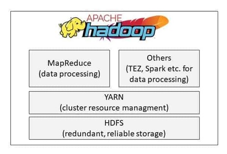

# MapReduce

### Ausarbeitung des Themas MapReduce für das Modul Datenbanktechnologien

### Autoren

| Name               | Matrikelnummer | Hochschule |
| :----------------- | :------------- | :--------- |
| Corinna Schnögl    | 897102   | Beuth Hochschule für Technik Berlin  |
| Susanne Dittrich geb. Mitschke   | 20082904 | TH Brandenburg   |

Table: Autoren

### Betreut durch:

Prof. Dr.-Ing. Nils Jensen und Nicolai Alex

### Abgabedatum:

25.01.2021

## Inhalterverzeichnis

1. [Einleitung](#einleitung)
2. [Definition](#definition)
3. [Einsatzfelder](#einsatzfelder)
4. [Die Grundfunktionen](#die-grundfunktionen)
<br/>4.1. [Map](#map)
<br/>4.2. [Shuffle and Sort](#shuffle-and-sort)
<br/>4.3. [Reduce](#reduce)
5. [Anwendungsbeispiel](#anwendungsbeispiel)
<br/>5.1. [Einlesen der Daten](#einlesen-der-unstrukturierten-daten)
<br/>5.2. [Erzeugen von Schlüssel-Wertpaaren](#erzeugen-von-schlüssel-wertpaaren)
<br/>5.3. [Gruppieren der Schlüssel-Wertpaare](#gruppieren-der-schlüssel-wertpaare)
<br/>5.4. [Berechnung der Ergebnisse](#berechnung-der-ergebnisse)
<br/>5.5. [Ausgabe der Ergebnisse](#ausgabe-der-ergebnisse)
6. [Hadoop](#hadoop)
<br/>6.1. [Hadoop Common](#hadoop-common)
<br/>6.2. [HDFS](#hdfs)
<br/>6.3. [MapReduce](#mapreduce)
<br/>6.4. [YARN](#yarn)
<br/>6.5. [Weitere Komponenten](#weitere-komponenten)
7. [MapReduce im Vergleich](#mapreduce-im-vergleich)
<br/>7.1. [mit relationalen Datenbanken](#mit-relationalen-Datenbanken)
<br/>7.2. [mit NoSQL-Datenbanken](#mit-nosql-datenbanken)
8. [Fazit](#fazit)

[Literaturverzeichnis](#literaturverzeichnis)
<br/>[Tabellenverzeichnis](#tabellenverzeichnis)
<br/>[Abbildungsverzeichnis](#abbildungsverzeichnis)


## 1. Einleitung

„In einem datengetriebenen Markt sammeln Algorithmen und Anwendungen rund um die Uhr Informationen zu Personen, Prozessen, Systemen und Organisationen. Das Ergebnis ist eine gigantische Datenflut, die täglich zunimmt. Die Herausforderung besteht nun darin, diese massiven Datenmengen schnell und effizient zu verarbeiten, ohne dass wertvolle Erkenntnisse verlorengehen“ (Talend, 2021).
Für dieses Szenario kommt das Programmiermodell MapReduce ins Spiel, da es aufgrund seiner Fähigkeit Terabytes an Daten aufzuteilen und parallel zu verarbeiten, bekannt geworden ist. MapReduce ist eine Kernkomponente des Hadoop-Frameworks und wird für den Zugriff auf Big Data im Hadoop File System (HDFS) verwendet (Talend, 2021). Deshalb wird das Thema MapReduce in dieser Arbeit näher betrachtet.


## 2. Definition

MapReduce ist ein von Google im Jahr 2004 entwickeltes Verfahren, mit dem sich große strukturierte oder auch unstrukturierte Datenmengen mit hoher Geschwindigkeit verarbeiten lassen. MapReduce kann als Framework für Datenbanken genutzt werden und eignet sich für die Verarbeitung von großen Datenmengen, die im Big-Data-Umfeld auftreten und bis zu mehreren Petabytes groß sind. Es parallelisiert die Bearbeitung durch die Verteilung auf mehrere Tasks die gleichzeitig ausgeführt werden. Dabei verteilt das Framework die Aufgaben auf verschiedene Rechner oder Cluster und führt die Ergebnisse im Anschluss zusammen. Das Verfahren kann bei Problemen mit einzelnen Rechnern die Aufgaben neu verteilen, was dazu führt, dass Entwickler sich nicht mehr um die Fehlerbehandlung, die Aufgabenüberwachung die Cluster-Kommunikation kümmern müssen (Luber & Litzel, 2017).

## 3. Die Grundfunktionen

### 3.1 Map

Die Grundfunktionen von MapReduce basieren auf den zwei Funktionen Map und Reduce, die nacheinander ausgeführt werden. Im ersten Schritt werden die Input-Daten in einzelne Segmente unterteilt die anschließend auf verschiedene Rechner verteilt werden. Die Datensegmente werden zu Key-Value-Paaren verarbeitet und für die Map-Funktion als Input bereitgestellt (Technische Hochschule Mittelhessen, 2015). „Die Map-Funktion nimmt die Eingabedaten von der Festplatte als -Paare, verarbeitet sie und generiert einen weiteren Satz an -Zwischenpaaren als Ausgabe. Die Reduce-Funktion nimmt ebenfalls Eingabedaten als -Paare und generiert -Paare als Ausgabe“ (Talend, 2021). Dadurch werden die Aufgaben in kleine parallelisierte Arbeitspakete aufgeteilt und anschließend wieder zusammengeführt. Das bedeutet, dass die Berechnungen parallel und zur selben Zeit laufen können und die Arbeitslast auf mehrere Rechner verteilt wird. Bei der Verarbeitung kommt zu den Phasen Map und Reduce noch die Shuffle Phase hinzu was auch in der nachfolgenden Abbildung 1 deutlich wird (Talend, 2021).

<p align="left">
<br>Abbildung 1: Funktionsweise MapReduce (Wuttke, 2020)</p>

### 3.2 Shuffle and Sort

In der Shuffling Phase werden die Ergebnisdaten der Mapper vom Reducer eingelesen und anschließend nach ihrem Schlüssel sortiert und gruppiert (Luber &amp; Litzel, 2017).

### 3.3 Reduce

 „Der Reduce-Funktion werden dann nacheinander ein Schlüssel mit dem Satz seiner zugehörigen Werte zur Verarbeitung übergeben. Die Ausgabe wird dann an ein finales Output-File angehängt. Sind alle Map- und Reduce-Funktionen abgeschlossen, benachrichtigt der Master das Benutzerprogramm. Das Ergebnis liegt dann in den Output-Files der einzelnen Reducer vor“ (Technische Hochschule Mittelhessen, 2015). Optional kann zusätzlich die Combiner-Funktion genutzt werden, die die Ergebnismenge der Map-Funktion reduziert, um möglichst wenig Daten über das Netzwerk senden zu müssen. Die typischen Probleme, die relationale Datenbanken mit der Verarbeitung von großen unstrukturierten Datenmengen haben werden mit MapReduce beseitigt (Luber &amp; Litzel, 2017).


## 4. Einsatzfelder

MapReduce wird oft im Big-Data-Umfeld verwendet. Dazu gehören beispielsweise Finanzanalysen, wissenschaftliche Simulationen oder das Data Mining. Auch die Suchmaschinenanbieter Google und Yahoo nutzten das Verfahren für die Indexierung der Webseiten. Außerdem wird MapReduce von vielen E-Mail-Providern für die Erkennung von Spam E-Mails eingesetzt. Weiter Anwender sind Facebook und Amazon. Facebook nutzt das Verfahren für Data Mining, die Optimierung von Ads und die Spam-Erkennung. Amazon nutzt MapReduce unteranderem für das Clustering von Produkten (Luber & Litzel, 2017).

## 5. Anwendungsbeispiel

Ein häufig genanntes Beispiel im Zusammenhang mit MapReduce ist die Anwendung "Wörter Zählen", die auch in dieser Arbeit dabei helfen soll, das Paradigma besser zu verdeutlichen. 
Möchte man beispielsweise als Forenbetreiber herausfinden über welche Themen sich die User besonders häufig unterhalten, so wäre ein möglicher Ansatz das Aufkommen der im Titel verwendeten Wörter zu zählen und auszuwerten.

**Schritt 1: Einlesen der Daten**
Um dies zu erreichen müssen im ersten Schritt die im Cluster gespeicherten Dateien gelesen werden. Dabei soll es sich um JSON-Dateien handeln, deren Aufbau und Struktur bekannt sind, damit eine anschließende Auswertung ermöglicht wird. 

Folgender Inhalt könnte beispielsweise aus einer Datei geladen werden:

```
inhalt_datei1 = {
"forum" : {
    "id": "3423232",
        "user" : {
            "id": "23143"
            "name": "Toni Huber",
            "username": "Der Ahungslose"
        },
        "title": "Hallo Big Data",
        "text": "Hallo, ich wollte einmal fragen...",
        "created": "2021-01-20T09:06:28Z",
        "response" : {
            "user" : {
            "id": "456893"
            "name": "Rita Müller",
            "username": "Alter Hase"
            },
            "text": "Hallo, um dein Problem zu lösen musst du...",
            "created": "2021-01-24T11:08:36Z",
        }
        ...
        }
}
```

**Schritt 2: Erzeugung von Schlüssel-Wertpaaren**
Wurden die Daten erfolgreich geladen, muss anschließend eine vorher definierte Map-Funktion ausgeführt werden. Diese enthält, je nach Implementierung, ein bis zwei Übergabeparameter. In jedem Fall müssen aber der Funktion, die in Schritt 1 gelesenen Daten übergeben werden. Innerhalb der Funktion muss dann auf das Feld "title" zugegriffen und dessen Inhalt ausgewertet werden. Der Inhalt wiederum wird dann Wort für Wort durchlaufen und jedem Wort ein bestimmter Wert (in diesem Fall 1) zugewiesen. Weiterhin ist zu beachten, dass der Text gegebenenfalls noch bereinig werden muss. Das heißt, dass vorhandene Satzzeichen entfernt und Groß- bzw. Kleinschreibung außer Acht gelassen werden müssen.

Die Map-Funktion würde für den Inhalt der oben beschriebenen Datei dementsprechend folgende Ausgabe generieren:  

```
map(inhalt_datei1) -&gt; {
    („Hallo“, 1), 
    („Big“, 1),
    („Data“,1)
}*
```
Und für eine weiteren Datei beispielsweise folgende Ausgabe:

```
map(inhalt_datei2) -&gt; {
    („Big“, 1), 
    („Data“, 1),
    („ist“, 1),
    („überall“, 1)
}
```

Auf diese Weise entstehen Schlüssel-Wertpaare, bei denen die Wörter die Schlüssel und die Einsen die dazugehörigen Werte darstellen. Bei einem großen Fachforum ist es demnach möglich und wahrscheinlich, dass jeder Schlüssel mehrfach vorkommt.

Anstatt den Worten jeweils eine 1 zuzuweisen wäre es alternativ auch möglich einen eindeutige DocumentID zu speichern, die als zweiter Parameter der Map-Funktion übergeben wird. Dazu kann eine eigens dafür erzeugte ID verwendet werden, beispielsweise ein numerischer Wert, ein Hashwert oder auch eine URL.

Die Funktion würde dann folgendermaßen aussehen: 

```
map((inhalt_datei2, "map-reduce-beispiel.de\datei2.json")) -&gt; {
    („Big“, "map-reduce-beispiel.de\datei2.json"), 
    („Data“, "map-reduce-beispiel.de\datei2.json"),
    („ist“, "map-reduce-beispiel.de\datei2.json"),
    („überall“, "map-reduce-beispiel.de\datei2.json")
}
```

Die zweite Variante hat den Vorteil, dass es so später für weitere Analysen möglich ist herauszufinden, aus welchem Dokument die Worte geladen wurden. Gegen dieses Verfahren spricht jedoch, dass auf verteilten Rechnern manchmal sog. Combiner eingesetzt werden, die den Zweck haben die transferierte Datenmenge zwischen den unterschiedlichen Datenknoten zu begrenzen. Wenn beispielsweise der Mapper das Wort "Big" 500-mal erkennt, kann er die 500 Instanzen leicht von ("Big" 1) zu ("Big", 500) zusammenfassen, bevor sie zur Weiterverarbeitung an den Reducer übergeben werden. Dadurch müssen erheblich weniger Daten verschickt werden und der Algorithmus wird noch einmal deutlich beschleunigt. 

Sämtliche Prozesse in Schritt 1 und 2 können parallel ausgeführt werden.  

**Schritt 3: Gruppieren der Schlüssel-Wertpaare**

Im nächsten Schritt werden die URLs entsprechend den jeweiligen Wörtern (Schlüsseln) gruppiert und ggf. sortiert, was zur Folge hat, dass jetzt jeder Schlüssel nur noch einmal existiert und auf mehrere Werte verweist. 

```
{
„Hallo“, [1],
„Big“, [1, 1],
„Data“, [1, 1],
„ist“, [1],
„überall“, [1]
}
```
Die Sortierung nach bestimmten Schlüsseln ist in diesem Schritt optional, hat jedoch den Vorteil, dass bei einer anschließenden Abfrage die Werte beispielsweise alphabetisch oder nach Hashwert geordnet auf einem bestimmten Datenkonten im Cluster liegen und so die Performance weiter gesteigert werden kann.

**Schritt 4: Berechnung der Ergebnisse**
Nach dem erfolgreichen Abarbeiten des Map-Vorgangs kann die Reduce-Funktion aufgerufen werden. Diese wird pro Wort genau einmal aufgerufen und nimmt als Parameter die zuvor gruppierten Schlüssel-/Wertepaare entgegen. Wurden die Daten in der vorherigen Phase nicht sortiert, sondern liegen noch verteilt auf den verschiedenen Datenknoten, müssen diese erst noch von den jeweiligen Mappern abgeholt und zu einem Datensatz zusammengeführt werden. Innerhalb der Reduce-Funktion können die Daten dann letztendlich weiter ausgewertet, in diesem Beispiel also die Anzahl der verwendeten Worte ermittelt werden.

Der Aufruf einer Reduce-Funktion könnte beispielsweise so aussehen:
```
reduce("Big", [1, 1]) -&gt; 
    ("Big", ([1, 1], 2))
```

**Schritt 5: Ausgabe der Ergebnisse**
Abschließend werden die ermittelten Schlüssel-Wertpaare in eine Datei geschrieben. Das kann beispielsweise eine kommaseparierte Liste sein, in der jedes Wort und die zugehörige Anzahl in eine neue Zeile geschrieben werden.

Folgende Abbildung visualisiert noch einmal den oben beschriebenen MapReduce-Algorithmus:
![enter image description here][1]
<p>
<br>Abbildung 1: Funktionsweise MapReduce (Wuttke, 2020)</p>


## 6. Hadoop

Apache Hadoop ist ein auf Java basierendes Software Framework welches auf dem Map-Reduce Algorithmus basiert. Mit Hilfe dieser verteilten Big Data Plattform lassen sich große Datenmengen auf verteilten Systemen in hoher Geschwindigkeit verarbeiten. Dabei ist Hadoop eins der ersten Open Source Big Data System, gilt als Vorreiter der Big Date Ära und wurde bereits 2008 als Top Level Open Source Projekt eingestuft. Das Framework ist in der Lage sehr große Datenmengen zu speichern und anschließend mit hoher Geschwindigkeit verarbeiten zu können. Dies ist durch die verteile Architektur und die Parallelisierung möglich. Ein Hadoop Cluster setzt sich aus folgenden Komponenten zusammen: HDFS, YARN, MapReduce und einigen Erweiterungen. Dies wird in der Abbildung 2 verdeutlicht (Wuttke, 2020).

<p>
<br>Abbildung 2: Hadoop Komponenten  (Wuttke, 2020)</p>

<p align="left">
<br>Abbildung 2: Hadoop Komponenten  (Wuttke, 2020)</p>

### 6.1. Hadoop Common

Das allgemeine Modul enthält die Java-Bibliotheken und Dienstprogramme. Es hat auch die Dateien, um Hadoop zu starten.

### 6.2. HDFS

HDFS ist die Abkürzung für Hadoop Distributed File System welches auf große Datenmengen ausgelegt ist und Dateisysteme bis zu mehreren Millionen Dateien erstellen kann. „HDFS ist ein hochverfügbares, verteiltes Dateisystem zur Speicherung von sehr großen Datenmengen, welches in Clustern von Servern organisiert ist. .Dabei werden die Daten auf mehreren Rechnern (Nodes) innerhalb eines Clusters abgespeichert, das passiert in dem die Dateien in Datenblöcken mit fester Länge zerlegt und redundant auf den Knoten verteilt“ (Wuttke, 2020). Im Gegensatz zu klassischen Datenbanken legt Hadoop einzelne Files in dem Dateisystem ab. Das System arbeitet zudem in Clustern auf Servern und verwendet Masternodes, welche auch NameNodes genannt werden, und Datanodes (Wuttke, 2020)

### 6.3. MapReduce

TODO: umschreiben oder rausnehmen
Das MapReduce-Konzept sieht außerdem vor, dass sämtliche Fehlerbehandlungen vom Framework   übernommen werden und dem Anwenderdiesen Aufwand ersparen. Auch regelt das Framework   selbstständig, welche Recheneinheit welche Daten einliest und verarbeitet und wie die Aufteilung derBerechnungen erfolgt

### 6.4. YARN

Da MapReduce bereits in einem vorherigen Kapitel genauer betrachtet wurde, wird im nachfolgenden auf YARN und HDFS näher eingegangen. YARN steht für Yet Another Resource Negotiatior und ist der Ressource Manager von Hadoop. Er ist dafür zuständig die Ressourcen eines Hadoop Clusters zu verteilen. (Wuttke, 2020)

## 6.5. Weitere Komponenten

TODO: noch ausformulieren
Sekundäre Komponenten sind eine Sammlung anderer Apache-Produkte, darunter: Hive (zum Abfragen von Daten), Pig (zum Analysieren großer Datenmengen), HBase (spaltenorientierte Datenbank), Oozie (zum Planen von Hadoop-Jobs), Sqoop (zum Verbinden mit anderen Systeme wie BI, Analytics oder RBDMS) und Flume (zur Aggregation und Vorverarbeitung von Daten).

## 7. Hadoop im Vergleich

**Anmerkung:** Eine genauer Vergleich zwischen Datenbanken, sei es relational oder NoSQL, und MapReduce ist an dieser Stelle nicht möglich, da es sich hier um zwei komplett unterschiedliche Dinge handelt. Während auf der einen Seite von Datenbanken im klassischen Sinn die Rede ist, so ist mit MapReduce lediglich der Algorithmus gemeint wie große Datenbestände über verteilte Systeme hinweg abgefragt werden können. Aus diesem Grund soll Hadoop als komplettes Framework und nicht nur MapReduce, mit anderen Systemen verglichen werden.  

Hadoop wirkt im Vergleich zu herkömmlichen Datenbankmodellen etwas unhandlich, weshalb sich die Frage stellt, warum man nicht einfach auf ein anderes Modell zurückgreift. Die Antwort liegt in der der Struktur und Menge der zu verarbeitenden Daten, sowie der Art der Anwendung, die auf die Daten zugreift. 
In dem folgenden Kapitel soll nun näher darauf eingegangen werden, wann sich der Einsatz von Hadoop lohnt und wo die Stärken und Schwächen des Frameworks liegen. 

### 7.1. mit relationalen Datenbanken

Um die Unterschiede beider Systeme besser verdeutlichen zu können, wurden diese zunächst in folgender Tabelle aufgelistet und sollen anschließend genauer erläutert werden. 

|------ | RDBMS | Hadoop |
|------ |------ | ------ |
| Datenobjekte | Relationale Tabellen | Key/Value-Paare | 
| Struktur | Statisches Schema | Dynamisches Schema |
| Datengröße | Gigabyte | Petabyte |
| Zugriff | Interaktiv und Batch | Batch |
| Abfrage | SQL | HQL oder MapReduce-Task |
| Updates | Mehrmaliger Schreib- und Lesezugriff | Einmaliger Schreib-, mehrmaliger Lesezugriff |
| Integrität | Hoch | Niedrig |
| Skalierung | Nonlinear | Linear |
| Durchsatz | Niedrig | Hoch |
| Latenz | Keine | Vorhanden | 
| Kosten | Hoch | Niedrig |
*Tabelle 1: Vergleich von RDBMS mit MapReduce [WHITE 09, Seite 5]*

**Datenobjekte und Struktur**
Relationale Datenbanken basieren auf dem relationalen Modell und benötigen strukturierte Daten. Die Relationen zwischen den einzelnen Objekten werden hier über Tabellen und Indizes abgebildet. Hadoop MapReduce hingegen greift über Schlüssel-Wertpaare auf die jeweiligen Daten zu, wobei neben strukturierten auch un- oder semistrukturierte Daten verarbeiten werden können. 

**Datengröße**
Bei der Verarbeitung großer Datenmengen stoßen relationale Datenbanken relativ schnell an ihre Grenzen und beantworten kommende Anfragen nur noch extrem langsam oder im schlimmsten Fall gar nicht mehr. Hadoop dagegen wurde extra für den Big-Data-Bereich entwickelt und kann dementsprechend auch mit sehr großen Datenmengen umgehen. 

**Zugriff und Abfrage**
Relationale Datenbanken eignen sich besonders dann, wenn gezielt auf einzelne Datensätze zugegriffen und deren Inhalt bearbeitet werden soll. Ein Anwendungsbeispiel wäre z.B. die Ausgabe von Nutzerdaten in Online-Shops. Hadoop hingegen eignet sich eher zur Auswertung kompletter Datensätze, wie es beispielsweise bei Wetterdaten der Fall ist, um die Höchsttemperaturen der letzten 10 Jahre zu ermitteln.

Daten aus relationalen Datenbanken können bequem und interaktiv mittels SQL abgefragt werden. Um Daten über Hadoop MapReduce zu erhalten müssen die benötigten Funktionen über Batch-Jobs angestoßen werden. Die Map- und Reducefunktionen können in unterschiedlichen Sprachen implementiert werden. Häufig verwendet werden Java, Ruby, Python und C++. Um die Abfrage zu erleichtern kann auch HQL (Hive query language) verwendet werden. HQL wurde speziell für Hadoop entwickelt, um so SQL-Befehle nachzuahmen und die Abfrage der Daten zu erleichtern.

**Updates**
Wie in der untenstehenden Grafik zu sehen ist sind relationale Datenbanken darauf ausgelegt, Daten mehrfach zu lesen, aber auch nachträglich noch zu verändern. MapReduce hingegen ist auf Lesezugriffe spezialisiert. Die Daten werden (meist einmal) über eine externe Anwendung im HDFS geschrieben, damit anschließend über MapReduce lesend darauf zugegriffen werden kann.  

![Dittrich, 2013][2]
*Abbildung 3: Architekturvergleich relationale Datenbanken / MapReduce*

**Integrität**
In relationalen Datenbanken wird grundsätzlich die Normalform angestrebt, um die Integrität der Daten sicherzustellen und Redundanzen zu vermeiden. Hadoop kennt dieses Konzept nicht bzw. unterstützt auch das Speichern nicht normalisierte Einträge. Ein Beispiel dafür wäre das wiederholte Speichern von identischen Serverdaten in Logdateien. 

**Skalierung**
Hadoop verwendet für die Speicherung in der Regel mehrere Datenknoten, auf denen die Daten verteilt abgelegt werden. Um die Daten mittels MapReduce wieder auszulesen werden verschiedene Jobs auf den unterschiedlichen Knoten parallel ausgeführt, was dazu führt, dass die Rechenlast gleichmäßig verteilt wird. Wird die Anzahl der Datenknoten nachträglich erhöht, wird auch der Ausführgeschwindigkeit dementsprechend gesteigert. Bei (verteilten) relationalen Datenbanken beeinflusst die Anzahl der Server die Rechenleistung hingegen nicht.  

**Durchsatz und Latenz**
Sofern es sich um eine moderate Datenmenge und nicht um Big-Data handelt liefern relationale Datenbanken quasi instant ein Ergebnis zurück, wobei das Ausführen der MapReduce-Tasks zu gewissen Latenzen führen kann. Aufgrund der Natur von MapReduce-Jobs und den Zielen, die damit erreicht werden sollen, ist dieser vermeintliche Nachteil aber zu vernachlässigen. 

Der Datendurchsatz, also die Menge an Daten, die in einer gewissen Zeit verarbeitet werden, ist jedoch bei MapReduce höher. 

**Kosten**
Die Kosten, die durch den Betrieb einer relationalen Datenbank anfallen sind meist höher als die, die durch MapReduce entstehen. Das liegt zum einen daran, dass (je nachdem welche Datenbank genau verwendet wird) Lizenzgebühren  anfallen können, wohingegen es sich bei Hadoop MapReduce um eine reine Opensource-Lösung handelt. Des Weiteren müssen die Kosten für die benötigte Hardware berücksichtigt werden. Relationale Datenbanken benötigen häufig teure High-End-Server, während Hadoop auch auf herkömmlicher Standardhardware lauffähig ist. 

[WHITE 09, Seite 4-6]

### 7.2. mit NoSQL Datenbanken

Genau wie Hadoop wurden NoSQL-Datenbanken für den Big-Data-Bereich entwickelt und haben viele Gemeinsamkeiten. Die wichtigsten sind, dass beide Anwendungen mit extrem großen Datensätze, unterschiedlicher Formate, über verteilte Systeme hinweg umgehen können. Sie skalieren horizontal, erhöhen also die Performance durch hinzufügen zusätzlicher Datenknoten im Cluster, sind kostenlos und können auf Standardhardware betrieben werden. Auch der MapReduce-Algorithmus wird teilweise von NoSQL-Datenbanken, wie beispielsweise MongoDB, unterstüzt. 

Trotz der vielen Gemeinsamkeiten gibt es jedoch einen wichtigen Unterschied. Mit NoSQL-Datenbanken können Anfragen interaktiv und in Echtzeit ausgeführt werden, während Hadoop ausschließlich für Batch-Jobs im Hintergrund geeignet ist. Beide Systeme wurden also für komplett unterschiedliche Anwendungsfälle konzipiert und konkurrieren demnach nicht miteinander. 

Im BigData-Umfeld macht es deshalb häufig Sinn, Hadoop und NoSQL-Datenbanke miteinander zu kombinieren. So könnten beispielsweise ständig anfallende Sensordaten mit MongoDB geschrieben und verwaltet und mit Hadoop im Hintergrund ausgewertet werden. Zu beachten ist hierbei noch, dass beide Systeme zwar prinzipiell auf verschiedene Cluster zugreifen können, es aber Sinn macht beide zu kombinieren um so unnötigen Datentransfer zu vermeiden.

## 8. Fazit

Relationale Datenbanken stellen für viele Unternehmen noch das geeignete Mittel der Wahl dar, da diese viele Vorteile mit sich bringen. So können sich damit schnelle, gezielte Abfragen, auf überschaubar großen, integeren Datenmengen realisieren lassen. Dazu arbeiten die Datenbankmanagementsysteme mit einer effizienten und weit entwickelten Abfragesprache - SQL.

Der Einsatz von Systemen wie Hadoop oder MongoDB, die den MapReduce-Algorithmus verwenden, rentiert sich in der Regel erst ab einer extrem hohen Datenmenge im Petabyte-Bereich und aufwärts, da hier relationale Datenbanken an ihre Grenzen stoßen. Der Vorteil von MapReduce liegt darin, dass die Einlesevorgänge parallel auf verschiedenen Datenknoten ausgeführt werden und mit der Anzahl der Knoten skalieren. Umso mehr Rechner im Cluster vorhanden sind, umso schneller finden die Abfragen statt. Durch die Kombination von Hadoop mit geeigneten NoSQL-Datenbanken lassen sich via MapReduce sowohl interaktive Abfragen in Echtzeit, als auch aufwändige Batch-Prozesse im Hintergrund realisieren, um so viele Aufgaben im BigData-Umfeld abzudecken.   

Frameworks und Datenbanken die MapReducue verwenden existieren bei weitem noch nicht so lange wie relationale Datenbanken und sind deshalb in manchen Bereichen auch noch nicht so ausgereift, wie die klassische, tabellenbasierte Variante. Die späte Entwicklung beruht vor allem auf dem Trend der letzten Jahre: Der stetig wachsenden Menge an generierten Daten. Da die Datenmenge aber auch in Zukunft immer weiter steigen wird, werden wohl auch MapReduce und BigData-Lösungen immer mehr an Bedeutung finden. 


## Literaturverzeichnis

Luber, S., &amp; Litzel, N. (14. Juli 2017). Bigdata Insider. Abgerufen am 03. Januar 2021 von https://www.bigdata-insider.de/was-ist-mapreduce-a-624936/

Talend. (2021). Abgerufen am 04. Januar 2021 von https://www.talend.com/de/resources/what-is-mapreduce/

Technische Hochschule Mittelhessen. (05. Oktober 2015). Abgerufen am 04. Januar 2021 von http://wi-wiki.de/doku.php?id=bigdata:mapreduce

Wuttke, L. (2020). Datasolut. Abgerufen am 04. Januar 2021 von https://datasolut.com/apache-hadoop-einfuehrung/#Was-ist-MapReduce

Dittrich, J. (2013). Youtube. Abgerufen am 23. Januar 2021 von https://www.youtube.com/watch?v=iQodaHGvOLY

Geeksforgeeks. (2020). Abgerufen am 23. Januar 2021
https://www.geeksforgeeks.org/difference-between-rdbms-and-hadoop/

https://www.it-zoom.de/it-mittelstand/e/big-data-technologien-hadoop-und-nosql-10805/
https://www.sigs-datacom.de/uploads/tx_dmjournals/thomsen_OS_03_14_9Oba.pdf

## Tabellen 

[White 09] Tom White:Hadoop – The Definite GuideO'Reilly Media, 2009

## Abbildungen

[1]: #file:629c47a1-e84f-7fa6-7d3d-a1546c8c188a
[2]: #file:a08dbdb9-47a9-34d0-a517-48690089c4ca
  


