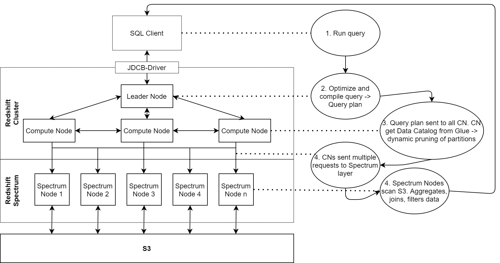
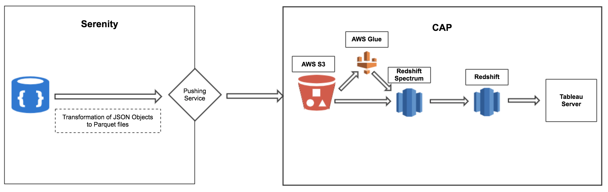

[Zurück](04_Ueber_MongoDB.md)

## 5. Vergleich der JSON Verarbeitung

Wir haben in den vorhergehenden Kapiteln einen allgemeinen Eindruck von JSON, MongoDB und Postgres bekommen. Hier soll es nun darum gehen, wie diese Technologien zusammenspielen. Zuerst geht es darum, wie MongoDB und Postgres jeweils konkret mit JSON arbeiten. Anschließend werden bestehende Tests, sowie Erfahrungsberichte analysiert, die beschreiben, wie sich die beiden Datenbanken in der Praxis im Umgang mit JSON schlagen.


### Verarbeitung von JSON in Postgres

Wenn es um die Verarbeitung von JSON in Postgres geht, kommt man nicht um die Differenzierung zwischen JSON und JSONB in Postgres herum. Wie im Kapitel über Postgres schon kurz beschrieben, wurde mit PostgreSQL-9.2 zuerst das reine JSON-Format in Postgres eingeführt. Das bedeutet die native Unterstützung für das eigentliche JSON Format. Allerdings sind die damit verbundenen formatierten Textdateien für leistungsintensive Abfragen, wie sie in Datenbanken oft benötigt werden, nicht besonders gut geeignet. [9] Suchvorgänge und damit Indexierung sind dabei wichtige Themen, die uns hier noch weiter begleiten werden. Das reine JSON-Format unterstützt nur die klassische B-Tree Indexierung, was heute für schnelle und effiziente Suchvorgänge nicht mehr das Optimum ist. [9]
Mit PostgreSQL-9.4 wurde deshalb JSONB eingeführt. Es ist eine Erweiterung des JSON Datentyps, die die JSON Daten im Binärformat speichert. JSONB erweitert die Möglichkeiten zur Arbeit mit JSON-Daten und Suche in den JSON-Daten. Die initiale Eingabe ist aufgrund der nötigen Konvertierung etwas langsamer als bei reinem JSON, aber ab dann ist die Verarbeitung deutlich schneller, da die Dateien nicht jedes Mal wieder geparst werden müssen. [11] Damit ist JSONB klar die präferierte Methode zur Arbeit mit JSON in Postgres.


#### Funktionsumfang JSON- und JSONB-Format

JSON|JSONB
---|---
JSON-Dokumente werden wie TEXT-Daten gespeichert. Es wird auf gültiges JSON geprüft.|JSON-Dokumente werden im Binärformat gespeichert.
JSON-Dokumente werden unverändert gespeichert, einschließlich Leerzeichen.|Leerzeichen abgetrimmt. Speichert in einem Format, das für eine schnellere und effiziente Suche förderlich ist.
Unterstützt keine breite Palette von JSON-Funktionen und Operatoren|Unterstützt alle JSON-Funktionen und -Operatoren
Unterstützt keine FULL-TEXT-SEARCH-Indexierung|Unterstützt FULL-TEXT-SEARCH Indexing
[9]


Ein Beispiel: Volltextsuche erfolgt in JSON über Operatoren, wie “@>” oder “#>”Versucht man dies in Postgres auf einer Tabelle mit Daten im JSON Format, wird ein Fehler zurückgegeben:

```yaml
dbt3=# select * from product where productdetails @> '{"l_shipmode":"AIR"}' and productdetails @> '{"l_quantity":"27"}';
ERROR:  operator does not exist: json @> unknown
LINE 1: select * from product where productdetails @> '{"l_shipmode"...
                                                   ^
HINT:  No operator matches the given name and argument types. You might need to add explicit type casts.
dbt3=#
```

[9]

Mit der gleichen Eingabe bei einer Tabelle in JSONB, funktioniert die Abfrage.Das ist nur ein sehr simples Beispiel, aber zeigt bei wie kleinen Dingen die Vorteile von JSONB anfangen.


#### GIN-Index

Neben dem Umfang von Funktionen und Operationen ist Full-Text-Search-Indexierung eine der wichtigsten Stärken von JSONB. Der Indexierungstyp, den JSONB nutzt, nennt sich GIN-Index, was für Generalised Inverted Index steht. GIN-Index speichert “Key” (oder Element oder Value) – “Position List” Paare. Die Position List ist die rowID des Keys. [9] Das bedeutet, wenn der "Key" an mehreren Stellen im Dokument auftritt, speichert der GIN-Index den Schlüssel nur einmal zusammen mit allen Positionen seines Vorkommens, was den GIN-Index zum einen kompakt hält und zum anderen die Suche erheblich beschleunigt.

Abhängig von der Größe und Komplexität der Daten kann es aufwändig sein, den GIN-Index aktuell zu halten. Die Indexierung verbraucht Zeit und Ressourcen, da der Index das gesamte Dokument durchsuchen muss, um die Schlüssel und ihre Zeilen-IDs zu finden. [9]
Die Nutzung von B-Tree Indexierung ist trotzdem keine wirkliche Alternative. Dieser beschleunigt nur klassische SQL Abfragen, wie etwa mit dem “Where” Befehl, aber keine Volltextsuchen. [9]

### Verarbeitung von JSON in MongoDB

Wie in den vorherigen Kapitel erwähnt, speichert MongoDB Daten in Dokumenten als Schlüssel-Wert-Paare, auch Key-Value-Stores genannt. [16] 
Dokumente sind hierbei eine Sammlung von zusammengehörigen Daten und enthalten immer einen eindeutigen Wert, dem sogenannten Primärschlüssel. [17] Zusammengehörige Dokumente werden in Collections gespeichert, welche dann auf einer Datenbank abrufbar sind. Jedes MongoDB System enthält eine beliebige Menge (1-x) an Datenbanken. [16]

Die Dokumenten selbst werden als BSON-Objekte dargestellt und nicht als JSON-Objekte. 

Das hat drei Gründe: 
1. JSON ist ein text-basiertes Format und Text parsing ist langsam
2. JSONs lesbares Format ist nicht platzsparend
3. JSON unterstützt nur eine limitierte Anzahl an Basis-Datentypen

BSON hingegen ist eine speichereffiziente, binäre Variante von JSON, die die oben aufgeführten Nachteile von JSON auflöst. [15]

#### Funktionsumfang JSON- und BSON-Format

JSON|BSON
---|---
UTF-8 String Encodierung|Binäre Encodierung
Unterstützt String, Boolean, Number, Array|Unterstützt String, Boolean, Number (Integer, Float, Long, Decimal128…), Array, Date, Raw Binary
lesbar von Anwender und Maschine|nur maschinenlesbar

[15] 

Zur Veranschaulichung ist im folgenden Beispiel ist ein Dokument aufgeführt in Java Script / Python style Syntax und dem korrespondierendem BSON Repräsentant:

```yaml
{"hello": "world"} →
\x16\x00\x00\x00           // total document size
\x02                       // 0x02 = type String
hello\x00                  // field name
\x06\x00\x00\x00world\x00  // field value
\x00                       // 0x00 = type EOO ('end of object')

{"BSON": ["awesome", 5.05, 1986]} →
 \x31\x00\x00\x00
 \x04BSON\x00
 \x26\x00\x00\x00
 \x02\x30\x00\x08\x00\x00\x00awesome\x00
 \x01\x31\x00\x33\x33\x33\x33\x33\x33\x14\x40
 \x10\x32\x00\xc2\x07\x00\x00
 \x00
 \x00
```
[15]

Mit der Verwendung BSON schafft es MongoDB das im Web gebräuchlichste Datenformat JSON um die branchenweit leistungsstärksten Indexierungs- und Abfragefunktionen zu erweitern. 


#### Indexierung

Wie bei Postgres spielt auch bei MongoDB die Indexierung eine wichtige Rolle. Sie ermöglicht den schnellen Zugriff auf ein Feld in der Datenbank und verbessern damit die Effizienz der Lese-Operatoren. Ohne den Index führt MongoDB einen Collection Scan durch, der alle Dokumente in einer Collection nach dem passenden Query Statement durchsucht. Der Index speichert ein spezielles Datenfeld oder ein Set von Datenfeldern, geordnet nach dem Wert des Feldes bzw. der Felder. [18]


MongoDB bietet folgende Indextypen an: 
1. Single Field Index
2. Compound Index
3. Multikey Index
4. Geospatial Index
5. Text Index
6. Hashed Index 
[18]

### Tests und Erfahrungsbericht

+++ Platz für Content+++

### Projekterfahrungsbericht eines großen, internationalen Automobilherstellers: Von MongoDB zu Postgres via AWS Glue*

Im Zeitalter der Digitalisierung setzt auch ein Branchenriese aus der Automobilindustrie auf die Entwicklung eines digitalen Vertriebskanals. Ziel ist die Erstellung einer digitalen Plattform, die den Vertragspartnern und Händlern weltweit einheitliche Webshop Funktionalitäten bietet im Marken Look-and-Feel. In diesem Rahmen arbeiten viele Entwickler in kleinen Teams an der Realisierung sogenannter Feature Apps, die als Microservices verstanden werden können. Im folgenden betrachten wir die Projektumsetzung und Datenbankentscheidungen eines dieser Teams genauer. Das Team entwickelt eine Recommendation-Engine, die auf der Produktdetailseite ähnliche Automobile zu dem aufgerufen Fahrzeug in einem Karussell anzeigt.

#### Projekt Set-Up

Die Rahmenbedingungen, die das Projekt mit sich bringt, sind nicht trivial. Als Serviceumgebung der digitalen Plattform wurde AWS Serenity gewählt. Produkt- und Bestelldaten werden in einer Datenbank gespeichert, die schwer zugänglich und nicht selbst um Anwendungsszenarien erweiterbar ist. On Top sitzt daher eine zentrale Backend Komponente, die Funktionen wie Authentifizierung oder Multi-Tenancy Fähigkeiten hinzufügt. 

Das Projektteam hatte entsprechend folgende Voraussetzungen: 
- keine bis kaum Einsicht in die Daten auf Produktionsumgebung
- verschiedene Datenmodelle der einzelnen Tenants
- große Abhängigkeiten zu Bottleneck-Komponenten wie der zentralen Backendkomponente
- hohe Erwartungshaltung der Business Owner in den schnellen Release eines ersten Prototypen

#### Projekt Umsetzung

Für die Umsetzung eines ersten Prototypens einer Recommendation-Engine entschied sich das Projektteam dafür, ein eigene Backend Komponente zu implementiere, die sich selbst verwalten und nach Belieben erweitern oder verändern kann. Damit reduzieren sich die Abhängigkeiten zu anderen Teams erheblich. Um die bereits implementierten Vorzüge wie Sicherheitsstandards übernehmen zu können, wurde sich dafür ausgesprochen, das sogenannte Backend - for - Machine Learning ebenfalls auf Serenity umzusetzen. Dazu gehört eine eigene Datenbank, die die transformierten Produktdaten speichert und dem Algorithmus, der die Produktempfehlungen berechnet, zur Verfügung stellt.Da das Team mit einer Vielzahl an unterschiedlichen Datenmodellen konfrontiert war, aber kaum die Möglichkeit hatte eine Datenevaluation inklusive -qualitätscheck auf der Produktionsebene durchzuführen und zusätzlich dem Druck ausgesetzt war möglichst schnell Erfolge in der Umsetzung nachzuweisen, wurde sich gezielt für den Einsatz von MongoDB entschieden. Damit konnte eine schnelle Implementierung des Set-Ups garantiert und auf Überraschungen in den vorhandenen Datensätzen flexibel reagiert werden.


#### Projekt Entwicklung

Nach dem ersten Release der Feature App wurde schnell klar, dass die Trainings- und Skalierungsmöglichkeiten auf Serenity zu limitiert für die Projektvision sind. Hinzu kam der Wunsch einer Auswertungsmöglichkeit für die Profitabilität der Feature App. Aus diesem Grund wurde das ursprüngliche Set-Up neu überarbeitet. Neben der Service Umgebung Serenity hat der Automobilhersteller eine weitere AWS Instanz entwickelt, die zukünftig als Data Lake und Data Warehouse fungieren soll: die Cloud Analytics Plattform (CAP). Ziel ist es hier alle relevanten Daten für die Zwecke Analytics, Personalisierung und Data Science zu sammeln und verfügbar zu machen.Das Projektteam entschied sich für einen Umzug der Machine Learning Modelle auf die CAP. Hier gelten die Beschränkungen von Serenity nicht mehr und es kann an einer Skalierung gearbeitet werden. Allerdings stellte der Umzug das Team auch vor eine Herausforderung, denn die Daten, die in der MongoDB gespeichert sind müssen ebenfalls auf die CAP transferiert werden. Auf der CAP wird Redshift genutzt. Redshift ist eine SQL-kompatible Data Warehouse Lösung von AWS, die auf Postgres basiert.




Um auf der CAP Zugang zu den Daten zu haben, bedarf es daher einen Umzug von MongoDB zur relationalen Datenbank Postgres. Um die Dokumente aus der MongoDB in eine lesbare Tabellenform umzuwandeln mit der Postgres arbeiten kann, hat sich das Team eine Lösung einfallen lassen. Dazu kommt AWS Glue ins Spiel. Glue ist ein Crawler, mit dem Spaltennamen, Datentypen oder die Anzahl der im Data Lake gespeicherten Datenpunkte extrahiert werden können. In diesem Sinne kann Glue als verwalteter ETL-Service betrachtet werden, der als geplanter Job konfiguriert und regelmäßig ausführbar ist. Das neue Set-Up sieht wie folgt aus.





Mit dieser Lösung ist es dem Team gelungen die anfängliche Lösung mit MongoDB, in der sie mit vielen Unsicherheiten umgehen und doch schnell lieferfähig sein mussten und daher auf die Flexibilität der Datenbank angewiesen waren mit zunehmender Projektreife weiterzuentwickeln. An dem Punkt, wo Analytics gefordert wurde, die Datenmodelle ausgereift und zugänglich waren, wurde es nötig umzudenken. Und anstelle eines kompletten Wechseln, der automatisch auch einen Change Request wie beispielsweise die neue Orchestrierung der Requests an einen geänderten Endpunkt an andere Teams beinhaltete, hat man einen Weg gefunden sein bestehenden Set-Up umzuwandeln und mit wenigen weiteren Tools auch für die neuen Anforderungen auszurüsten.


[Weiter](06_Fazit.md)