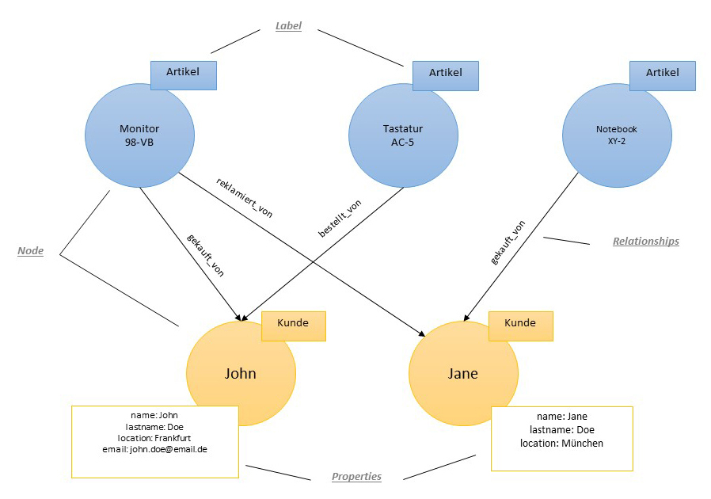

table { width:100%; }# Neo4j

### Ausarbeitung für das Modul Datenbanktechnologien

### Autoren

| Name               | Matrikelnummer | Hochschule |
| :----------------- | :------------- | :--------- |
| Florian Jeger      | 270885         | TH Lübeck  |
| Christoph Jeger    | 270898         | TH Lübeck  |


## Inhaltsverzeichnis
1. [Einleitung](#1-einleitung)
  <br/>1.1. [Neo4j](#11-neo4j)
  <br/>1.2. [Was bringt eine Graph-Basierung?](#12-was-bringt-eine-graph-basierung)
  <br/>1.3. [Vorteile von Graphendatenbanken](#13-vorteile-von-graphendatenbanken)
  <br/>1.4. [Nachteile von Graphendatenbanken](#14-nachteile-von-graphendatenbanken)
  <br/>1.5. [Wofür eignet sich Neo4j?](#15-wofür-eignet-sich-neo4j)  
2. [Installation und Start](#2-installation-und-start)  
3. [Grundlagen](#3-grundlagen)
  <br/>3.1. [Datenmodell](#31-datenmodell)
  <br/>3.2. [Datenintegrität](#32-datenintegrität)
4. [Architektur](#4-architektur)
5. [Cypher](#5-cypher)
  <br/>5.1. [Syntax](#51-syntax)
  <br/>5.2. [Filterformulierung](#52-filterformulierung)
  <br/>5.3. [Datentypen](#53-datentypen)
  <br/>5.4. [Vorteile der Abfragesprache Cypher](#54-vorteile-der-abfragesprache-cypher)
6. [Plugins](#6-plugins)
7. [Object-Graph-Mapping (OGM)](#7-object-graph-mapping-ogm)
8. [Migration](#8-migration)
9. [Fazit](#9-fazit)
10. [Literaturverzeichnis](#10-literaturverzeichnis)


## 1. Einleitung
Nach heutigem Stand reicht es nicht mehr aus große Mengen an Daten zu sammeln und zu speichern. Die Daten sollen einen Mehrwert erzielen und eine Grundlage schaffen um Entscheidungen zu treffen, dafür müssen die Daten innerhalb von Sekunden auswertbar sein. Recht schnell sammeln sich Terabytes an Daten zusammen, die nicht unbedingt sauber strukturiert sind, sondern als E-Mails, Dokumente, Fotos oder Videos vorhanden sind. Mit diesen Anforderungen muss die Datenbank dann zurechtkommen. Für die Entwickler stellt sich dann die Frage, welche Datenbank die richtige für das Projekt ist. Dabei beantworten viele Entwickler diese Frage nach Gefühl oder nach Gewohnheit und vernachlässigen dabei, sich Gedanken um den Anwendungszeck zu machen. [1]

Die folgenden Punkte können für die Wahl einer Datenbank berücksichtigt werden:
- **Anwendungsfall:** Der wichtigste Faktor für die Entscheidung, welche Datenbanktechnologie verwendet werden soll, ist der Anwendungszweck. Werden beispielsweise in einer Anwendung im Frontend viele Interaktionen ausgeführt mit einem hohen Datenvolumen und wichtig dabei sind kurze Reaktionszeiten, dann fällt die Wahl auf NoSQL-Datenbanken. Diese bieten den Vorteil, dass NoSQL-Datenbanken sich über Nodes skalieren und in Clustern organisiert sind. Das ermöglicht eine fast unendliche Flexibilität. Die klassische relationale Datenbank mit ihren festen Tabellenstrukturen kommen nur über Umwege und Problemumgehungen mit diesen Anforderungen zurecht, dadurch steigen bei der relationalen Datenbank die Kosten und das Leistungsverhalten der Datenbank sinkt. Daher sollte der Anwendungsfall genau betrachtet werden und sich dann für einen Datenbanktyp entschieden werden. [1]
- **Anforderungen für die Verfügbarkeit:** Ebenfalls zu beachten sind die Anforderungen in der Verfügbarkeit. Muss eine Anwendung immer verfügbar sein, auch bei steigender Anzahl an Arbeitslasten und paralleler Benutzernutzung, dann muss die Datenbank skalierbar sein um die Arbeitslasten zu schaffen. [1]
- **Datenbanktechnologie für die Zukunft:** Die ausgewählte Datenbank sollte nicht nur die aktuellen Anforderungen erfüllen, sondern die Eigenschaften der Datenbank sollte auch zukünftige Arbeitsbelastung und Einsatzszenarien abdecken. [1]
- **Kosten der Datenbank:** Bei Big Data werden große teure Server benötigt um die Abfragen und Analysen ausreichend performant auszuführen zu können. Bei steigendem Datenvolumen wird auch ein leistungsstärkerer Server benötigt. Bei den NoSQL-Datenbanken können die Server problemlos nach oben skaliert werden. [1]

Unterschiedliche Punkte sind für die Wahl der Datenbank entscheidet. Daher sollten die Entwickler eines Systems verschiedene Datenbanktechnologien kennen, damit die richtige Datenbanktechnologie gewählt wird und nicht später eine böse und teure Überraschung entsteht, den Wechsel der Datenbanktechnologie. Daher wird hier die Datenbanktechnologie Neo4j näher betrachtet und vorgestellt.


### 1.1 Neo4j
Neo4j ist eine quelloffene Graphdatenbank zur Speicherung vernetzter Informationen. Sie gehört zu den weit verbreiteten und bekanntesten Graphdatenbanken. Mit dieser Datenbank ist es möglich eine effiziente Verarbeitung unterschiedlicher Anwendungsfälle umzusetzen, die in relationalen Datenbanken mit anderen Datenmodellen eher aufwendig wären. [2] [3]

Neo4j wurde 2010 mit der ersten Version veröffentlicht und gehört zu den NoSQL-Datenbanken. Mittlerweile steht die Version 4.1.3 (stand Oktober 2020) zur Verfügung. Entwickelt wurde Neo4j mit der Programmiersprache Java. Allerdings werden Daten in einer Graphenstruktur aufgebaut und verwertet. Weiterhin ist Neo4j ein hochskalierbares System, das kostenlos und lizenzfrei in der Community Edition zur Verfügung steht. Außerdem gibt es einen Enterprise Bereich, dieser bietet umfangreiche Zusatzfunktionen. Dieser Enterprise Bereich benötigt aber eine kommerzielle Lizenz. [3] [4]


### 1.2. Was bringt eine Graph-Basierung?
Allgemein besteht ein Graph aus einer Menge von Knoten und Kanten. Diese Knoten und Kanten werden auch Beziehung genannt. Hierbei werden zwei Knoten jeweils durch eine Kante verbunden. In einer Graphdatenbank werden die Daten im Graph gespeichert. Außerdem sind in der Graphdatenbank die Knoten und Kanten quasi die primitive erste Ordnung. [2]

Die Graphdatenbank Neo4j besitzt wohl überlegte Strategien für die Verwaltung von riesigen und beliebig verknüpften Datenmengen. Hierfür verwendet Neo4j Mechanismen, die es ermöglichen Indizes auf Knoten und Beziehungen zu definieren. Mit Neo4j ist es möglich mehr als 1 Mio. Beziehungen pro Sekunde auf einer Standard-Hardware zu traversieren. Damit problematische bzw. nicht einfache Abfragen über einen Graphen formulieren zu können, besitzt Neo4j eine Vielzahl von Mechanismen. [2]

Heutzutage sind viele allgemeine Graph-Algorithmen in der Mathematik bzw. in der Informatik bekannt. Eine Implementierung von bekannten Graph-Algorithmen ist in Neo4j bereits vorhanden, z.B. sind die Algorithmen für die Suche von den kürzesten Wegen sowie der A*- Algorithmus und der Dijkstras Algorithmus bereits implementiert. [2]


### 1.3. Vorteile von Graphendatenbanken
Graphdatenbanken besitzen allgemein einen Vorteil gegenüber Relationalen Datenbanken (RDBMS) und anderen NoSQL-Datenbanken, wenn es um komplizierte Beziehungen innerhalb einer riesigen Datenmenge geht. [5]

Relationale Datenbanken eignen sich nicht dafür, aus dem Grund, dass sie für das Darstellen und Finden von Verbindungen viele zeitintensive JOINs benötigen. Je mehr Datensätze entstehen bzw. hinzugefügt werden und je tiefer diese Verbindungen gehen, desto mehr Zeit wird benötigt. Die Lösung für dieses Problem sind Graphdatenbanken, weil sie für dieses Problem entwickelt und optimiert wurden. Sie besitzen dementsprechend die nötigen Algorithmen. [5] 

Nach einer allgemeinen Beschreibung von den Vorteilen einer Graphdatenbank folgt eine explizite Aufzählung der Vorteile der Graphendatenbank Neo4j: 

- **Zuverlässig und schnell:** Bei Neo4j können Daten vollständig schnell geschrieben und gelesen werden. [6]
- **Einfach zu bedienen:** Neo4j bietet ein leicht verständliches User-Interfaces und es gibt erprobte Lernmaterialien, die den Einstieg erleichtern. [6]
- **Gutes Preis-Leistungs-Verhältnis:** Die Enterprise-Version von Neo4j wird zu einem fairen Preis angeboten. [6]
- **Skalierbar:** Neo4j garantiert hohe Geschwindigkeiten und passt sich dem Datenvolumen an. [6]
- **ACID Optimierung:** Durch Atomarität, Konsistenz, Isolation und Dauerhaftigkeit wird die Verknüpfung von Daten optimiert. [6]
- **Benutzerfreundlich:** Neo4j bietet ein einfaches User-Interfaces, Cypher und Java für Anwendungen. [6]
- **Open Source:** Neo4j ist ein Open Source Projekt. Die Community unterstützt das Open Source Projekt von Neo4j, diese Unterstützung fließt auch in die Enterprise-Version mit ein. [6]
- **Erprobt & bewährt:** Von Analysten wird Neo4J als zuverlässig genug für kritische Anwendungen eingestuft. [6]
- **Community:** Neo4j besitzt die größte Community aller Graph-Datenbanken. [6]

### 1.4. Nachteile von Graphendatenbanken
Die NoSQL-Datenbanken verteilen ihre Daten hauptsächlich nach ihrem Primärschlüssel. Die Graphdatenbanken hingegen müssen ihr Beziehungsgeflecht aufbrechen, damit das System auf einer verteilten Architektur skalierbar ist. Dafür stellen Graphdatenbanken entsprechende Operationen bereit. Sharding (bezeichnet die Aufteilung einer Datenbank auf mehrere physikalische Datenbankserver) ist bei Graphdatenbanken kein einfacher Prozess wie bei anderen Systemen. Der Sharing Prozess führt eher zu Performanceverlust als zu Performancegewinn, weil diese Systeme eher für Ein-Server-Architekturen konzipiert wurden. Bei diesen Ein-Server-Architekturen geschieht das traversieren schneller als auf einem verteilten System. Soll eine Graphdatenbank verteil werden und die Kapazität des Servers ist nicht ausreichend, dann ist es notwendig, dass der Graph in Teilgraphen partitioniert (aufgeteilt) wird. Dabei kann es schwierig werden eine geeignete Stelle für das partitionieren im Graphen zu finden. [5]


### 1.5. Wofür eignet sich Neo4j?
Für ein System, wo die Daten zahlreich vernetzt und kaum strukturiert sind, eignet sich besonders Neo4j. Besitzt ein System zahlreiche zusammenhängende strukturierte Daten, die verwaltet werden müssen, dann eignet sich Neo4j nicht besonders und es wäre besser eine relationale Datenbank zu wählen. Besitzt das System allerdings vernetze Daten, wo die Beziehungen zwischen den Daten abgefragt werden müssen, dann ist Neo4j als Graphdatenbank die passende Wahl. Die folgende Abbildung 2-1 zeigt einen Überblick von den Bestandteilen von Neo4j die ein Anwender benötigt. [2]

<p align="left"><b>Abbildung 1-1: Neo4j-Überblick [2]</b></p>


## 2. Installation und Start
Diese Schritte sind nötig um Neo4j unter Windows zu installieren und zu starten:
- Java muss auf dem PC (Personal Computer) installiert sein. [7]
- Nun ist es nötig die neuste Version von Neo4j herunterzuladen. Hierfür besucht man die <a href="https://neo4j.com/download-center/#community" target="_blank">Neo4j-Webseite</a> und downloadet die "Neo4j Community Edition". [7]
- Der nächste Schritt ist die heruntergeladene ZIP-Datei zu entpacken. [7]
- Nun navigiert man über die Konsole in den Bin Ordner und führt „bin\neo4j console“ aus. Jetzt können Neo4j-Abfragen im Terminal ausführt werden. [7]
- Im gleichen Verzeichnis führt man den Befehl „bin/neo4j start“ aus in der Konsole, um den Webserver zu starten. Damit der Webserver gestoppt wird, gibt man den Befehl „bin/neo4j stop“ in der Konsole ein. [7] [8]
- Nun ruft man im Browser seiner Wahl den localhost unter http://localhost:7474 auf. [9]
- Der Benutzername und das Passwort sind bei Neo4j ab der Community-Version 3.0.3 standardmäßig „neo4j“ (siehe Abbildung 2-1). Nachdem das Passwort eingegeben wurde, kann das Passwort geändert werden. [9] [8]

<p align="left"><b>Abbildung 2-1: Neo4j Login</b></p>

Aus dem Grund, dass Neo4j mit Java erstellt wurde, läuft Neo4j auf jeder Plattform auf der Java installiert ist. [8]


## 3. Grundlagen
Nachfolgend werden die Grundlagen zu Graphen und die Thematik von den Graphdatenbanken spezifisch am Beispiel von Neo4j näher betrachtet.

### 3.1. Datenmodell
Leonard Euler legte mit der Graphentheorie die Grundlage für das Datenmodell der Graphdatenbanken [5]. Anders als in relationale Datenbanken, wo die Übertragung eines Graphenmodells mit den Knoten und Kanten nur in der Form einer Datenbanktabelle möglich ist, nutzt Neo4j die unveränderte Form der Graphenelemente. Das hat den Effekt, dass die Problemfelder, die sonst entstehen, deutlich vereinfacht werden. Die wichtigsten Bestandteile des Datenmodells von Neo4j werden nachfolgend beschrieben: [10]

**Knoten (Nodes):** Das Grundelement in jeden Graphen ist der Knoten. In Neo4j enthält jeder Knoten eine eindeutige ID, die fortlaufend für alle Knoten verteilt wird. Die Knoten in Neo4j können Eigenschaften zugewiesen werden, die auch Properties genannt werden. Diese Attribute enthalten einfache Schlüssel oder Werte-Paare. Diese Eigenschaften müssen kein vorgegebenes Schema folgen, das heißt, die Attribute können sich von Knoten zu Knoten unterscheiden. Dies ermöglicht eine größere Flexibilität im Vergleich zu relationalen Datenbanken, wo für jeden Knotentyp eine eigene Tabelle erforderlich ist. [10]

Die folgenden Wertetypen aus Tabelle 3-1 können für Properties vergeben werden:

| Typ                               | Beschreibung                                                                               |
| :-------------------------------- | :----------------------------------------------------------------------------------------- | 
| boolean                           | true oder false		                                                                     | 
| byte                              | 8-bit integer (Ganzzahl)                                                                   | 
| short                             | 16-bit integer (Ganzzahl)                                                                  | 
| int                               | 32-bit integer (Ganzzahl)                                                                  | 
| long                              | 64-bit integer (Ganzzahl)                                                                  | 
| float                             | 32-Bit IEEE 754 Gleitkommazahl                                                             | 
| double                            | 64-Bit IEEE 754 Gleitkommazahl                                                             | 
| char                              | 16-Bit-Ganzzahlen ohne Vorzeichen, die Unicode-Zeichen darstellen                          | 
| String                            | Sequenz von Unicode-Zeichen                                                                | 
| org.neo4j.graphdb.spatial.Point   | Ein 2D- oder 3D-Punktobjekt in einem bestimmten Koordinatensystem.                         | 
| java.time.LocalDate               | Eine sofortige Erfassung des Datums, aber nicht der Zeit oder der Zeitzone.                | 
| java.time.OffsetTime              | Eine sofortige Erfassung der Tageszeit und des Zeitzonenversatzes, jedoch nicht das Datum. | 
| java.time.LocalTime               | Ein Augenblick, der die Tageszeit erfasst, aber nicht das Datum und nicht die Zeitzone.    | 
| java.time.ZonedDateTime           | Eine sofortige Erfassung des Datums, der Uhrzeit und der Zeitzone.                         | 
| java.time.LocalDateTime           | Eine sofortige Erfassung des Datums und der Uhrzeit, aber nicht der Zeitzone.              | 
| java.time.temporal.TemporalAmount | Ein zeitlicher Betrag. Dadurch wird der Zeitunterschied zwischen zwei Momenten erfasst.    | 

<p align="left"><b>Tabelle 3-1: Wertetypen für Properties in Neo4j [11]</b></p>

In Neo4j existiert außerdem ein spezieller Knoten, den sogenannten Referenzknoten. Dieser existiert in jeder neu angelegten Neo4j Datenbank, weil dieser Knoten den allgemein bekannten Einstiegspunkt für jeden Graphen darstellt. Dieser Knoten sollte zu mindestens indirekt mit allen Knoten verbunden sein, damit jeder Knoten von dem Referenzknoten erreichbar ist. [10]

**Kanten (Relationships):** Die Verbindungen zwischen den Knoten werden als Kanten oder Relationships bezeichnet und stellen eine Auffindbarkeit des Knotens in der Datenbank sicher. Dabei kann ein Knoten keine, eine oder mehrere Beziehungen zu anderen Knoten haben. Auch die Kanten können mit einer eindeutigen ID identifiziert werden, die fortlaufend für alle vergeben werden. Eine Kante kann nur durch einen Start- und Endknoten mit einem Typbezeichner entstehen. Dabei sind die Kanten immer gerichtet, das heißt eine Kante ist immer nur mit zwei Knoten verbunden. Die Richtung der Kante kann ebenfalls entscheidend sein, denn wenn X Follower von Y ist, heißt das nicht das Y auch Follower von X ist. Sollte die Richtung der Verbindung der Knoten egal sein, kann diese beim traversieren auch ignoriert werden. Kanten können ebenfalls wie Knoten Attribute enthalten in der Form von Schlüssel oder Werte-Paare. [10]

**Pfade:** Pfade sind eine Aufreihung von einem oder mehreren Knoten über Kanten und stellen das Ergebnis einer Suchanfrage dar. [10]

**Indizes durch Labels:** Die Knoten können mit zusätzlichen Eigenschaften versehen werden, die Labels genannt werden. Labels ermöglichen eine Teilmenge an Knoten auszuzeichnen und zu indizieren, damit können die Knoten gruppiert und bei Suchanfragen schneller gefunden werden. Wichtig ist, dass Knoten jederzeit mit weiteren Attributen und Labels ergänzt werden können. Knoten können mehr als ein Label enthalten. [3]

Die Abbildung 3-1 zeigt ein Beispiel für das Datenmodell von Neo4j. Der Knoten John und Jane haben unter anderem die Attribute von Kundendaten, wie Name, Nachname, Ort und E-Mail. Jedoch müssen die Knoten nicht alle die gleichen Eigenschaften mit unterschiedlichen Werten besitzen. So hat der Knoten Jane in diesem Beispiel nicht das Attribut von einer E-Mail-Adresse. Außerdem wurde der Knoten John und Jane mit dem Label Kunden versehen. Damit kann über das Label Kunden John und Jane leichter und schneller über eine Suchanfrage in der Datenbank gefunden werden. Das Beispiel verdeutlicht ebenfalls, dass die Knoten unterschiedliche Beziehungen (Kanten) zueinander haben können. 

<p align="left"><b>Abbildung 3-1: Veranschaulichung des Datenmodells in Neo4j [3]</b></p>


### 3.2. Datenintegrität
Bei vielen NoSQL-Datenbanktechnologien geht die Skalierbarkeit auf Kosten der Garantie für die Abgeschlossenheit, Konsistenz, Isolation und Dauerhaftigkeit, kurz ACID. Neo4j bietet hingegen mit seiner NoSQL-Datenbank eine vollständige transaktionsfähige und weitest gehende ACID-Konformität an. Damit steht Neo4j den relationalen Datenbanken in diesem Punkt in fast nichts nach. [10]

Durch die Datenbankmodellierung der Knoten und Kanten wird außerdem eine Form der Datenintegrität gesichert. Denn es ist nur möglich Kanten zu erstellen, die einen Anfangs- und Endknoten besitzen. Zudem ist das Löschen von einem Knoten nur möglich, wenn an diesem Knoten keine Kanten mehr dran sind. Diese Datenintegrität ist bei Neo4j von Anfang an garantiert, wohingegen bei relationalen Datenbanken dies nur über die Bestimmung von Fremdschlüsseln möglich ist. [10]

Dadurch, dass kein festes Schema bei Neo4j vorhanden ist, bietet das jedoch Gefahren hinsichtlich der Datenintegrität. Denn hier ist es problemlos möglich Daten eines anderen Typs oder unter falschem Namen in einem Knoten zu speichern. Dieser Fall würde bei relationalen Datenbanken durch das feste Schema nicht auftreten. [10]


## 4. Architektur
Eine Datenbank kommt im Unternehmen-Umfeld erst zur Verwendung, wenn die Datenbank gewisse Voraussetzungen erfüllen. Wichtig für die Wahl einer Datenbank ist für Unternehmen die Eigenschaften Abgeschlossenheit, Konsistenz, Isolation und Dauerhaftigkeit (ACID). Neo4j ist ACID-fähig und legt einen großen Wert auf eine Hochverfügbarkeit. Daher ist die Architektur der Datenbank auf eine Master-Slave-Architektur ausgelegt, siehe Abbildung 4 1. Die Aufgaben werden so verteilt, dass der Master für den größten Teil der Schreiblast und die Slaves für das Bearbeiten von Leseanfragen zuständig sind. Der vorgeschaltete Load-Balancer übernimmt die Verteilung der Lasten und der Apache Zookeeper ist für die Koordinierung der Master und Slaves zuständig sowie für die Bestimmung eines Master Servers. Das Ziel dieser Architektur ist, eine Fehlertoleranz und Skalierbarkeit des gesamten Systems zu erreichen. [12] [10]

<p align="left"><b>Abbildung 4-1: Hochverfügbarkeitsarchitektur von Neo4j [12]</b></p>


## 5. Cypher
Aus einem Projekt des Unternehmens Neo4j Inc. entstand im Jahre 2011 die Abfragesprache Cypher für die Graphdatenbank Neo4j. Mit dem Open-Source-Projekt openCypher hat Neo4j die Abfragesprache Cypher im Jahre 2015 zu einem Open-Source-Projekt gemacht. Cypher ist eine deklarative Abfragesprache für Graphdatenbanken. Mit der übersichtlichen Syntax, die Cypher besitzt, können komplizierte Abfrage oder Datenaktualisierungen in Graphdatenbanken schnell und einfach formuliert werden. Dabei eignet sich Cypher für den Betrieb und die Entwicklung. Die Absprache ermöglicht einen effizienten und intuitiven Umgang mit Daten in NoSQL-Graphdatenbanken. [13]

### 5.1. Syntax
Die Abfragesprachen SQL oder SPARQL haben das Design von der Abfragesprache Cypher geprägt. Eine Abfrage in Cypher besitzt eine gewisse Ähnlichkeit wie eine Abfrage in SQL. Zum Beispiel besitzen sie zum Teil ähnliche oder gleiche Schlüsselwörter, die dementsprechend groß geschrieben werden. [14] In der nachfolgenden Tabelle sind wichtige Schlüsselwörter aufgelistet: 

| Schlüsselwort                     | Beschreibung                                                                               |
| :-------------------------------- | :----------------------------------------------------------------------------------------- | 
| MATCH                             | Musterabgleich		                                                                     | 
| OPTIONAL MATCH                    | Optional Musterabgleich                                                                    | 
| WHERE                             | Selektion                                                                                  | 
| RETURN                            | Rückgabe als Knoten oder Ergebnistabelle                                                   | 
| WITH                              | Erstellen eines Alias für einen Knoten                                                     | 
| CREATE                            | Erstellen eines Knotens oder einer Kante                                                   | 
| SET                               | Eigenschaft eines Knotens oder einer Kante einen Wert zuweisen                             | 
| DELETE                            | Knoten entfernen                                                                           | 
| REMOVE                            | Entfernen einer Eigenschaft, eines Labels oder eines Typs                                  | 
| ORDER BY                          | Sortierung                                                                                 | 
| SKIP                              | Bestimmte Anzahl an Resultate am Anfang überspringen                                       | 
| LIMIT                             | Resultat auf ein bestimmte Anzahl limitieren                                               | 

<p align="left"><b>Tabelle 5-1: Wichtige Schlüsselwörter für die Sprachstruktur von Cypher [14]</b></p>

Das Konstrukt MATCH – WHERE – RETURN ist die Basis jeder Abfrage. Mit MATCH können Knoten und Kanten durch einen Musterabgleich gewählt, mit WHERE gefiltert und mit RETURN die gewünschten Informationen zurückgegeben werden. Zurückgegeben kann ein Knoten, aber auch eine Ergebnisstabelle mit einer Kombination von Konten und deren Eigenschaften. [14]

```cypher
MATCH [Musterabgleich]
WHERE [Filter]
RETURN [Knoten oder Eigenschaften] 
```
<p align="left"><b>Listing 5-1: Basis Konstrukt [14]</b></p>

Das Schlüsselwort CREATE wird benötigt, um einen neuen Knoten zu erstellen und wird ergänzt mit der Beziehung zu anderen Knoten. [14]

```cypher
CREATE [Knoten- und Kantendefinition]
RETURN [Knoten oder Eigenschaften] 
```
<p align="left"><b>Listing 5-2: Knoten erstellen [14]</b></p>

Die vorher gezeigten Abfragen können zu einer MATCH – CREATE – RETURN Abfrage zusammengefügt werden. Zum Beispiel kann ein Knoten abgefragt werden, um dann einen neuen Knoten über einer neuen Kante zu verbinden und diese dann zurückzugeben. [14]

```cypher
MATCH [Musterabgleich]
CREATE [Knoten- und Kantendefinition]
RETURN [Knoten oder Eigenschaften] 
```
<p align="left"><b>Listing 5-3: Kombinierte Abfrage [14]</b></p>

### 5.2. Filterformulierung
Die Abfragesprache Cypher besitzt unterschiedliche Operatoren, um Filter zu formulieren. Diese Operatoren werden auch in anderen Sprachen wie Java und SQL verwendet [14]. Nachfolgend wird die Tabelle der Operatoren aufgeführt.


| Schlüsselwort                     | Beschreibung                                                                               |
| :-------------------------------- | :----------------------------------------------------------------------------------------- | 
| =                                 | Gleich		                                                                             | 
| <                                 | Kleiner als                                                                                | 
| >                                 | Grösser als                                                                                | 
| <>                                | Ungleich                                                                                   | 
| <=                                | Kleiner gleich                                                                             | 
| >=                                | Grösser gleich                                                                             | 
| IS NULL                           | Gleich NULL                                                                                | 
| IS NOT NULL                       | Ungleich NULL                                                                              | 

<p align="left"><b>Tabelle 5-2: Filterformulierung in der Sprachstruktur von Cypher [14]</b></p>

In Cypher gibt es vier boolesche Operatoren, um Filter zu verknüpfen [14].

| Schlüsselwort                     | Beschreibung                                                                               |
| :-------------------------------- | :----------------------------------------------------------------------------------------- | 
| AND                               | UND		                                                                                 | 
| OR                                | ODER                                                                                       | 
| XOR                               | Exklusives ODER                                                                            | 
| NOT                               | NICHT                                                                                      | 

<p align="left"><b>Tabelle 5-3: Boolesche Operatoren in der Sprachstruktur von Cypher [14]</b></p>

### 5.3. Datentypen
Welcher Datentyp verwendet wird, entscheidet Neo4j durch die Definition der Daten. Hierbei verwendet Neo4j Datentypen, die auch andere Sprachen verwenden. Zu diesen Datentypen zählen boolean, byte, short, int, long, float, double, char und String. [14]

### 5.4. Vorteile der Abfragesprache Cypher
Die Abfragesprache besitzt viele Vorteile für Graphdatenbanken. Im Folgenden werden diese Vorteile aufgelistet:

- Die Abfragesprache ist schnell zu erlernen und gut lesbar. [13]
- Die Abfragesprache besitzt eine einfache und übersichtliche Syntax. [13]
- Komplizierte Abfragen sind mit einfachen Ausdrücken realisierbar. [13]
- Die Abfragesprache ist mit dem Open-Source-Projekt openCypher für andere Graphdatenbanken und Plattformen nutzbar. [13]
- Die Abfragesprache Cypher besitzt eine breite Akzeptanz. [13]
- Die Abfragesprache Cypher bildet eine Grundlage für die in der Standardisierung befindlichen Graph Query Language (GQL). [13]


## 6. Plugins
Neo4j lässt sich wie andere Datenbanken mit Hilfe von Plugins erweitern. Diese Plugins werden auch als Functions und Procedures bezeichnet. [15]

- Die Hilfsfunktionen, die Cypher erweitern, sind die sogenannten Functions. Dabei besitzen diese Functions selber keinen direkten Zugriff auf die Datenbank. Die Functions geben einen Wert zurück, aber bekommen mehre Werte übergeben. String-Concatenation wäre ein Beispiel einer solchen Function. Hierbei wird eine Liste von Strings übergeben und es wird ein String zurückgegeben. [15]
- Im Gegensatz zu den Functions sind die Procedures mächtige Funktionen. Die Procedures besitzen Zugriff auf die Datenbank und geben Streams von Werten zurück. Diese können dazu benutzt werden, um neue Funktionen zu implementieren. Damit können z.B. komplexe Cypher-Befehle in einen Einzelnen verpackt werden. [15]

Mit Verwendung des Neo4j-Kernels werden Functions und Procedures in Java implementiert. Die dabei entstehende jar wird dann im Plugin-Folder abgelegt. Startet die Datenbank neu, dann wird es automatisch angewendet. Weiterhin stellt Neo4j die Plugin-Library „APOC“ (Awesome Procedures On Cypher) bereit. Diese enthält über 450 Functions und Procedures. Außerdem erweitert und pflegt Neo4j die Plugin-Library „Neo4j-Graph-Algorithms“. Diese Bibliothek enthält über 30 Graph-Algorithmen. Zu diesen Algorithmen zählen unter anderem A*, Betweenness Centrality und PageRank. [15]


## 7. Object-Graph-Mapping (OGM)
Ein nützliches Werkzeug für die Arbeit mit Neo4j ist das Object-Graph-Mapping (OGM). Dabei ist OGM eine Bibliothek mit der es möglich ist Java-Objektstrukturen auf die Neo4j-Graphstruktur zu übernehmen. Weiterhin ermöglicht OGM den programmatischen Zugriff auf die Datenbank über eine Session. Object-Graph-Mapping kommt dem gleich, was für relationale Datenbanken Hibernate darstellt. Dabei ist das Mapping einfach gehalten und besitzt eine ähnliche Umsetzung über Annotations wie bei Hibernate. [15]

Ist das Ziel Objekte einer Klasse auf Knoten zu mappen, dann annotiert man die Klasse mit @NodeEntity. Die Attribute, die nur vorübergehend sind, werden automatisch gemappt. Hingegen können die eingebetteten Objekte mit @Relationship annotiert werden. Die Umsetzung einer gemappten Relation ist in Listing 7-1 OGM-Annotation zu sehen. Dort ist ein Beispiel Annotation für eine Person, die mehre Personen kennen kann, abgebildet. [15]

```java
@Data
@NodeEntity
public class Person {

    @Id
    @GeneratedValue
    private Long id;

    private String name;

    @Relationship(type = "KNOWS")
    private List<Person> persons;

}
```
<p align="left"><b>Listing 7-1: OGM-Annotation [15]</b></p>

Damit man eine Klasse auf eine Relation mit zusätzlichen Attributen mappen kann, verwendet man @RelationshipEntity, um Klassen zu annotieren. Dabei ist es nötig die Klassen zu kennzeichnen mit @StartNode und @EndNode (siehe Listing 7-2). Weiterhin muss der Start- oder Endknoten referenziert werden, damit ein Mapping möglich ist (siehe Listing 7-3). [15]

```java
@Data
@RelationshipEntity(type = „KNOWS“)
public class KnowsRelation {

    @Id
    @GeneratedValue
    private Long id;

    private Instant since;

    @StartNode
    private Person from;

    @EndNode
    private Person to;

}
```
<p align="left"><b>Listing 7-2: Eine auf eine Klasse gemappte Relation mit zusätzlichen Attributen [15]</b></p>

```java
@Data
@NodeEntity
public class Person {

    @Id
    @GeneratedValue
    private Long id;

    private String name;

    @Relationship(type = „KNOWS“)    private List<KnowsRelation> knowsRelations;

}
```
<p align="left"><b>Listing 7-3: Eine referenzierte RelationshipEntity [15]</b></p>

Alle Entitäten brauchen aus technischen Gründen eine Id, die mit @Id gesetzt wird. Außerdem kann man diese Id generieren lassen, dazu annotiert man sie mit @GeneratedValue. Mit IdStrategy kann zusätzlich angegeben werden, wie die Ids generiert werden. Object-Graph-Mapping verwendet nativen Ids in dem Fall, wenn keine angegeben wurde. Allerdings ist das nicht zu empfehlen, weil die Ids nach einer Zeitspanne recycelt werden. Besonders bei Applikationen, die lange verwendet werden, führt dies zu Problemen. Ids selber zu erzeugen ist die bessere Lösung. Es kann zum Beispiel die UuidStrategy genutzt werden, um Uuids zu erzeugen. [15]

Die Neo4j Datenbank kann aber nicht triviale Werte speichern. Daher benötigt man einen Mechanismus, um Uuids abbilden zu können. Für dieses Problem bietet der OGMConverter Abhilfe. Mit dem OGMConverter können nicht-triviale Attribute auf Graph-Attribute übersetzt werden. Mit der in der OGM enthaltene UuidStringConverter können Uuid-Objekte in der Datenbank als Strings gespeichert werden. [15]

Unter org.neo4j.ogm.typeconversion.AttributeConverter können eigene Converter als Implementierung hinzugefügt werden. Eigene IdStrategies können unter org.neo4j.ogm.id.IdStrategy hinzugefügt werden. Das Listing 7-4 zeigt ein Mapping, wo eine Uuid verwendet wird statt der nativen Id. [15]

```java
@Id
@GeneratedValue(strategy = UuidStrategy.class)
@Convert(UuidStringConverter.class)
private UUID id;

```
<p align="left"><b>Listing 7-4: Verwendung einer Uuid in OGM [15]</b></p>


## 8. Migration
Bei der Einführung einer Neo4j-Datenbank ist davon auszugehen, dass bereits eine relationale Datenbank vorhanden ist aufgrund der hohen Verbreitung von relationalen Datenbanken. Daher wird die relationale Datenbank entweder in Neo4j übernommen oder die relationale Datenbank bleibt bestehen und wird durch die Neo4j Datenbank erweitert. Die beiden beschriebenen Anwendungsfälle sind mit Neo4j leicht umzusetzen. [15]

Die Abfragesprache Cypher, die Neo4j verwendet, bietet Funktionen für die Auflösung einer relationalen Datenbank. Hierfür besitzt Cypher Funktionen für den Import von Daten aus json, csv, xml und anderen Formaten. Daher ist es notwendig zuerst einen Export der Daten aus der relationalen Datenbank durchzuführen und dann einen Cypher-Import in die Neo4j Datenbank durchzuführen. Allerdings weist Neo4j eine Schwäche bei der Schreiben-Performanz auf. Aus diesem Grund kann ein Groß-Import von Daten etwas Zeit in Anspruch nehmen. [15]

Ist das Ziel eine relationale Datenbank mit Neo4j zu erweitern, dann ist der Einsatz von Plugins hilfreich. Für die meisten Datenbank-Technologien bietet APOC Plugins mit Connectoren an. Damit können Cypher-Statements geschrieben werden, die die Verteilung der Daten von der relationalen Datenbank auf Neo4j managen. Zum Beispiel ist es dann möglich ein System zu implementieren, das die Stammdaten in einer relationalen Datenbank aufbewahrt, aber die Nachfolger bzw. die Vorgänger Relationen in Neo4j gepflegt wird. [15]


## 9. Fazit
Die Community Edition von Neo4j ermöglicht eine schnelle Installation und ein schnelles Starten. Die integrierte Dokumentation und das Tutorial führt einen Neo4j-Einsteiger in die Konzepte von Neo4j und dessen Abfragesprache Cypher ein.

Die Stärke von Neo4j ist die einfache Traversierung von Graphen, dass im Vergleich zu relationalen Datenbanken eine erhebliche Minimierung des Aufwandes bei der Entwicklung zur Folge hat. Das ist möglich, weil die Graphen mit gerichteten Kanten eins zu eins in Neo4j umgesetzt werden können. Damit lassen sich dann auch komplexe Beziehungen einfacher darstellen und effektiv verwalten. Zudem bieten Graphdatenbanken, durch die Eigenschaften von Graphen eine sehr schnelle Lesegeschwindigkeit, das unabhängig von den enthalten Datenmenge gewährleistet ist. Außerdem bietet Neo4j durch seine Schemalosigkeit für die Datenmodellierung genug Flexibilität um mit ständig ändernden Anforderungen klar zu kommen. 

Die eigens entwickelte Abfragesprache Cypher ermöglicht eine Java-basierte Plugin-Entwicklung und eine Object Graph Mapping (OGM) Nutzung. Dazu bietet Neo4j einen einfachen Datenimport an. Dazu ist Neo4j in der Lage ACID konforme Datenbanken zu stellen, die voll clusterfähig sind, was besonders das Unternehmen-Umfeld ansprechen soll.

Zu beachten ist jedoch, dass durch eine fehlende Standardisierung von Graphendatenbanken, zum Beispiel bei der Abfragesprache Cypher von Neo4j auch eine stärke Bindung an die Datenbanktechnologie Neo4j miteingeht.


## 10. Literaturverzeichnis
- [1] IT Verlag für Informationstechnik GmbH, „Fünf Tipps für die Wahl der richtigen Datenbank,“ 01 April 2020. [Online]. Available: https://www.it-daily.net/it-management/big-data-analytics/23876-fuenf-tipps-fuer-die-wahl-der-richtigen-datenbank. [Zugriff am 25 Oktober 2020].
- [2] P. Ghadir, „Neo4j – Eine graph-basierte transaktionale Datenbank,“ 01 September 2012. [Online]. Available: https://www.innoq.com/de/articles/2012/09/neo4j-rockt/. [Zugriff am 24 Oktober 2020].
- [3] „Neo4j,“ Begerow Beratungsgesellschaft mbH & Co. KG, [Online]. Available: https://www.datenbanken-verstehen.de/lexikon/neo4j/. [Zugriff am 24 Oktober 2020].
- [4] „Neo4j Release Notes,“ Neo4j, Inc., [Online]. Available: https://neo4j.com/release-notes/. [Zugriff am 24 Oktober 2020].
- [5] „Graphdatenbanken,“ Technische Hochschule Mittelhessen, [Online]. Available: http://wi-wiki.de/doku.php?id=bigdata:graphdb. [Zugriff am 26 Oktober 2020].
- [6] „Neo4J: Die weltweit führende Graph-Datenbank,“ AOE GmbH, [Online]. Available: https://www.aoe.com/de/produkte/datenbanken-storage/neo4j.html. [Zugriff am 26 Oktober 2020].
- [7] „Neo4j docs - Windows installation,“ Neo4j, Inc., [Online]. Available: https://neo4j.com/docs/operations-manual/current/installation/windows/#windows-installation. [Zugriff am 27 Oktober 2020].
- [8] „Erste Schritte mit neo4j,“ [Online]. Available: https://riptutorial.com/de/neo4j. [Zugriff am 27 Oktober 2020].
- [9] skyridetim, „Neo4j Installation,“ [Online]. Available: https://www.geeksforgeeks.org/neo4j-installation/. [Zugriff am 27 Oktober 2020].
- [10] S. Schönung, „Graphendatenbanken,“ 2012. [Online]. Available: https://www.christianbaun.de/SEM12/Dokumente/CLCP_SEM_SS2012_Graphendatenbanken_Ausarbeitung.pdf. [Zugriff am 26 Oktober 2020].
- [11] Neo4j, Inc., „Neo4j docs - Property values,“ [Online]. Available: https://neo4j.com/docs/java-reference/current/java-embedded/property-values/index.html. [Zugriff am 27 Oktober 2020].
- [12] C. Borowski, „Agilität statt Performanceprobleme: Die Graphendatenbank Neo4j,“ 29 September 2017. [Online]. Available: https://blogs.itemis.com/de/agilit%C3%A4t-statt-performanceprobleme-die-graphendatenbank-neo4j#:~:text=Neo4j%20ist%20ACID%2Df%C3%A4hig.&text=Neben%20mehreren%20Neo4j%2DInstanzen%2C%20die,die%20Skalierbarkeit%20des%20Gesamtsystems%20erreicht.. [Zugriff am 28 Oktober 2020].
- [13] S. Luber, „Was ist Cypher?,“ [Online]. Available: https://www.bigdata-insider.de/was-ist-cypher-a-912813/. [Zugriff am 29 Oktober 2020].
- [14] „Sprachstruktur,“ Information Systems Research Group, [Online]. Available: https://www.sql-nosql.org/de/cypher-tutorial. [Zugriff am 29 Oktober 2020].
- [15] S. Schubert, „Einstieg in die Graphdatenbank Neo4j,“ [Online]. Available: https://www.informatik-aktuell.de/betrieb/datenbanken/einstieg-in-die-graphdatenbank-neo4j.html. [Zugriff am 27 Oktober 2020].
