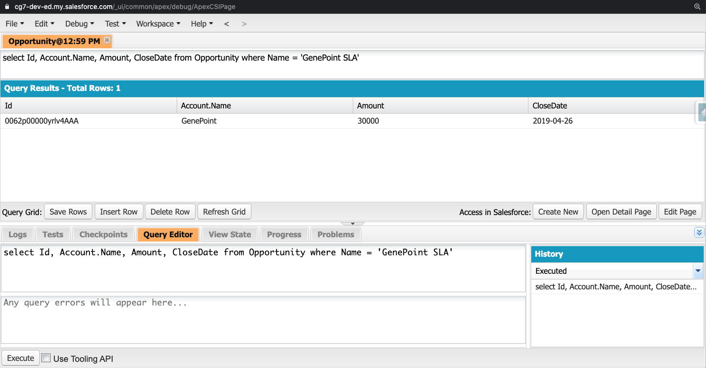
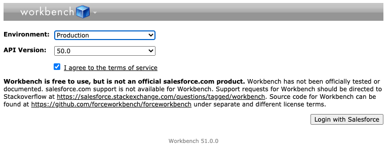
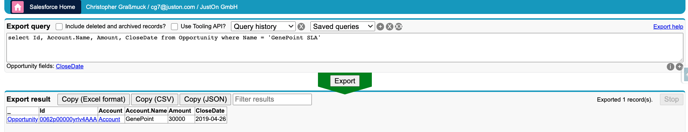

##6. Werkzeuge##
__________
**Anwenderwerkzeuge zum Ausführen für SOQL-Abfragen**

Es gibt verschiedene Möglichkeiten, SOQL-Abfragen zu schreiben. Man kann in der Salesforce-Developer-Console den **Query Editor** nutzen, alternativ die **Salesforce-Workbench** oder **Inline SOQL in Apex-Code** verwenden. Ich persönlich bevorzuge die Salesforce-Workbench gegenüber dem Abfrage-Editor der Developer-Console, da alle abfragbaren Objekte und Felder angezeigt werden und die Ergebnisse schnell in eine CSV-Datei exportiert werden können. Workbench bietet auch die Möglichkeit, Abfragen deklarativ zu schreiben, was für Anfänger ohne viel SOQL-Erfahrung hilfreich ist.     

Ein weiteres interessantes Werkzeug ist der **Salesforce-Inspector**, welcher als Erweiterung (Plug-In) für z.B. den Chrome- oder Firefox Browser verfügbar ist. Der Salesforce-Inspector ist ein Werkzeug für Salesforce-Administratoren und -Entwickler,  zur Prüfen von Daten und Metadaten direkt über die Salesforce-Benutzeroberfläche.

###Developer Console - Quer Editor###

###Salesforce-Workbench###

  

###Salesforce-Inspector###

__________

[Nächstes Kapitel](Quellenverzeichnis.md)