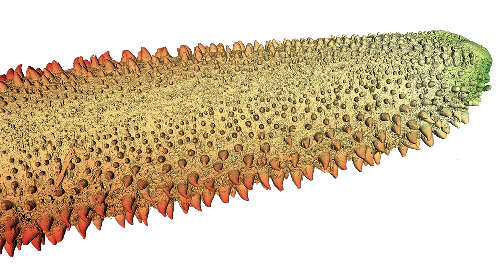
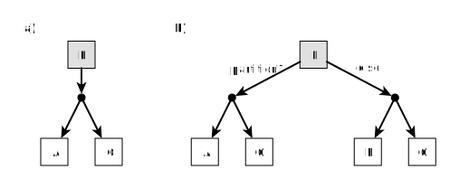
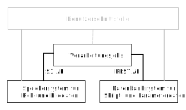
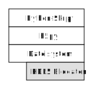
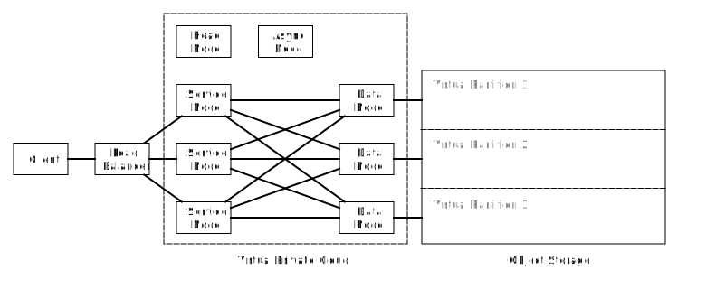
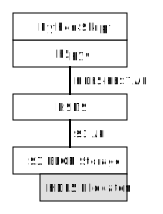

= Entwurf eines Datenbanksystems zur Speicherung und Vorverarbeitung medizinischer Bilddaten
:figure-caption: Abbildung
:table-caption: Tabelle
:listing-caption: JSON-Listing
:xrefstyle: short
//:imagesdir: /images
:toc: preamble
:toc-title: Inhaltsverzeichnis
:toclevels: 2

|===
|Name |Hochschule

|Michael Breuker
|TH Lübeck

|David Engelhardt
|TH Lübeck
|===

[abstract]
.Kurzfassung
Nach einer Einführung in das bestehende wissenschaftliche Projekt zur Analyse von Segelfischschnäbeln und in ausgewählte Themen aus dem Bereich Datenbanktechnologien werden die Anforderungen näher spezifiziert. Daraus wird im Anschluss ein Entwurf zur Speicherung und Verarbeitung von µCT-Aufnahmen von Segelfischschnäbeln skizziert. Aufgrund der stark unterschiedlichen Eigenschaften der zu speichernden Daten wird eine polyglotte Persistenz entwickelt. Die vergleichsweise großen Roh- und Bilddaten werden in dem S3-kompatiblen Objektspeicher _MinIO_ und die Python-Skripte, Parameter- und Steuerdaten werden in der dokumentenorientierten Datenbank _CouchDB_ gesichert. Das aktuell verwendete _HDF5_-Format zur Speicherung der Roh- und Bilddaten kann durch die Verwendung von _HSDS_ und der Python-Bibliothek _h5pyd_ beibehalten und damit umfangreiche Refaktorisierungen am bestehenden Code vermieden werden.

:sectnums:
== Einleitung
In einem wissenschaftlichen Projekt des Leibniz-Instituts für Gewässerökologie und Binnenfischerei (IGB), Berlin, wird das Verhalten des Segelfisches (Istiophorus Platypterus) untersucht, eines im Ozean lebenden, großen Raubfisches. Besonders auffällig sind der verlängerte speerartige Oberkiefer (Schnabel, lat.: Rostrum) und auch die große Rückenflosse, weswegen die Art auch den Namen Fächerfisch trägt. Die Schnäbel der Schwertfischartigen besitzen jeweils sehr artspezifische Eigenschaften <<hansen2020>> und werden als Jagdwaffe bei der Nahrungsaufnahme eingesetzt. Bei der Jagd auf kleine Beutefische, zum Beispiel Sardinen, nutzt der Segelfisch seinen Schnabel, indem er seine Beute durch wiederholtes Schlagen verletzt und erlegt. Es wird vermutet, dass die Anpassung der Schnäbel daher eine wesentliche Komponente beim Überleben dieser Fische darstellen. Um tiefere Einblicke in die Morphologie der Speere zu bekommen, wurden Digitalaufnahmen mit Mikro-Röntgen-Computertomographen (µCT) an der _Charité Berlin_, im _Museum für Naturkunde Berlin_ und am _European Synchrotron Radiation Facility_ in Grenoble angefertigt. 

=== Problemstellung
In dieser Arbeit wird untersucht, inwiefern Datenbanktechnologien eingesetzt werden können, um Probleme im bereits bestehenden Softwareprojekt zu lösen, und ein entsprechender Entwurf skizziert. Als Einstieg in das Softwareprojekt und um die Abläufe, Bedingungen und Probleme besser zu verstehen, wird zunächst der Anwendungskontext erläutert.

=== Anwendungskontext
Die gescannten Schnäbel bilden die Grundlage für die Forschungsarbeit und müssen daher dauerhaft gespeichert werden, um für erneute oder weitere Analysen verfügbar zu sein (vgl. <<ludwig2013>>, _Lebenszyklus von Forschungsdaten_, S14ff). Das gleiche gilt auch für alle daraus abgeleiteten Ergebnisse. Die gescannten Schnäbel stellen aber auch per se einen hohen Wert dar. Ein Verlust der Rohdaten wäre gar nicht oder nur sehr schwer kompensierbar, da das Institut nur dann neue Schnäbel erhält, wenn ein Fischer den Aufruf des Instituts kennt, einen Segelfisch fängt und den präparierten Schnabel an das Institut versendet. Eine zusätzliche Schwierigkeit besteht darin, einen geeigneten µCT-Scanner zu finden und dann auch noch Scanzeiten an den teuren und daher ausgelasteten Messgeräten zu bekommen. Neue Datensätze kommen daher eher burstartig, also viele Scans auf einmal in kurzer Zeit, hinzu. Seit 2016 nimmt nicht nur die Anzahl und die Größe der gescannten Schnabelabschnitte zu, sondern auch die Auflösung der Aufnahmen. Allein der benötigte Speicherplatz zum Archivieren der Rohdaten wuchs in dem Zeitraum von etwa 30GB auf 8TB an und wird voraussichtlich in Zukunft noch weiter anwachsen. Aktuell werden die Rohdaten auf einem Computer mit einer großen Festplatte an der _Technischen Hochschule Lübeck_ (THL) und zweifach auf externen Festplatten an unterschiedlichen Orten (in Lübeck und Berlin) gesichert. Es sind einfache Replikate ohne weitere Maßnahmen gegen Totalausfall oder langsamen Verschleiß (Bit-Verfall, engl. Bit Rot) der verwendeten Speichermedien. 

Ein einzelner Scan besteht aus den Bilddaten, in Form einer Bilderserie (_PNG_-, _TIFF_- oder _JPEG_-Dateien) oder als Volumendatei (_VOL_-Datei) und mehreren Logdateien mit Scanner-Einstellungen und Scan-Parametern. Diese Daten gehören zusammen und bilden eine Einheit, einen Datensatz. Für eine manuelle Analyse (durch Menschen) sind die so vorliegenden Rohdaten aufgrund ihrer Größe und wegen den unterschiedlichen Formaten und Bildauflösungen nicht geeignet. Die Daten müssen gefiltert und in besser geeignete Repräsentationen (z.B. 3D-Surface-Mesh) transformiert werden. In <> ist ein Ergebnis der Verarbeitung dargestellt. Für die notwendigen Verarbeitungsschritte wurden eine Reihe Python-Skripte entwickelt. 

[#img-rostrum]
.Aus Scandaten berechnete 3D-Darstellung der Spitze eines Segelfischschnabels. _Quelle: Eigene Darstellung_

{zwsp} +

Um eine Automatisierung der Verarbeitung zu ermöglichen und auch um die Implementation zu vereinfachen, wird im ersten Schritt die Daten-Schnittstelle vereinheitlicht bzw. normalisiert. Mit Hilfe von Scanner-spezifischen Import-Skripten werden die Bilddaten in einen Datencontainer importiert und mit den Informationen aus den Logdateien in einem einheitlichen Metadatenschema annotiert. Bei der weiteren Verarbeitung entstehen nach jedem Schritt Zwischenergebnisse (z.B. Volumendaten, Mesh-Daten, Histogramme, Positionsdaten), teilweise mit einem ähnlich großen Speicherplatzbedarf wie die Originaldaten, zwischen 5GB und 600GB je Datensatz. Die Verarbeitung der Datensätze geschieht für gewöhnlich batchweise und die Zwischenergebnisse werden in der Regel nur für den nächsten Verarbeitungsschritt benötigt und können danach entfernt werden. Durch die automatisierte Verarbeitung können alle automatisch erzeugbaren Zwischenergebnisse mit nur wenig (manuellem) Aufwand aus den Rohdaten mit Hilfe der Python-Skripte erzeugt werden -- ein Speichern aller anfallenden Zwischenergebnisse ist dadurch nicht notwendig. Es wird nur noch Speicherplatz für die Roh- oder manuell erstellten Daten und die Python-Skripte benötigt. Der Speicherplatzbedarf ist somit reduziert und wird gegen Rechenzeit bzw. Wartezeit eingetauscht.

Es ist offen, welche neuen Erkenntnisse noch aus den Daten extrahiert und welche Fragen damit beantwortet werden können.

=== Anforderungen
Es wird eine Speicherlösung gesucht, welche die wertvollen Rohdaten dauerhaft sichert. Die Rohdaten sollen dabei nicht nur vor Verlust und Verfall, sondern auch vor unbefugtem Zugriff und vor absichtlicher oder versehentlicher Veränderung geschützt werden. Die Rohdaten müssen in ihrer rohen Form unter allen Umständen erhalten bleiben. Die Ergebnisdatensätze sollen zuverlässig und exakt aus den Rohdaten reproduziert werden können. Alle dazu erforderlichen Daten, wie z.B. die verwendeten Python-Skripte und die verwendeten Parameter, müssen dafür ebenfalls dauerhaft gesichert werden. 

Es existiert bereits eine Python-Code-Basis, die weitestgehend erhalten bleiben soll. Die Einführung der Speicherlösung soll nicht zu hohem Anpassungsaufwand oder sogar zu einer teuren und zeitintensiven Neuentwicklung führen. Der Zugriff auf die Daten muss daher auch mit Python möglich sein und sollte, 
soweit es anderen Anforderungen nicht widerspricht, eine effiziente Verarbeitung der Daten unterstützen. Die Speicherlösung soll möglichst kostengünstig und wartungsarm sein. Im Falle einer cloudbasierten Speicherung sind Lösungen, welche dem europäischen Datenschutz unterliegen, zu bevorzugen.

Es wäre zu begrüßen, wenn die beteiligten Forscher weitestgehend unabhängig vom Arbeitsort neue Python-Skripte im System ablegen und auch Verarbeitungsjobs konfigurieren und starten können. Der Arbeitsort kann dabei auch sehr abgelegen sein und über eine eingeschränkte Internet-Konnektivität verfügen.

Die Verwendung von freier Software (engl. Free Software oder Libre Software) oder Open-Source-Software ist grundsätzlich wünschenswert.

=== Begriffsdefinitionen
Die im Anwendungskontext zu verstehenden Begriffe sind folgendermaßen definiert.

* *_Rohdaten / Bilddaten:_* Überbegriff aller dreidimensionalen Voxeldaten, welche durch die Anwendung verarbeitet oder ausgegeben werden.
* *_Eingabedaten:_* Unstrukturierte Binärdaten, welche von der Anwendung verarbeitet werden sollen. Hierbei handelt es sich fast immer um Bilddaten.
* *_Ausgabedaten:_* Unstrukturierte Binärdaten, welche von der Anwendung als Ergebnis einer Verarbeitung ausgegeben werden. Auch hier handelt es sich meist um Bilddaten.
* *_Parameterdaten:_* Strukturierte Daten, welche der Anwendung als Parameter mitteilen, auf welche Weise die Verarbeitung erfolgen soll, bzw. wie die Eingabedaten auf Ausgabedaten abgebildet werden sollen.
* *_Abbildung / Verarbeitung_*: Eine Verarbeitung ist ein atomarer Vorgang, bei dem Eingabedaten auf Ausgabedaten abgebildet werden. In der Regel soll eine Verarbeitung reproduzierbar sein, also mit gleichen Parameter- und Eingabedaten auch identische Ausgabedaten produzieren. Von einer _Abbildung_ sprechen wir, weil dies jedoch nicht in allen denkbaren Fällen garantiert werden kann, eine Verarbeitung also nicht immer eine rechtseindeutige Funktion darstellt.

== Grundlagen
In diesem Kapitel werden Begriffe und Technologien kurz eingeführt, die als Grundlage für die zu treffenden Entwurfsentscheidungen dienen sollen. Des Weiteren werden Technologien vorgestellt, die bereits im laufenden Projekt eingesetzt werden, deren Kenntnis aber nicht einfach vorausgesetzt werden kann.

=== HDF5
Aktuell werden die einzelnen normalisierten Rohdatensätze in Dateien im https://www.hdfgroup.org/solutions/hdf5[HDF5]-Format abgespeichert. HDF5 (Hierarchical Data Format) ist ein _scientific data exchange_-Format, sowie der Name der dazugehörigen Bibliothek, und wird in wissenschaftlichen Anwendungen für die Speicherung großer Datenmengen (viele Terabytes bis Exabytes) verwendet. Die Daten werden in einer Verzeichnisstruktur bzw. -hierarchie in Datensätze (_dataset_) und Gruppen (_group_) organisiert. Es können beliebige atomare Datentypen (Boolean, 8-Bit, 16-Bit, 32-Bit und 64-Bit-Integer, IEEE 32-Bit und 64-Bit Fließkommazahlen, Strings und Referenzen) und Kompositionen aus den genannten Datentypen verwendet werden. HDF5 ist aber speziell für die Speicherung und den effizienten Zugriff auf mehrdimensionale homogene Tabellen entwickelt worden. Eine weitere Stärke von HDF5 besteht darin, dass alle Datensätze und Gruppen zusätzlich mit Attributen versehen und sich damit selbst beschreiben können. (vgl. <<collette2013>>, <<hdfgroup2020b>>)

==== Speicherlayout und Chunking
Beim Speicherlayout kann zwischen kontinuierlich (standardmäßig) und _chunked_ gewählt werden. Beim kontinuierlichen Speicherlayout werden die Daten linear hintereinander abgelegt, während die Daten beim _chunked_ Layout in Datenblöcke fester Größe (engl. chunks) zerlegt und im Speicher an einer beliebigen Stelle abgelegt werden. Die Chunks werden über eine Indexierung durch einen B-Tree im Speicher wiedergefunden. Der Lese- und Schreibzugriff geschieht blockweise, also nur auf ganzen Chunks, was bei gut gewählter Chunkgröße zu einem deutlichen Performancegewinn führen kann. Gute Chunkgrößen liegen je nach Art der Daten und je nach vorhandener Hardware (z.B. verfügbarer RAM) zwischen einigen hundert Kilobytes bis zu einigen Megabytes. (vgl. https://docs.h5py.org/en/stable/high/dataset.html#chunked-storage[h5py API Dokumentation, _Chunked Storage_])

Die Verwendung von Chunks ermöglicht nicht nur, dass Datensätze nachträglich verkleinert oder vergrößert werden können, sondern auch eine effiziente und vor allem transparente Kompression der Chunks. Dies ist beim kontinuierlichen Speicherlayout nicht möglich. Es werden ausschließlich verlustfreie Kompressionsverfahren angeboten -- verlustbehaftete Kompressionsverfahren kommen bei medizinischen Bilddaten und automatisierter Verarbeitung nicht in Frage: https://www.gnu.org/software/gzip[GZIP] mit einer hohen Portabilität, einer guten Kompressionsrate und einer moderaten Geschwindigkeit und LZF (_Lempel-Ziv-Welch_) mit einer schlechten bis moderaten Kompressionsrate, aber dafür sehr hohen Geschwindigkeit. Das dritte Verfahren ist SZIP, welches aber patentiert und daher nicht frei nutzbar ist. (vgl. https://docs.h5py.org/en/stable/high/dataset.html#lossless-compression-filters[h5py API Dokumentation, _Lossless Compression Filters_])

==== Parallelverarbeitung
Das Verarbeiten der Daten ist bei großen Datenmengen u.U. mit hohen Rechenzeiten bzw. Wartezeiten verbunden. Durch die Verteilung der Rechenlast auf mehrere Prozessoren ist es möglich, eine parallele Verarbeitung durchzuführen, und die Ergebnisse schneller zu erhalten. Bei HDF5 ist ein gleichzeitiger lesender Zugriff von mehreren Prozessen auf eine HDF5-Datei ohne Einschränkung möglich, aber von einem parallelen schreibenden Zugriff wird explizit abgeraten, da dies zu Inkonsistenzen der Daten führen kann. Der schreibende Zugriff muss synchronisiert werden und kann somit zu einem Flaschenhals bei der Verarbeitung werden. 

==== Python-Bibliothek
HDF5 kann mit Hilfe der Bibliothek https://www.h5py.org/[h5py] in Python-Skripten verwendet werden. Die zugrundeliegende C-Implementierung macht die Bibliothek plattformunabhängig und sehr effizient. Sie hat außerdem, im Vergleich zur C, C++ und Java API, eine äußerst elegante Schnittstelle. Insbesondere gestaltet sich der Umgang mit ganzen Datensätze oder Ausschnitten von Datensätzen (Hyperslabs) durch die Verwendung von https://www.w3schools.com/python/numpy_array_slicing.asp[Array Slicing] als sehr komfortabel und gut lesbar im Quellcode. Die weitere Verarbeitung der Daten und die Interaktion mit anderen Bibliotheken geschieht mittels https://numpy.org[NumPy]-Arrays und ist transparent für die Entwickler.

==== Aktuelle Implementierung
Aktuell wird das _chunked_ Speicherlayout verwendet. Die Chunkgröße liegt je nach Datensatz zwischen 2MB und 20MB. Als Kompressionsverfahren hat sich GZIP bewährt und stellt einen guten Kompromiss aus Zeit und Speicherbedarf jeweils beim Komprimieren und beim Dekomprimieren, Kompressionsrate und Portabilität dar. Auf den Bilddaten der Schnäbel erzielt GZIP Kompressionsraten von 2:1 (und besser) bei vernachlässigbaren Geschwindigkeitseinbußen beim Zugriff. Ganz konkret sind aus 8TB Rohdaten nur noch etwa 4TB normalisierte Daten geworden. 

Wenn möglich, findet die Verarbeitung der Daten parallel auf mehreren Prozessoren statt. Zur Synchronisation der Schreib-Operationen, werden die Ergebnisse gepuffert und sequentiell durch einen einzelnen Prozess weggeschrieben. Der Flaschenhals wird dadurch zwar abgemildert, die Implementierung ist aber komplexer und entsprechend die Wartbarkeit und Erweiterbarkeit schwieriger geworden.

=== Speichersysteme für große unstrukturierte Daten
Mit Hilfe von Datenbanksystemen wird die innewohnende Struktur der Daten verwendet, um einen möglichst effizienten Zugriff und eine platzsparende Ablage der Daten zu ermöglichen. Es gibt aber auch Daten, die keine oder kaum innere Struktur aufweisen, die sogenannten _unstrukturierten Daten_. Sie liegen in ihrer Rohform vor und können nicht weiter sinnvoll aufgeschlüsselt oder aufgebrochen werden. Text, Bild-, Ton- und Videoaufnahmen gehören zu dieser Art von Daten und werden von Datenbanksystemen nur als binäre Datenblöcke behandelt. Je nach Anwendungskontext können diese unstrukturierten Daten eine riesige Größe (Megabytes, Gigabytes und mehr) besitzen, mit denen herkömmliche Datenbanksysteme gar nicht oder nur sehr eingeschränkt umgehen können. Solche Daten werden als große binäre Datenobjekte oder kurz _BLOB_ (engl. Binary Large Objects) bezeichnet. Zur dauerhaften Speicherung solcher BLOB-Daten gibt es spezielle Speichersysteme (engl. Storages oder auch Stores). Es werden dabei Datei-, Block- und Objektspeicher unterschieden.

In einem Dateispeicher werden alle Daten in Dateien abgelegt. Die Dateien sind die kleinste Organisationseinheit und können nur komplett herunter- oder hochgeladen werden. Die Dateien befinden sich in einer hierarchischen Ordner- bzw. Verzeichnisstruktur und können über einen Pfad angesprochen werden. 
Die im Rechner eingebauten Speichermedien stellen bereits einen Dateispeicher dar. Der Zugriff erfolgt hier lokal über das Betriebssystem.
Der entfernte Zugriff auf einen Dateispeicher in einem Netzwerk erfolgt über einen NAS-Server (engl. Network Attached Storage). Es können mehrere Benutzer auf die Daten gleichzeitig zugreifen. Besitzer, Benutzerrechte und Dateisperren werden vom NAS-Server verwaltet. Wird mehr Speicherkapazität benötigt, kann der Dateispeicher einfach durch zusätzliche NAS-Server erweitert werden, was aber die Komplexität des Zugriffs erhöht (z.B. Pfade werden länger).
(vgl. https://www.ionos.at/digitalguide/server/knowhow/was-ist-file-storage[IONOS, File Storage])

Ein Blockspeicher setzt eine Ebene tiefer als ein Dateispeicher an. Er besteht aus adressierbaren Speicherblöcken fester Größe bzw. Datensegmenten. Beispielsweise kann sich eine Datei aus vielen Blöcken zusammensetzen, welche nicht linear im Speicher angeordnet sein müssen. Eine Datei kann in dieser Form nicht direkt verwendet werden. Ihre Blöcke müssen zuerst gefunden und die Datei daraus zusammengesetzt werden, bevor sie weiterverwendet werden kann. Auf der Blockebene gibt es keine Besitzer oder Benutzerrechte und auch keine Metadaten. Der Zugriff auf einen Blockspeicher erfolgt über ein SAN (engl. Storage Area Network). Blockspeicher sind sehr redundant und schnell. (vgl. https://www.ionos.at/digitalguide/server/knowhow/was-ist-block-storage[IONOS, Block Storage])

Ein Objektspeicher setzt eine Ebene höher als ein Dateispeicher an. Die Objekte bilden die kleinste Organisationseinheit und sind vergleichbar mit Dateien. Zusätzlich zu den Daten besitzen die Objekte einen eindeutigen Namen bzw. Identifikator und Metadaten. Die Metadaten können auf der Anwendungsebene frei verwaltet und verändert werden. Die Objekte sind in einer flachen Struktur (keine Hierarchie) von Containern bzw. _Buckets_ organisiert, wobei jedes Objekt genau einem Bucket zugeordnet ist. Innerhalb eines Buckets liegen die Objekte gleichwertig nebeneinander. Die flache Struktur ermöglicht einen schnellen Zugriff, Änderungen an Objekten sind hingegen langsam, weil dafür neue Objekte erzeugt werden müssen. Ein Objektspeicher eignet sich eher für statische Daten, die oft gelesen und nur selten geschrieben werden. Der tatsächliche Speicherort der Objekte wird vom Objektspeicher verwaltet und der Zugriff geschieht ausschließlich über die Identifikatoren der Objekte. Der Speicherort ist für angeschlossene Anwendungen völlig lokationstransparent. Eine Erweiterung der Speicherkapazität geschieht durch einfaches Hinzufügen von neuen Speicherknoten und ist durch die Lokationstransparenz sehr hoch skalierbar. Besitzer und Benutzerrechte können objektweise sehr feingranular eingestellt werden. Der Zugriff auf die Objekte erfolgt per HTTP über einen RESTful Service. Die S3 API von _Amazon_ hat sich hier als Quasi-Standard durchgesetzt. Beispiele für Objektspeicher-Services sind https://aws.amazon.com/de/s3[Amazon S3], https://azure.microsoft.com/de-de[Microsoft Azure] und https://min.io[Min.IO].
(vgl. https://www.ionos.at/digitalguide/server/knowhow/was-ist-object-storage[IONOS, Object Storage])

In <<table-storage-systems>> sind die Vor- und Nachteile der beschriebenen Speichersysteme tabellarisch dargestellt.

[[table-storage-systems]]
.Vor- und Nachteile der unterschiedlichen Speichersysteme
|===
|Einheit |Vorteile |Nachteile 

|Block
|hohe Geschwindigkeit, geringe Latenz, Redundanz
|hoher Preis, keine Metadaten

|Objekt
|hoch skalierbar, flache Struktur, reichhaltige Metadaten
|Änderungen nur langsam möglich

|Datei
|geringer Preis, einfache Handhabung, leicht skalierbar
|langsame Zugriffszeiten, begrenzte Metadaten
|===

In der aktuellen Implementierung werden die HDF5-Dateien im lokalen Dateisystem gespeichert.

=== Datenbankmodelle
Es werden relationale und NoSQL-Datenbanken vorgestellt und die jeweiligen Konzepte kurz erläutert. Der Fokus liegt hierbei auf denjenigen Eigenschaften, die für die anschließenden Entwurfsentscheidungen wichtig sind.

==== Relationale Datenbanken
Relationale Datenbanken sind sehr praxiserprobt und gut erforscht, lange Zeit waren sie praktisch die einzige relevante Form von Datenbanksystemen. Mit Hilfe von Transaktionen und den https://de.wikipedia.org/wiki/ACID[ACID]-Eigenschaften können sehr starke Zusagen zur Verlässlichkeit des Systems gemacht werden.
Bei relationalen Datenbanken werden die Daten in Tabellen abgelegt. Jede Tabellenzeile stellt dabei einen eigenständigen Datensatz dar, und jede Tabellenspalte ein Attribut dieses Datensatzes. Jede Spalte hat einen eindeutigen Namen und auch einen Datentyp. Einzelne Datensätze sind durch ein oder mehrere Attribute eindeutig identifizierbar. Dieses Attribut bzw. diese Attribut-Kombination wird als _Primärschlüssel_ bezeichnet. Datensätze können sich über Primärschlüssel tabellenübergreifend referenzieren. Für Anfragen an bzw. Operationen auf der Datenbank hat sich als de-facto-Standard die Abfragesprache _SQL_ durchgesetzt. Verschiedene Datenbanksysteme können allerdings, schon allein aufgrund unterschiedlicher angebotener Fähigkeiten, in Hinblick auf den verwendeten SQL-Dialekt leicht unterscheiden. (vgl. <<redmond2012>>)

Anzahl und Datentyp der Spalten bzw. Attribute wird normalerweise einmal festgelegt und bleibt danach unverändert. Daher sind relationale Datenbanken besonders geeignet, wenn die Struktur der Daten statisch ist, sich also nicht (oft) ändert, aber die Abfragen oder Aggregationen vielfältig und u.U. nicht von vornherein bekannt sind. Da komplexe Daten jedoch häufig über mehrere Tabellen verteilt vorliegen, und diese Tabellen je nach Einsatz enorme Ausmaße annehmen können, skalieren sie für sehr große Systeme nicht gut. Ebenso eignen sie sich aufgrund ihrer statischen Natur weniger für sich im Laufe der Zeit dynamisch verändernde Szenarien.

Bekannte Beispiele relationaler Datenbanksysteme sind https://www.mysql.com/de[MySQL] und https://www.postgresql.org[PostgreSQL].

==== Key/Value-Datenbanken
Key/Value-Datenbanken (kürzer: KV-Datenbanken) bzw. Schlüssel/Wert-Speicher sind eine Menge von Verknüpfungen von eindeutigen Schlüsseln (Identifikatoren) mit Werten, wie z.B. eine _Hashmap_ in _Java_ oder ein _Dictionary_ in _Python_. Die Werte müssen kein Schema aufweisen und können aus einfachen atomaren Datentypen oder auch aus komplexeren Datenstrukturen bestehen, wie z.B. Listen, (sortierte) Mengen. Es können auch Dokumente und unstrukturierte Daten abgelegt werden, wenn die anbieterspezifischen Größenbeschränkungen es zulassen.

KV-Datenbanken können in der Art des hauptsächlich verwendeten Speichermediums unterschieden werden:

* _in-memory_: Die Daten werden nur flüchtig im Arbeitsspeicher gespeichert bzw. gepuffert. Dafür geschieht der Zugriff auf die Daten sehr schnell.
* _on-disk_: Die Daten werden nicht-flüchtig gespeichert bzw. persistiert, aber auf einem Speichermedium (z.B. Festplatte) mit deutlich langsameren Zugriffszeiten.

Der Zugriff auf einen Wert über seinen Schlüssel ist sehr performant, komplexere Abfragen oder auch Aggregationen sind dagegen eher langsam. Da im Gegensatz zu relationalen Datenbanken keine feste Datenstruktur der gespeicherten Daten vorgegeben ist, kann flexibel auf sich verändernde Anforderungen reagiert werden. Auch skalieren KV-Datenbanken sehr gut.

Die Kommunikation mit der Datenbank erfolgt meist über HTTP und eine RESTful API. Beispiele für KV-Datenbanken sind https://redis.io[Redis], https://aws.amazon.com/de/dynamodb[Amazon DynamoDB] und https://riak.com[Riak]. (vgl. <<redmond2012>>)

==== Dokumentenorientierte Datenbanken 
Dokumentenorientierte Datenbanken speichern und verwalten die Daten in Form von Dokumenten. Die Datenbank kennt und versteht das Format der Dokumente und kann auch auf den Inhalt verarbeiten. Wie auch die Einträge in Key/Value-Datenbanken, müssen die einzelnen Dokumente kein Schema aufweisen und können über einen Identifikator gefunden werden. Die Dokumente sind in Bezug auf den Inhalt sehr flexibel und unterliegen kaum Beschränkungen, beispielsweise dürfen auch verschachtelte Strukturen verwendet werden. Viele dokumentenorientierte Datenbanken verwenden JSON zur Beschreibung der Inhalte. Die Kommunikation mit der Datenbank erfolgt meist über HTTP und einer RESTful API. Es gibt aber auch einige Systemeigenschaften, die sehr anbieterspezifisch sind und vor der Auswahl eines Datenbanksystems individuell geprüft werden müssen. Das betrifft Fragen zur Indexierung der Dokumente, wie Abfragen an die Datenbank gestellt werden, ob Ad-hoc-Abfragen (einmalige Abfragen) möglich sind und wie die Konsistenz der Daten gewährleistet wird. Zwei bekannte Vertreter der dokumentenorientierten Datenbanken sind https://couchdb.apache.org[Apache CouchDB] und https://www.mongodb.com/de[MongoDB]. (vgl. <<redmond2012>>)

==== Graphenbasierte Datenbanken
In graphenbasierten Datenbanken werden die Daten in den Knoten und den Beziehungen zwischen den Knoten gespeichert. Die Knoten und auch die Beziehungen können Eigenschaften in Form von Schlüssel/Wert-Paaren abspeichern. Diese Art von Datenbank eignet sich besonders für selbstreferenzierende und stark verknüpfte Daten, wo die Datenverarbeitung durch Besuchen von Knoten und Verfolgen von Beziehungen geschieht. Daten, die bereits ihrer Natur nach Netzwerke darstellen (z.B. soziale Netzwerke), oder sich leicht auf Graphen abbilden lassen, können sehr effizient durch graphenbasierte Datenbanken umgesetzt und verarbeitet werden. Ein Beispiel ist die Datenbank https://neo4j.com[Neo4J]. (vgl. <<redmond2012>>)

==== Spaltenorientierte Datenbanken
Spaltenorientierte Datenbanken organisieren ihre Daten in Tabellen mit beliebig vielen Spalten. Das steht im Gegensatz zu relationalen Datenbanken, welche ihre Daten zwar auch in Tabellen ablegen, aber mit beliebig vielen Zeilen. Die Daten jeder Spalte werden jeweils in einer separaten Datei abgelegt. Dies führt zu sehr geringen Kosten bzw. hoher Performanz beim Einfügen von neuen Spalten und bei Schreibzugriffen. Bei dünnbesetzten (engl. sparse) Tabellen entstehen keine Speicherkosten für Null-Werte. https://hbase.apache.org[Apache HBase] und https://cassandra.apache.org[Apache Cassandra] sind Beispiele dieser Datenbankkategorie. (vgl. <<redmond2012>>)

==== Multi-Modell-Datenbanken
Multi-Modell-Datenbanken unterstützen mehr als ein Datenmodell, d.h. sie speichern die Daten in mehr als einem Modell ab. Dabei sollen die Stärken der einzelnen Datenmodelle kombiniert und je nach Situation nahtlos zwischen den Modellen gewechselt werden. Dies kann die Leistung und Robustheit der Datenbank steigern. Vor der Entstehung von Multi-Modell-Datenbanken wurde dies manuell durch eine mehr oder weniger lose Kopplung verschiedener Datenbanksysteme (_polyglotte Persistenz_) umgesetzt. Multi-Modell-Datenbanken vereinen die unterschiedlichen Datenmodelle in einer Implementierung und bieten eine einheitliche Schnittstelle auf die Datenbank an. Das ist zuverlässiger und performanter als die polyglotte Persistenz. Bei beiden Vorgehensweisen müssen die Daten dafür mehrfach, aber unterschiedlich organisiert, gespeichert werden. Beispiele sind https://www.orientdb.org[OrientDB] und https://www.arangodb.com[ArangoDB], welche beide die Konzepte von dokumentenorientierten, graphenbasierten und KV-Datenbanken miteinander kombinieren. (vgl. <<redmond2012>>)

=== CAP-Theorem
Das CAP-Theorem spielt eine wichtige Rolle bei der Klassifikation und beim Entwurf von verteilten Datenbanksystemen. Es besagt, dass es in einem verteilten System unmöglich ist, mehr als zwei der folgenden drei Eigenschaften gleichzeitig zu garantieren:

* Konsistenz (engl. **C**onsistency): Alle Klienten können zum gleichen Zeitpunkt die gleichen Daten sehen, unabhängig davon, mit welchen Knoten sie sich verbinden. Eine Änderung eines Datensatz an einem beliebigen Knoten muss erst an alle anderen Knoten repliziert werden, bevor die Änderung abgeschlossen ist und Anfragen bezüglich dieses Datensatzes wieder beantwortet werden.
* Verfügbarkeit (engl. **A**vailability): Jede Anfrage an das verteilte System muss eine valide Antwort erhalten, auch bei Ausfall von Knoten. Die Antwort kann aber veraltet bzw. eine andere Version der Daten sein.
* Ausfalltoleranz (engl. **P**artition Tolerance): Das verteilte System kann trotz Netzwerk-Partitionierung stabil weiterarbeiten, also auch wenn Knoten aus einer Partition nicht mehr mit Knoten aus einer anderen Partition kommunizieren können. Dies kann aufgrund des Ausfalls einzelner Knoten oder bei Verlust oder Verzögerung von Nachrichten zwischen zwei Knoten geschehen.

(vgl. https://www.ibm.com/cloud/learn/cap-theorem[IBM, _CAP-Theorem_])

Bei zwei von drei garantierten Eigenschaften ergeben sich drei unterschiedliche Klassen von Systemen: CA-, CP- und AP-Systeme.

* CA-Systeme (ohne Ausfalltoleranz) garantieren Konsistenz und Verfügbarkeit, aber nur solange keine Netzwerk-Partitionierung auftritt, also keine Knoten ausfallen. Relationale Datenbanksysteme werden dieser Systemklasse zugerechnet. Ein verteiltes System, welches nicht mit Netzwerk-Partitionierungen umgehen kann, erscheint unrealistisch, siehe _Fallacies of Distributed Computing_ <<rotemgaloz2008>>.
* CP-Systeme (ohne Verfügbarkeit) garantieren Konsistenz auch unter Netzwerk-Partitionierung. Die Verfügbarkeit des verteilten Systems ist für die Dauer der Störung degradiert. Als Beispiel werden Banking-Anwendungen aufgeführt, wo die Konsistenz der Daten so wichtig ist, dass eine totale Unerreichbarkeit des Systems besser ist, als mit einem inkonsistenten System weiterzuarbeiten.
* AP-Systeme (ohne Konsistenz) garantieren Verfügbarkeit auch unter Netzwerk-Partitionierung. Das verteilte System bleibt weiterhin erreichbar, auch wenn es (für die Dauer der Störung) inkonsistent sein könnte. Es repariert sich nach Behebung der Störung und erreicht letztlich wieder einen konsistenten Zustand: _Eventual Consistency._

Im Idealfall tritt keine Netzwerk-Partitionierung auf und die Eigenschaften Konsistenz und Verfügbarkeit können erfüllt werden. Je länger ein verteiltes System läuft und je mehr Knoten beteiligt sind, desto wahrscheinlicher ist ein Ausfall von Knoten. Genauso kann aus den _Fallacies of Distributed Computing_ (siehe <<rotemgaloz2008>>) der Umkehrschluss gezogen werden, dass in einem verteilten System quasi mit Sicherheit Netzwerk-Partitionierungen auftreten und auch nicht verhindert werden können. Ein verteiltes System sollte also entsprechende Gegenmaßnahmen implementieren. Es gibt bei der Ausfalltoleranz somit keine Wahlmöglichkeit, anders als das CAP-Theorem es impliziert. Wie auch in <>a dargestellt, besteht in der Praxis eigentlich nur die Wahl zwischen Konsistenz und Verfügbarkeit, da Ausfalltoleranz bereits gesetzt ist. (vgl. <<patinge2016>>, <<abadi2012>>)

[#img-cap-pacelc]
.Wahlmöglichkeiten im CAP-Theorem in der Praxis (a) und im PACELC-Theorem (b). _Quelle: Eigene Darstellung_

{zwsp} +

Das CAP-Theorem ist nach <<patinge2016>> zu unpräzise und uneindeutig definiert. Die Verfügbarkeit ist weniger eine binäre Eigenschaft, sondern wird aufgrund von unvermeidbarer auftretender Latenz eher graduell erfüllt. Des Weiteren wird eine Wahlmöglichkeit bei der Ausfalltoleranz angeboten, die so in der Praxis nicht besteht. Dies führt zu einer Präzisierung bzw. Erweiterung des CAP-Theorems, dem PACELC-Theorem (siehe <<abadi2012>>): In <>b sind die Auswahlmöglichkeiten der Erweiterung dargestellt. Die Ausfalltoleranz ist vorausgewählt. Im Falle einer Netzwerk-Partitionierung besteht eine Wahl zwischen Verfügbarkeit und Konsistenz, ansonsten (_else_-Zweig) zwischen Latenz und Konsistenz.

=== Weitere Begriffe
Im weiteren Verlauf wird eine grundsätzliche Kenntnis, nicht direkt mit Datenbanktechnologien verbundener Begriffe, vorausgesetzt.

==== Docker
Bei Docker handelt es sich um eine aus der Linux-Welt stammende Containertechnologie, die dabei helfen kann, eine Anwendung mit sämtlichen Abhängigkeiten zu kapseln. Dies hilft dabei, Anwendungen mit unterschiedlichen Abhängigkeiten parallel zu betreiben, hält das Host-System weitgehend sauber, definiert Orte, in denen die Anwendung ihren Zustand ablegen darf und erleichtert allgemein die Administration. Im Gegensatz zu virtuellen Maschinen sind Container sehr leichtgewichtig, da sie sich den Kernel des Host-Systems teilen, allerdings bieten sie aus dem gleichen Grund keine saubere Isolierung nicht-vertrauenswürdiger Prozesse. Als Industriestandard ist Docker betriebssystemübergreifend verfügbar und liefert so eine gewisse Plattformunabhängigkeit. Die offizielle Dokumentation befindet sich auf https://docs.docker.com/. Wichtige Unterbegriffe:

* _Image:_ Durch einen definierten Build-Prozess werden in einem _Basis-Image_ Abhängigkeiten installiert, Binaries bzw. die Anwendung hineinkopiert und der Befehl bzw. Prozess festgelegt, welchen ein Image standardmäßig ausführen soll. Das Image ist das Ergebnis dieses Build-Prozesses. Es ist unveränderbar und kann beliebig oft instanziiert werden.
* _Container:_ Ein Container ist die konkrete Instanziierung eines Images. Es ist grundsätzlich veränderbar, wobei nur solche Dateien und Ordner dauerhaft persistiert werden, welche beim Start des Containers vom Host-System in den Container eingebunden sind. Im Falle einer Webanwendung werden außerdem meist ein oder mehrere interne Ports des Containers Ports des Hosts zugewiesen, welche sich auch unterscheiden können. So können beispielsweise mehrere HTTP-Webserver parallel betrieben werden, obwohl aus Sicht der Container in beiden Fällen auf Port 80 gehorcht wird.
* _docker-compose:_ Konventionell führt ein Container jeweils nur einen einzigen Prozess aus. Um komplexe Anwendungen aus mehreren Komponenten mittels Docker zu betreiben, kann das Tool docker-compose verwendet werden. Dieses definiert in einer YAML-Datei unter anderem die auszuführenden Container, darin eingebundene Ordner und Dateien, Port-Mappings und Umgebungsvariablen. Ein klassisches Beispiel für ein solches Zusammenspiel wäre eine Webanwendung, bestehend aus PHP-Webserver, Datenbankserver und dem Administrationswerkzeug PhpMyAdmin.

In den folgenden Kapiteln werden wir feststellen, dass auch die im Rahmen dieser Arbeit entworfene Anwendung sinnvollerweise aus mehreren Komponenten besteht, welche in unterschiedlicher Kombination betrieben werden können.

==== JSON
JSON (JavaScript Object Notation) ist ein kompaktes, textbasiertes Datenformat und war ursprünglich eine Untermenge der JavaScript-Programmiersprache. Es kann Zahlen, Zeichenketten, Listen und (verschachtelte) Objekte darstellen und ist menschenlesbar. Aufgrund seiner Verbreitung existieren JSON-Parser in praktisch allen gängigen Programmiersprachen. In weiten Teilen hat es sich gegenüber dem früher dominanten XML als Datenaustauschformat durchgesetzt. Ein Großteil der dokumentenorientierten Datenbanken verwendet JSON-Dokumente.

== Entwurf
Die typischen Datenbanksysteme sind für die Größe der Roh- und Bilddaten nicht ausgelegt. Sie besitzen entweder spezifizierte Obergrenzen für die Größe einzelner Werte bzw. Datensätze oder geben eine maximale Größe für das gesamte System an, unterhalb derer eine uneingeschränkte Funktion des Systems erwartet werden darf. Die Rohdaten und Bildsaten sind statisch, ändern sich nie und es kommen nur selten, dafür aber burstartig, neue Datensätze hinzu. Aus den Anforderungen geht hervor, dass für die Roh- und Bilddaten ein erhöhtes Maß an Ausfalltoleranz und Konsistenz gefordert wird. Ausfalltoleranz und Konsistenz sind wesentlich wichtiger als Verfügbarkeit, wie es auch bei Bankensystemen (siehe <<CAP-Theorem>>, CP-Systeme) gefordert wird. Aus den genannten Bedingungen kommen daher nur Speichersysteme aus <<Speichersysteme für große unstrukturierte Daten>> in Frage.

Bei der Entwicklung der Python-Skripte wurde darauf geachtet, dass die Verarbeitung deterministisch ist und somit die Ergebnisse immer wieder identisch aus den Rohdaten erstellt werden können. Für die Reproduzierbarkeit müssen zusätzlich zu den Rohdaten die Python-Skripte und die verwendeten Parametern gespeichert werden. Die Skript- und auch die Parameterdateien sind üblicherweise nur einige Dutzend Kilobyte groß und damit vergleichsweise klein. Im Vergleich zu den Rohdatensätzen gibt es sehr viele Skript- und Parameterdateien und die Anzahl wächst stetig an. Aus den Anforderungen geht hervor, dass die Verfügbarkeit gegenüber der Konsistenz bevorzugt wird bzw. eine letztendliche Konsistenz (Eventual Consistency) ausreicht.
Beispielsweise muss es für einen Nutzer selbst mit eingeschränktem Netzwerkzugriff möglich sein, Zugriff auf die Skripte und Parameterdaten zu haben, also vergangene Verarbeitungen einzusehen und neue zu planen. Skript- und Parameterdaten müssen entsprechend auf jedem Endgerät gespeichert sein. Wenn der Netzwerkzugriff wiederhergestellt wurde, sollen sich diese Daten wieder mit dem Gesamtsystem abgleichen. Ein Datenbanksystem aus <<Datenbankmodelle>> kann die gestellten Anforderungen erfüllen.

Da ein einzelnes Datenbanksystem und auch Multi-Modell-Datenbanksysteme nicht alle Anforderungen erfüllen können, wird eine polyglotte Persistenz angestrebt. Der Entwurf des Gesamtsystems wird nach dem Prinzip _Divide et Impera_ in zwei Subsysteme aufgeteilt.

=== Systemkonzept
Das System in <> setzt sich aus den zwei Subsystemen für die Persistenz, Worker-Nodes für die Verarbeitung der Daten und der Benutzerschnittstelle zusammen. Die Benutzerschnittstelle dient zur Konfiguration, Darstellung und Steuerung der Speicher- und Datenbanksysteme und der Worker-Nodes. Sie ist hier nur angedeutet, da sie nicht Bestandteil dieses Entwurfs ist. Die Worker-Nodes haben Lese- und Schreibzugriff auf die jeweilig benötigten Skript- und Parameterdaten aus dem Datenbanksystem und auf die Roh- und Bilddaten aus dem Speichersystem. In den Parameterdaten befinden sich alle Angaben (URIs) zum Auffinden aller benötigten Datensätze und zum Schreiben der Ergebnisse.

[#img-system-architecture]
.Systemkonzept mit der Trennung in die zwei unterschiedlichen Subsysteme für die Datenhaltung. _Quelle: Eigene Darstellung_

{zwsp} +

Die eigentliche Verarbeitung findet auf den _Worker-Nodes_ statt. Erkennt ein solcher Node, dass durch einen Nutzer für ihn eine neue Verarbeitungsoperation eingepflegt wurde, wird er diese durchführen, und die Ergebnisdaten wie in <<Rohdaten und Bilddaten>> beschrieben persistieren. Außerdem erstellt er einen Verweis auf die neu erzeugten Daten, und referenziert diese in der Beschreibung der Operation. Für die Nutzer ist somit erkennbar, dass die Verarbeitung durchgeführt wurde, und welche neuen Rohdaten dadurch erzeugt wurden. Um eine Verarbeitung durchführen zu können, benötigt ein Worker-Node entsprechend Zugriff sowohl auf die unstrukturierten Roh- und Bilddaten, als auch die strukturierten Skript- und Parameterdaten. Um Verarbeitungen anzulegen, bzw. die Historie durchgeführter Verarbeitungen einsehen zu können, ist aus Sicht des menschlichen Nutzers jedoch nur Zugriff auf diese strukturierten Daten notwendig.

=== Rohdaten und Bilddaten
Zurzeit wird ein Dateispeicher für die Roh- und Bilddaten im HDF5-Format verwendet. Der Zugriff auf die HDF5-Dateien geschieht, wie in <> dargestellt, lokal mit der Bibliothek h5py. 

[#img-hdf5-filesystem-layer]
.Zugriff auf die HDF5-Bildaten im lokalen Dateisystem. _Quelle: Eigene Darstellung_

{zwsp} +

Die Verarbeitung ist zwar effizient, weil der Zugriff lokal (viel Bandbreite, Caching) und nicht entfernt über ein Netzwerk erfolgt, aber er skaliert schlecht und es werden keine Maßnahmen zum Schutz der Daten unternommen. Die existierende Code-Basis soll nur wenig angepasst werden müssen und HDF5 und h5py haben sich im Laufe des Projekts sehr gut bewährt. Daher soll an dieser Wahl möglichst festgehalten werden. 

Eine einfache Verlegung der HDF5-Dateien in einen entfernten Dateispeicher (z.B. NAS) zieht kaum Änderungen am Code nach sich, skaliert und schützt die Daten besser. Vor jeder Verarbeitung müssen aber alle benötigten Datensätze erst einmal vollständig herunter- und nach der Verarbeitung die Ergebnisdatensätze wieder in den Dateispeicher hochgeladen werden. Das ist wenig effizient und macht das Netzwerk dazwischen zum Flaschenhals. Das gleiche gilt nicht nur für Dateispeicher, sondern auch für Objektspeicher. Große (nicht aufspaltbare) Dateien oder Objekte scheinen problematisch für eine effiziente Verarbeitung über ein Netzwerk. Blockspeicher wären grundsätzlich in der Lage, einzelne Blöcke innerhalb einer HDF5-Datei auszulesen oder zu beschreiben. Dafür ist aber eine genaue Kenntnis des Datenformats notwendig, um den richtigen Speicherblock eines zu bearbeitenden Ausschnitts aus den Daten zu bestimmen.

==== Datenformat und Zugriff
Die Entwickler von HDF5 und h5py bieten mit https://github.com/HDFGroup/hsds[HSDS] (Highly Scalable Data Service) einen Ausweg an. HSDS kann HDF5-Dateien in kleinere Portionen aufbrechen und implementiert einen REST-basierten Zugriff (siehe <<hdfgroup2020c>>) auf die Daten. Zunächst werden die _datasets_ und _groups_ separat gespeichert, was gut für ein _Sharding_ der Daten ist. Dann werden die Inhalte der _datasets_ chunkweise gespeichert. Aus Sicht der Python-Skripte wirken die aufgebrochenen Daten weiterhin wie eine einzige HDF5-Datei. Damit ist eine effiziente und sogar parallele Verarbeitung und Speicherung der Daten möglich, da nun nicht mehr die vollständigen Dateien (bis zu 1TB), sondern nur noch die benötigten Teile vor jeder Verarbeitung heruntergeladen werden müssen. HSDS ist nicht für die Speicherung der Daten zuständig, bietet aber Schnittstellen zum verknüpfen mit Objektspeichern an, welche die S3 API implementieren, wie z.B. https://aws.amazon.com/de/s3[Amazon S3], https://azure.microsoft.com/de-de[Microsoft Azure], https://www.openio.io[OpenIO] und https://ceph.io[Ceph]. (vgl. <<hdfgroup2020a>>)

Die Verwendung von HSDS erfordert den Austausch der Bibliothek h5py durch die Bibliothek https://github.com/HDFGroup/h5pyd[h5pyd]. Diese implementiert eine fast identische Schnittstelle zum Auslesen und Bearbeiten von HDF5-Daten. Es werden anstelle von Dateipfaden URIs bzw. Identifikatoren verwendet. Alle weiteren Konsequenzen durch die Verwendung von HSDS sind für die Python-Skripte vollständig transparent. Damit sind die zu erwartenden Änderungen an der bestehenden Implementierung minimal.

Die Architektur von HSDS ist in <> dargestellt. Anfragen über HTTP an HSDS werden von einem vorgeschalteten _Load Balancer_ gleichmäßig auf alle _Service Nodes_ verteilt. Jeder Service Node ist mit allen _Data Nodes_ verbunden und leitet Anfragen an diejenigen _Data Nodes_ weiter, welche die jeweilige Anfrage am besten beantworten können. Die Data Nodes fordern ihrerseits die Anfragen an den Objektspeicher weiter und leiten die Antwort wieder zurück zum Service Node. Zusätzlich unterhält jeder Data Node einen Cache, um zukünftige Anfragen schneller zu beantworten. Der Objektspeicher wird in virtuelle Partitionen aufgeteilt, die der Anzahl der Data Nodes entspricht. Jeder Data Node ist für eine virtuelle Partition verantwortlich und hat exklusiven Zugriff. Dies macht einen echten parallelen Zugriff auf den Objektspeicher möglich.

[#img-hsds-architecture]
.HSDS-Architektur. _Quelle: In Anlehnung an https://github.com/HDFGroup/hsds/raw/master/docs/design/hsds_arch/sys_diagram.png[HDF Group]_

{zwsp} +

Der _Head Node_ verwaltet alle Service und Data Nodes und initiiert eine Umverteilung der virtuellen Partitionen, wenn Knoten hinzukommen oder wegfallen, während der _Async Node_ Aufräumarbeiten durchführt.
Die MinIO-Entwickler empfehlen, HSDS in einer Virtual Private Cloud (VPC) auszuführen, um das HSDS-Netzwerk vor unbefugtem Zugriff zu schützen.

HSDS erfüllt alle gestellten Anforderungen und wird als Grundlage für den weiteren Entwurf verwendet. <> zeigt den vorläufigen Aufbau des Subsystems.

[#img-hdf5-S3-layer]
.Verwendete Konfiguration für entfernten Zugriff auf die HDF5-Bilddaten mit S3-kompatiblem Objektspeicher. _Quelle: Eigene Darstellung_

{zwsp} +

Die Inbetriebnahme von HSDS und h5pyd und ein erster Testlauf mit Docker-Containern verlief (nach anfänglichen Konfigurationsproblemen) erfolgreich.

==== Speichersystem
Die Auswahl der Speichersysteme wird durch die Verwendung von HSDS reduziert auf S3-kompatible Objektspeicher (siehe <>). Damit stehen die beiden großen Anbieter Amazon S3 und Microsoft Azure zur Wahl. Beide Dienste bieten frei skalierbaren Objektspeicher in unterschiedlichen Preisstufen an. Die Kosten für die Nutzung der Dienste richten sich nach der Menge der Daten, der Häufigkeit des Zugriffs, der Verfügbarkeit der Daten, der Anzahl der Replikate, der Wahl und Anzahl der verwendeten Datencenter (weltweit) und dem Aufkommen des ein- und ausgehenden Datenverkehrs. Es werden Online-Kostenrechner angeboten, die bei der Schätzung der zu erwartenden monatlichen Kosten helfen sollen. Ohne Erfahrungswerte aus ähnlich aufgestellten Projekten ist eine belastbare Schätzung der Kosten aufgrund der vielen Kostenparameter kaum möglich.

Mit Hilfe der Kostenrechner sind Kostenschätzungen nur für das Archivieren im Umfang von 8TB berechnet, also ohne Datenverkehr und ohne Zugriff auf die Daten. Die geschätzten monatlichen Kosten liegen zwischen 250€ und 400€. Diese Schätzungen sind als Mindestkosten zu verstehen, da in der Praxis noch weitere Kosten bei der Verwendung der Daten (Zugriff und Datenverkehr) entstehen. Dafür entfallen Anschaffungs- und Wartungskosten für den Betrieb einer eigenen Infrastruktur. Obwohl die angebotenen Services sehr flexibel sind und alle gestellten Anforderungen erfüllen werden, erscheinen die laufenden Kosten kaum kontrollierbar und überraschend hoch. Die Nutzung der vorhandenen eigenen Infrastruktur (On-Premise, On-Prem) erscheint erst einmal sicherer, auch wenn diese nicht so flexibel skaliert werden kann. 

https://min.io[MinIO] ist ein Open-Source (Apache V2 Lizenz) Objektspeicher, der auf eigener oder angemieteter Infrastruktur betrieben werden kann und die S3 API vollständig implementiert. Daher wird angenommen, dass MinIO theoretisch mit HSDS verknüpft werden kann, auch wenn MinIO nicht explizit in der Liste der unterstützten Objektspeicher von HSDS genannt wird. 

Der MinIO-Objektspeicher kann durch Hinzufügen von zusätzlichen Speicherknoten während des Betriebs skaliert werden. 
Die gespeicherten Daten werden redundant über alle Speicherknoten verteilt. Dafür wird eine konfigurierbare Anzahl von Replikaten vorgegeben, sodass bei Ausfall einer nicht kritischen Menge von Knoten, keine Daten irreversibel verloren gehen. Es können zusätzlich aktive Maßnahmen gegen Verlust und Bitverfall der Daten durch _Erasure Coding_ getroffen werden. Die Speicherknoten überwachen dazu kontinuierlich den Zustand der Daten. Jedes Objekt kann individuell vor versehentlicher oder absichtlicher Veränderung mit einem _Object Lock_ geschützt werden. (vgl. <<minio2020>>)

Damit erfüllt MinIO alle Anforderungen und wird zusammen mit HSDS für die Speicherung der Roh- und Bilddaten ausgewählt. <> zeigt den Aufbau des Subsystems, der für weitere Untersuchungen in der eigenen Infrastruktur aufgesetzt worden ist.

[#img-hdf5-MinIO-layer]
.Verwendete Konfiguration für entfernten Zugriff auf die HDF5-Bilddaten durch HSDS und MinIO als Objektspeicher. _Quelle: Eigene Darstellung_
image::images/object-storage-MinIO-layers.svg[Static,align=center]
{zwsp} +

MinIO und HSDS konnten zusammen in der eigenen Infrastruktur ohne Probleme in Betrieb genommen und miteinander verbunden werden. Die getroffenen Annahmen sind damit in der Praxis bestätigt worden.

=== Strukturierte Daten
Um die Verarbeitung der unstrukturierten Bilddaten vornehmen zu können, müssen die dafür notwendigen Informationen strukturiert abgelegt werden. Auch die Koordinierung der Komponenten untereinander bzw. deren Steuerung fällt darunter, daher wird im Folgenden zwischen Skript- und Parameterdaten, bzw. Kontroll-Daten unterschieden. An diese Art von Daten bestehen also vollkommen andere Anforderungen als an die im vorigen Kapitel besprochenen unstrukturierten Bilddaten, und sie werden, wie bereits geschrieben, auch getrennt davon verwaltet.

Außerdem können sich diese Anforderungen im Laufe der Zeit dynamisch verändern: Neu entwickelte Verarbeitungen haben meist auch andere Parameter, und in der Vergangenheit lagen die Röntgenaufnahmen häufig in unterschiedlichen Formaten mit anderen Metadaten vor. Wie im Grundlagenkapitel herausgearbeitet wurde, eignen sich unter solchen Voraussetzungen schemafreie NoSQL-Ansätze wie Key/Value-, oder dokumentenorientierte Datenbanken besser als die starren relationale Datenbanksysteme, und auch spalten- oder graphenbasierte Datenbanken bieten sich für die gegebene Problemstellung nicht an. Wir haben uns daher dafür entschieden, die strukturierten Daten in JSON darzustellen, und in einer Dokumentendatenbank zu verwalten. So können die strukturierten Daten flexibel an neue Anforderungen angepasst werden.

Dennoch müssen festzulegende Konventionen eingehalten werden, damit diese Daten komponentenübergreifend verwendet werden können, und das Gesamtsystem als solches koordiniert funktionieren kann. Die kommenden JSON-Listings sollen hierfür Anhaltspunkte geben und dienen als erste Grundlage für kommende Implementierungen.

==== Skript- und Parameterdaten
Die strukturierten Skript- und Parameterdaten beschreiben, wie die Eingabedaten verarbeitet, bzw. auf Ausgabedaten abgebildet werden. Skripte und deren Parameter sind demzufolge der Teil der Anwendung, mit dem die Nutzer selbst interagieren. Konkret handelt es sich bei diesen Daten um:

* Verweise auf existierende Bilddaten und deren Hashwert
* Python-Skripte
* Beschreibungen konkreter Verarbeitungen, bestehend aus Verweisen auf das zu verwendende Skript und dessen Parameter, die zugrundeliegenden Eingabedaten, sowie, nach erfolgreicher Durchführung, die Ausgabedaten

.Verweis auf eine einzelne Datei
[source#json-single-file,json]
....
{
    "file": {
        "id": "eaf3a277344fb9b6fb1888a5fdd3c7d90b40f44c5f7ba1b004450c0f67e4e128",
        "checksum": {
            "type": "sha256",
            "value": "eaf3a277344fb9b6fb1888a5fdd3c7d90b40f44c5f7ba1b004450c0f67e4e128"
        },
        "name": "example.png",
        "modified": "2020-03-14T03:14:159Z"
    }
}
....

.Verweis auf mehrere zusammengehörige Dateien
[source#json-composite,json]
....
{
    "composite": {
        "id": "scan-labxyz-2019-12-06-nikolausfisch",
        "files": [
            {
                "checksum": {
                    "type": "sha256",
                    "value": "eaf3a277344fb9b6fb1888a5fdd3c7d90b40f44c5f7ba1b004450c0f67e4e128"
                },
                "name": "example-part-1.png",
                "modified": "2020-03-14T03:14:159Z"
            },
            {
                "checksum": {
                    "type": "sha256",
                    "value": "f87f708e3bddc5d39b65d88161043b1c1ca18b2f6ff29fd5e54a34729e930919"
                },
                "name": "example-part-2.png",
                "modified": "2020-03-14T03:26:535Z"
            }
        ]
    }
}
....

Um auf diese Dateien zugreifen zu können, muss ein Speicherort angegeben werden. Dieser wird getrennt abgelegt, da er sich im Laufe der Zeit ändern kann, und für die Reproduzierbarkeit einer Verarbeitung nur die Prüfsummen der Eingabedaten übereinstimmen müssen. Auch können dieselben Eingabedaten gleichzeitig an mehreren Speicherorten vorliegen.

.Information zur Verfügbarkeit einer Datei in einem S3-Bucket
[source#json-location,json]
....
{
    "location": {
        "file-id": "eaf3a277344fb9b6fb1888a5fdd3c7d90b40f44c5f7ba1b004450c0f67e4e128",
        "type": "s3",
        "url": "https://s3.us-west-2.amazonaws.com/mybucket/example.png"
    }
}
....

Kleinere, textbasierte Dateien können direkt als Zeichenketten dargestellt werden. Damit die Datei entsprechend ihrer Checksumme rekonstruiert werden kann, müssen Zeilenumbrüche der Ausgangsdatei originalgetreu als `\n` (Linux-Konvention) bzw. `\r\n` (Windows-Konvention) angegeben sein. Diese Darstellungsform ist für Python-Skripte gewählt.

.In der Datenbank abgelegtes Python-Skript
[source#json-script,json]
....
{
    "file": {
        "id": "simple-pil-operation_v01",
        "checksum": {
            "type": "sha256",
            "value": "3c5c09915a642007dde714d5c280a04a1c44d77a33b69593bd44131948bdf45c"
        },
        "name": "simple-pil-operation.py",
        "modified": "2020-06-28T06:28:318Z",
        "content": {
           "encoding": "UTF-8",
           "text": "from PIL import Image\nimport sys\n\neingabedaten = Image.open(r\"./input.png\")\nausgabedaten = eingabedaten.convert(sys.argv[1])\nausgabedaten.save(\"./output.png\")"
        }
    }
}
....

_Hinweis:_ Das vorige Beispiel dient nur der Veranschaulichung, in der Praxis sind die Skripte deutlich umfangreicher und hängen voneinander ab. Eine Verarbeitung basiert in der Regel auf mehreren Skriptdateien.

Als JSON-Dokument dargestellte Verarbeitungen referenzieren nun die oberen Elemente. In dem folgenden Beispiel wurde die Verarbeitungsoperation bereits durchgeführt (eine Umwandlung eines Eingabebildes in Graustufen). Die Ausgabedaten wurden als Datei mit dem SHA256-Wert `efe6bce9...` gespeichert und ein entsprechender Verweis mit einer dem Hashwert identischen ID angelegt (nicht dargestellt).

.Repräsentation einer erfolgten Abbildung von Eingabe- auf Ausgabedaten
[source#json-transformation,json]
....
{
    "transformation": {
        "id": "2020-01-15_example_conversion_to_grayscale",
        "created": "2020-01-25T13:37:097Z",
        "inputs": [
            {
                "type": "file",
                "id": "eaf3a277344fb9b6fb1888a5fdd3c7d90b40f44c5f7ba1b004450c0f67e4e128",
                "name": "input.png"
            }
        ],
        "interpreter": "python3",
        "script": "simple-pil-operation_v01",
        "parameters": [
            "L"
        ],
        "outputs": [
            {
                "type": "file",
                "id": "efe6bce9cd8393d71299a8ba1338cc3325e6854b9c4f418c30420b64ba3124a5"
            }
        ],
        "comment": "Example mapping of example.png to it's grayscale counterpart."
    }
}
....

Im Falle der obigen Verarbeitung muss der Dateiname der einzigen Eingabedatei mit angegeben werden, da er sich von dem im ursprünglich angelegten Verweis auf diese Datei unterscheidet (das Skript erwartet eine Datei mit dem Namen `input.png`).

==== Verteilte Steuerdaten
Skript- und Parameterdaten gehen fließend in die Steuerung des verteilten Gesamtsystems über. Hierbei handelt es sich beispielsweise um:

* den Status aktiver Worker-Nodes
* Instruktionen an Worker-Nodes, angelegte Verarbeitungen durchzuführen

Daraus ergibt sich, dass die einzelnen Komponenten wie UI-Nodes und Worker-Nodes nicht direkt, sondern nur indirekt über die strukturierten Daten miteinander kommunizieren.

Auf eine detaillierte Untersuchung dieser Daten wird im Rahmen dieses Entwurfs verzichtet.

==== Backup-Strategie
Dadurch, dass alle Eingabedaten mit eindeutigen Hashwerten annotiert sind, wird eine sichere Backup-Strategie ermöglicht. Wenn beispielsweise eine Verarbeitung stattgefunden hat und dies entsprechend in der Dokumentendatenbank festgehalten wurde, sind dort immer auch die Eingabedaten referenziert. Diese Referenzen können nun rekursiv durchlaufen, und die benötigten Dateien in einem Backup-System sicher gespeichert werden. Durch Abgleichen der Prüfsummen sind Wiederherstellungen verifizierbar.

Gleichzeitig sollten auch die bisher besprochenen JSON-Dokumente in das Backup mit einbezogen werden. Die Sicherung der Kontroll-Daten hat hier im Vergleich zu den Skript- und Parameterdaten eine deutlich niedrigere Priorität.

==== CouchDB
Die Verwaltung der strukturierten Daten wird mittels CouchDB durchgeführt. Dieses Datenbanksystem erfüllt die Anforderungen gut:

* Es ist tolerant gegenüber Netzwerkpartitionierungen, so dass Nutzer auch _offline_ mit der Anwendung interagieren können.
* Es ist tolerant gegenüber dem Hinzufügen und Entfernen von einzelnen Knoten, dies betrifft vor allem Nutzer- und Worker-Nodes.
* Als JSON-basierte Dokumentendatenbank ist kein starres Schema vorgegeben, so dass Python-Skripte sowohl in Art und Anzahl der Parameter als auch der in Hinblick auf die Annotationen von Ausgabedaten relativ frei sind. Anwendungslogik bzw. Kontroll-Daten lassen sich an sich ändernde Erfordernisse dynamisch anpassen.
* Je nach Szenario kann https://pouchdb.com[PouchDB] eingesetzt werden, eine kompatible Implementierung von CouchDB in JavaScript.
** PouchDB unterstützt explizit den _offline_-Ansatz und synchronisiert sich mit CouchDB.
** PouchDB ist auf praktisch allen Plattformen verfügbar, inklusive solcher, auf denen eine Kapselung mittels Docker schwierig ist. Konkret trifft dies beispielsweise iOS oder Android zu. Auch wenn eine Erweiterung auf diese Plattformen aktuell nicht vorgesehen ist, erlaubt es große Flexibilität in Hinblick auf zukünftige Erweiterungen des Gesamtsystems.

=== Client und User-Interface
Der UI-Client ist das Programm, über das die Forscher als Endnutzer mit dem Gesamtsystem interagieren, bzw. manuelle Änderungen an der _Couch_-Datenbank vornehmen und Rohdaten verwalten. Hierdurch ergeben sich weitergehende Fragestellungen, wie beispielsweise nach den notwendigen Rechten, und ggf. sogar einer Nutzerverwaltung. Aktuell wird der Einfachheit halber davon ausgegangen, dass jeder Nutzer vertrauenswürdig ist und Vollzugriff gewährt.

Ein erster, rudimentärer Prototyp des User-Interfaces wurde als Webanwendung realisiert, und von einem Python-Server bereitgestellt. Als Webframework kam https://palletsprojects.com/p/flask[Flask] in Kombination mit https://jinja.palletsprojects.com/en/2.11.x[Jinja2]-Templates zum Einsatz. Flask-Apps lassen sich mit wenig Aufwand in plattformunabhängige GUIs konvertieren, siehe https://pypi.org/project/WebUI[WebUI]. Die Entscheidung für Flask steht jedoch noch nicht fest.

=== Kapselung mittels Docker
Die einzelnen Systemkomponenten wie Worker, User-Interface, CouchDB- oder MinIO-Instanzen werden als Docker-Images bereitgestellt, und deren Zusammenspiel auf einem einzelnen System durch docker-compose definiert.

Durch die Nutzung von Docker und docker-compose ergeben sich mehrere Vorteile:

* *_Plattformunabhängigkeit:_* Docker steht für alle Plattformen zur Verfügung. Gerade für den Betrieb auf Endnutzergeräten ist dies ein großer Vorteil, da weder der Nutzer in der Wahl des Betriebssystems eingeschränkt wird noch mehrere Softwareversionen gepflegt werden müssen.
* *_Vereinfachte Installation:_* Statt jede Komponente getrennt zu installieren wird nur noch Docker benötigt. In der Folge bleibt das Endsystem “sauberer”, da Abhängigkeiten in den einzelnen Containern gekapselt sind. Flüchtigkeitsfehler wie die Installation einer falschen Version beispielsweise von CouchDB werden ausgeschlossen.
* *_Reproduzierbarkeit:_* Da sich die Ausführungsumgebung der Komponenten nicht ändert, sollten keine oder zumindest weniger unerwartete Effekte auftreten, die sich auf das Ergebnis einer Verarbeitungsoperation auswirken. _(Beispiel: In einem Praxistest erzeugte eine Threshhold-Berechnung abhängig davon, ob sie nativ unter Windows bzw. Linux ausgeführt wurde, andere Ausgaben. Nachforschungen ergaben, dass die Berechnungen selbst identische Ergebnisse lieferten, Integerzahlen jedoch je nach System mit 32 oder 64 bit codiert wurden.)_
* *_Flexibilität der Deployments:_* Die Kapselung in Container ermöglicht den flexiblen Einsatz der Komponenten und deren Kombinationen in unterschiedlichen Szenarien. Beispiele hierfür:
** In einem Rechenzentrum werden spezialisierte Systeme mit nur einer oder zwei Komponenten betrieben. So teilen sich mehrere, mit Worker-Nodes dieselben CouchDB- und MinIO-Instanzen, die über schnelles, lokales Ethernet angebunden sind.
** Auf dem Arbeits-Laptop eines Endnutzers wird das User-Interface in Kombination mit CouchDB betrieben. So kann der Nutzer auch ohne Netzwerkverbindung die Verarbeitungshistorie einsehen und neue Verarbeitungen anlegen. Sobald wieder Zugriff auf das Netzwerk besteht, synchronisiert sich CouchDB mit dem Gesamtsystem bzw. den erreichbaren CouchDB-Instanzen (_Eventual Consistency_) wie der in dem Rechenzentrum betriebenen Instanz aus dem vorigen Beispiel.
** Ein leistungsfähiger Entwicklungsrechner führt sämtliche Komponenten selbst aus, inklusive der Bereitstellung von Eingabedaten, und betreibt mehrere Worker lokal.

== Zusammenfassung und Ausblick
Nach der Einführung in das bestehende Projekt und in ausgewählte Grundlagen im Feld _Datenbanktechnologien_ wurden die Anforderungen näher spezifiziert und dann ein Entwurf skizziert. Das System wurde aufgrund der stark unterschiedlichen Eigenschaften der zu speichernden Daten in zwei Subsysteme aufgeteilt. Einerseits gibt es ein Subsystem für die Speicherung der vergleichsweise großen Roh- und Bilddaten, andererseits ein Subsystem zur Speicherung strukturierter Daten wie Skripte, Parameter- und Steuerdaten. Dabei wird ein Ansatz der polyglotten Persistenz verfolgt. Die Roh- und Bilddaten werden in dem S3-kompatiblen Objektspeicher MinIO gespeichert. Den Zugriff und die Formatierung der HDF5-Daten übernimmt HSDS mit Hilfe der Python-Bibliothek h5pyd, ohne dass es zu umfangreichen Refaktorisierungen am bestehenden Code kommt. Mit Metadaten angereicherte Verweise auf Rohdaten, Skripte, Parameter- und Steuerdaten sowie die Historie durchgeführter Transformationen werden als JSON-Dokumente mit CouchDB verwaltet. Ob die anvisierte hohe Verfügbarkeit der CouchDB für die Forscher als Endnutzer auch im Feld erreicht werden kann, wird erst der Praxiseinsatz zeigen.

Zur praktischen Überprüfung der angegebenen Funktionen sind die einzelnen Subsysteme MinIO, HSDS und CouchDB jeweils in Betrieb genommen worden. Der skizzierte Entwurf erfüllt die angegebenen Anforderungen und erscheint vielversprechend hinsichtlich einer parallelen Verarbeitung ohne Notwendigkeit zur Synchronisation beim Schreiben der partitionierten Datensätze und einer damit einhergehenden Vereinfachung der Implementierung. Die Überprüfung verlief durchweg erfolgreich, erfolgte allerdings nur für die einzelnen Komponenten. Eine Integration dieser Komponenten in ein praxistaugliches Gesamtsystem steht noch aus.

Die Reproduzierbarkeit der Abbildung von Eingabedaten auf Ausgabedaten konnte in der Praxis nicht immer eingehalten werden. Wenn eine beteiligte Komponente ihr Verhalten verändert, ist die identische Reproduktion u.U. nicht mehr gegeben. Das kann z.B. auftreten, wenn eine neue Version von Python oder einer verwendeten Bibliothek installiert oder die Verarbeitung auf einem anderen Betriebssystem ausgeführt wird. Um dieses Problem zu entschärfen, könnten zukünftig Dockerfiles anstelle von Python-Skripten gespeichert werden. So kann der gesamte Systemkontext inklusive Betriebssystems und aller benötigen Programme und Bibliotheken nahezu identisch wiederhergestellt und zur Ausführung gebracht werden.

HSDS unterstützt explizit das Open-Source Speichersystem https://ceph.io[Ceph]. Ein näherer Blick zeigt, dass Ceph nicht nur Objektspeicher, Dateispeicher und Blockspeicher unterstützt, sondern alle drei Speichersysteme in einer einheitlichen Lösung vereinen kann. Eine nähere Untersuchung erscheint vielversprechend.

Die weiteren Schritte bestehen zunächst jedoch in der Integration der bestehenden Subsysteme zu einem funktionierenden Prototyp. Dazu gehört auch der Entwurf einer Benutzerschnittstelle zur Steuerung und Verwaltung der beteiligten Subsysteme und dem Einpflegen von Daten. Der Umstand, dass alle Subsysteme RESTful APIs implementieren, hat sich in ersten Machbarkeitsnachweisen mit dem Webframework Flask als große Arbeitserleichterung erwiesen.

:!sectnums:
== Referenzen
[bibliography]
* [[[hansen2020,Hansen et al. 2020]]] +
Hansen MJ et al. (2020). _Linking hunting weaponry to attack strategies in sailfish and striped marlin._ Proc. R. Soc. B 287: 20192228. https://doi.org/10.1098/rspb.2019.2228
* [[[abadi2012,Abadi 2012]]] +
Abadi D (2012). _Consistency Tradeoffs in Modern Distributed Database System Design: CAP is Only Part of the Story._ in Computer, vol. 45, no. 2, pp. 37-42, Feb. 2012, https://doi.org/10.1109/MC.2012.33, http://www.cs.umd.edu/~abadi/papers/abadi-pacelc.pdf
* [[[patinge2016,Patinge et al. 2016]]] +
Patinge O, Karkhanis V and Barapatre A (2016). _Inadequacies of CAP Theorem._ International Journal of Computer Applications 151 (2016): 18-20.
* [[[minio2020,MinIO 2020]]] + 
MinIO (2020). _White Paper: High Performance Object Storage._ https://min.io/resources/docs/MinIO-high-performance-object-storage.pdf, letzter Zugriff: 25.01.2021
* [[[hdfgroup2020a,HDF Group 2020a]]] + 
HDF Group (2020). _Highly Scalable Data Service (HSDS)._ https://www.hdfgroup.org/solutions/highly-scalable-data-service-hsds, letzter Zugriff: 25.01.2021
* [[[hdfgroup2020b,HDF Group 2020b]]] + 
HDF Group (2020). _Introduction to HDF5._ https://portal.hdfgroup.org/download/attachments/55279692/Introduction_to_HDF5.pdf?api=v2, letzter Zugriff: 25.01.2021
* [[[hdfgroup2020c,HDF Group 2020c]]] + 
HDF Group (2020). _RESTful HDF5_ https://support.hdfgroup.org/pubs/papers/RESTful_HDF5.pdf, letzter Zugriff: 23.01.2021
* [[[rotemgaloz2008,Rotem-Gal-Oz 2008]]] +
Rotem-Gal-Oz A (2008). _Fallacies of Distributed Computing Explained._ Doctor Dobbs Journal, https://www.researchgate.net/publication/322500050_Fallacies_of_Distributed_Computing_Explained
* [[[ludwig2013,Ludwig und Enke 2013]]] +
Ludwig J und Enke H (2013). _Leitfaden zum Forschungsdaten-Management._ ISBN: 978-3-86488-032-2, Verlag Werner Hülsbusch, Glückstadt, https://univerlag.uni-goettingen.de/bitstream/handle/3/isbn-978-3-86488-032-2/leitfaden_DGRID.pdf, letzter Zugriff 25.01.2021
* [[[redmond2012,Redmond und Wilson 2012]]] +
Redmond E und Wilson JR (2012). _Sieben Wochen, sieben Datenbanken: Moderne Datenbanken und die NoSQL-Bewegung._ ISBN: 978-3-86899-791-0, O'Reilly Verlag
* [[[collette2013, Collette 2013]]] +
Collette A (2013). _Python and HDF5._ ISBN: 978-1-44936-783-1, O'Reilly Verlag

