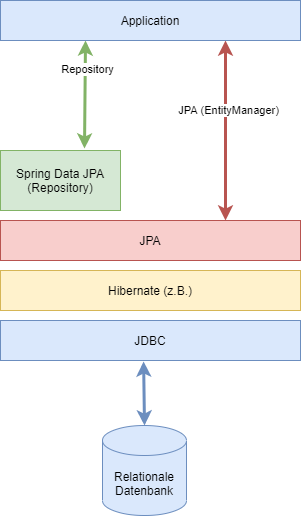

# Einführung in Spring Data JPA
## Allgemeines
Das Spring Framework erfreut sich im Laufe der letzten Jahre zunehmender Beliebtheit. Es wird sehr häufig bei der Erstellung umfangreicher Softwareanwendungen benutzt, in welchen eine große Menge an Daten verarbeitet (abgefragt, gespeichert, gelöscht und aktualisiert) werden. Vor allem unterstützt das Framework die Arbeit an der Persistenzschicht. Im Rahmen dieser Ausarbeit wird eine Bibliothek vorgestellt, die dem Entwickler sehr viel Arbeit abnehmen kann - die Rede ist von "Spring Data JPA".

Spring Data JPA gehört zu den Hauptbestandteilen des Springframeworks und bietet eine abstrakte Datenzugriffsschicht, welche ein Vielzahl generischer Methoden zum Datenzugriff beinhaltet. 

Bevor die Spring Data JPA ausführlich vorgestellt wird, wird zuvor ein kurzer Überblick über das allgemeine Spring-Framework, sowie der JPA gegeben.

## Spring
Bei dem Spring-Framework handelt es sich um ein schlankes und quelloffenes Framework für Java-Anwendungen. Die erste Version von Spring wurde im Jahr 2002 von dem australischen Programmierer Rod Johnson entwickelt. Er suchte nach einem Weg Businessapplikcationen auf möglichst einfache und schnelle Weise programmierern zu können und diese flexibel, leicht wart- und modifizierbar und einfach erweiterbar zu halten. 

Das Framework soll den Programmierer bei der Java/JavaE - Entwicklung mittels Techniken wie der Dependency Injection, Templates und der aspektorientierten Programmierung unterstützen und somit leichteren und besser wartbaren Programmcode ermöglichen. Das Spring-Framework wird am häufigsten bei der Entwicklung von Web-Anwendungen genutzt, es kann allerdings für jede Art von Anwendungen genutzt werden. 

Spring wird typischerweise als "Lightweigt" - Framework für Java-Anwendungen betitelt, da keinerlei Anpassungen am Quellcode notwendig sind, um von den vielzählien Vorteilen zu profitieren. Durch den Einsatz des Frameworks erhält man eine leistungsstarke Grundstruktur, die kaum verändert werden muss, dies macht es möglich das die Entwickler sich komplett auf die eigentliche Business-Logik konzentrieren können.

Innerhalb des Spring-Frameworks existieren eine Vielzahl von Projekten, welche für die unterschiedlichsten Problemstellungen Lösungen zur Verfügung stellen. Hierbei ist beispielsweise das Messaging, die Unterstützung für alle möglichen Formen von Datenbanken, Webapplikationen, Sicherheitsfunktionalitäten und vieles mehr zu nennen. Mittels des Spring Initializrs können diese Frameworks und Libraries individuell heruntergeladen werden. Durch diese Methodik erhält der Anwender ein vorkonfiguriertes Anwendungsgerüst, mit welchem er in nur kurzer Zeit eine lauffähige Software erstellen kann. 

Eines dieser Projekte innerhalb von Spring ist Spring Data. Spring Data beinhaltet Datenbank-Module, welche alle gängigen Datentechnologien unterstützen. Das Projekt ist selbst aufgeteilt in die folgenden Module:

- Spring Data JPA: Verbindung mit relationalen Datenbanken
- Spring Data MongoDB: Verbindung mit einer Mongo document database.
- Spring Data Neo4j: Verbindung mit einer Neo4j Graph-Datenbank.
- Spring Data Redis: Verbindung zu einem Redis key-value store.

Spring Data JPA wird im Rahmen dieser Hausarbeit ausführlich behandelt, für alle anderen Module wird auf die Fachliteratur hingewiesen.

### Vorteile des Spring-Frameworks
- Dependency Injection: Mittels der Dependency Injection wird jegliche Konfiguration aller Abhängigkeiten aus dem eigentlichen "Business"-Quellcode ferngehalten. Dadurch wird der Code schlanker und ist leichter zu warten.

- Aspektorientierte Programmierung: AOP erlaubt die Strukturierung von Zusammenhängen, die komponentenübergreifend bestehen. Dadurch lässt sich der eigentliche Programmablauf sauberer von anderen Aspekten (z.B. Validierung, Fehlerbehandlung) trennen und das Projekt kann modularer aufgebaut werden.

- Templates: Templates sind Klassen, die für Programmschnittstellen genutzt werden können, sie bieten Komfortfunktionen wie eine einheitliche Fehlerbehandlung, automatisches Ressourcenmanagement und andere Hilfestellungen.

Spring bietet insgesamt 20 Module an, die individuell in das Projekt integriert werden können. Diese Module sind in 6 Kategorien eingeteilt.

- Core Container: Der Core-Container beinhaltet die elementaren Module, die beispielsweise die Dependency-Injection-Funktionen sowie den Pojo-Support bieten. Ebenfalls gibt es im Core Container Module, durch die Bibliotheken von Drittanbietern in Spring eingebunden werden und Ressourcenn geladen werden können.

- AOP und Instrumentation: Damit die aspektorientierte Programmierung möglich wird, ernhält das Spring Framework das AOP-Modul und die Instrument-Komponente, die es erlaubt Bytecode zur Laufzeit zu verändern. 

- Messaging: Spring unterstützt ebenfalls nachrichtenbasierte Anwendungen.

- Data Access/Integration: Ebenfalls werden Module angeboten, die Java-Applikationen die Fähigkeit zur Interaktion mit anderen Anwendungen verleihen und den Datenzugriff zur regeln. Beispielsweise stellt das Modul spring-jdbc eine Abstraktionsschicht zur Verfügung, in welcher definiert wird, wie ein Client auf die Datenbank zugreift. Die aufwendige JDBC-typische Codierung bleibt dem Entwickler dadurch erspart. 

- Web: Hier bietet Spring spezfische Module für Webanwendungen an, die beispielsweise Upload-Funktionen anbieten oder auch einen HTTP-Client hinzufügen. 

- Test: Abschließend beinhaltet Spring noch die Test-Kategorie. Die Module stellen die Funktionalität der Komponenten der gecodeten Java-Anwendung sicher. 

Einer der größten Vorteile des Spring-Frameworks ist der Verzicht auf plattformspezfische und nicht standardisierte Komponenten. Dadurch ist Spring im hohen Maße portabel und unabhängig von Applikationsservern. Es lässt sich somit problemlos als Meta-Framework einsetzen, in das sich weitere externe Komponenten oder Frameworks eingliedern lassen. 

## JPA
Innerhalb von Java-Enterprise-Applikationen werden massenhaft Operationen auf Datenbanken durchgeführt und gleichzeitig große Mengen an Daten bearbeitet. Um solch eine Datenbankanbindung zu schreiben, benötigt man viele Zeilen Code, wenn man die Anbindung selbst entwickeln möchte. Es gibt allerdings auch die Möglichkeit sich der Funktionen des berühmten Frameworks "Spring" zu bedienen". Spring stellt beispielsweise die Java Persistance API (JPA) zur Verfügung. Hierbei handelt es sich um ein Interface, welches den Aufwand reduziert, der für die Kommunikation mit der Datenbank anfällt. 

Die Objekte des Java Programms werden hierbei mit den relationalen Modellen verbunden und hier wird die eigentliche Herausforderung sichtbar. Während die relationalen Objekte der Datenbank in Tabellenform daherkommen, wird das Objekt im Java Code mit etlichen Attributen dargestellt. 

Zusammenfassend lässt sich sagen, dass die Java Persistance API eine Sammlung von Klassen und Methoden ist, mit dem Ziel die Daten in die Datenbank zu speichern/persistieren. Für diese Datenbankdienste gibt es verschiedene Anbieter wie zum Beispiel:
- Oracle
- Redhat
- Eclipse.

Produkte dieser Firmen sind:
- Hibernate 
- EclipseLink 
- Spring-Data-JPA

Bei diesem Produkten handelt es sich um ORM-Frameworks für Java, welche in Kapitel 2 ausführlich erklärt werden.

Die Idee hinter JPA ist es also, ein ganz normales Java Objekt (POJO (Plaing Old Java Object) als relationales Datenbankobjekt zu speichern. 
Wichtige Objekte der JPA sind:
- EntityManagerFactory: Erstellt Instanzen vom Entity Manager
- EntityManager: Erstellt Instanzen von Querys
- Querys: Wird von den JPA-Providern zur Verfügung gestellt, um auf die Daten zuzugreifen.

## Spring-Data-JPA
Spring-Data-JPA ist die Weiterentwicklung der OpenSource Bibliothek "Hades", welche von Oliver Gierke entwickelt wurde. Oliver Gierke war bis zum Jahre 2010 als Software Architekt bei dem Unternehmen Synyx tätig, bevor er zu SpringSource gewechselt ist. Die Zukunft seines Hades-Projekts hat er sich gesichert, wodurch die Bibliothek in Spring Data integriert wurde.  

ToDo
- Architekturbeschreibung
- Geschichte wann wie von wem

