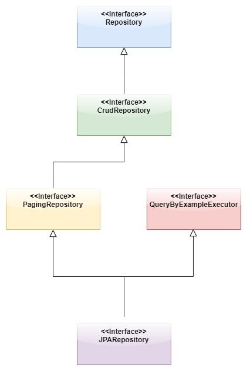

# 5. Repository

## 5.1 Einleitung
Die nächsten zwei folgenden Kapitel befassen sich mit den Themen Repository und Query Methods in der Spring Data JPA - Umgebung. Um ein besseres Verständnis zu erlangen, was diese abstrakten Begriffe bedeuten, sollen deren wichtigsten Eigenschaften vorgestellt und ihre Verwendung und Implementierung anhand von Code-Snippets verdeutlicht werden.

"*Das Ziel der Spring Data Repository-Abstraktion besteht darin, die Menge an Boilerplate-Code, die zum Implementieren von Datenzugriffsschichten für verschiedene Persistenzspeicher erforderlich ist, erheblich zu reduzieren.*"[18]. Diese Aussage ist absolut zutreffend, was Spring Data JPA und ihr Repository so besonders machen. Es wird nämlich vermieden, an mehreren Stellen mit geringen bis keinen Abweichungen wiederholt den gleichen Code zu verwenden. Im Vergleich zum Data Access Object Pattern, wo genau dies passiert und das auch sehr gerne zur Persistierung von Entitäten genutzt wird, hat man mit Hilfe des Repository-Patterns sprichwörtlich ein viel leichteres Spiel und genau dies umgesetzt.Spring Data JPA Repositories erleichtern nämlich dem Entwickler die Arbeit sehr. Mit der Implementierung des Repository sind es deutlich weniger Schritte, die er zu erfüllen hat, um das gleiche Ergebnis zu erlangen wie beim DAO-Pattern. Wiederholender Code entsteht erst gar nicht.
In Kapitel 5.2 soll auf die Implementierung zur Persistierung mittels des DAO-Patterns eingegangen werden, da es in der Vergangenheit große Verwendung fand. Danach soll im nächsten Kapitel 5.3 das gleiche Ergebnis mittels Spring Data JPA Repository erzielt werden. Ziel ist es, zu verdeutlichen, wo genau die Unterschiede aber auch Gemeinsamkeiten liegen, die dann in Kapitel 5.4 genauer behandelt werden, und im Besonderen wieviel weniger Code man schreiben muss, weil die Arbeit jetzt zum größten Teil von Spring Data JPA (im Hintergrund) übernommen wird. Spring Data JPA findet immer mehr Anklang und wir möchten gerne zeigen, warum dies so ist. Die in Kapitel 5.2 und 5.3 aufgeführten Code-Beispiele sind in unserem Projekt abgelegt unter [Projektcodes/repository_and_queries](./Projektcodes/repository_and_queries)

Das Kapitel 5.5 [Repositories in Spring Data JPA](05_Repository.md#55-repositories-in-spring-data-jpa) befasst sich ausführlich mit dem Thema Interfaces in Spring Data JPA, Kapitel 6 mit [Query Methods](06_Query_Methods.md).


## 5.2 DAO Pattern

Als erstes brauchen wir eine Entity-Klasse, sie bildet die Modelschicht. In unserem Beispiel besitzt die Entity-Klasse Stock neben ihrem Primärschlüssel *id* noch die Attribute *wkn* und *companyName*, die für die Wertpapierkennnummer der Aktie und den Firmennamen stehen.

***Entity-Class Stock***

```Java
@Entity
@Table(name = "STOCK")
public class Stock implements Serializable {


	private static final long serialVersionUID = 1L;

	@Id
    @GeneratedValue(strategy = GenerationType.IDENTITY)
    private long id;
    /**
     * wkn Wertpapierkennnummer
     */
	private String wkn;
	private String companyName;

	public Stock(){

	};

	public Stock(String wkn, String companyName) {
		this .wkn = wkn;
		this.companyName = companyName;
	}

	public String getWkn() {
		return wkn;
	}

	public void setWkn(String wkn) {
		this.wkn = wkn;
	}

	public String getCompanyName() {
		return companyName;
	}

	public void setCompanyName(String companyName) {
		this.companyName = companyName;
	}
}
  ```
#### DAO-Interface


Das Interface StockDAO bildet die Verbindungsstelle zwischen Persistenz- und Modelschicht. Dadurch werden Entities, hier Objekte der Klasse Stock von der Persistenzschicht entkoppelt. Sie beinhaltet nur CRUD-Methoden(CREATE, READ, UPDATE and DELETE).

***StockDAO-Interface***

  ```Java
  public interface StockDao<T> {

      Optional<T> get(long id);

      List<T> getAll();

      void save(T t);

      void update(T t, String[] params);

      void delete(T t);
  }
  ```

***StockDao Class***

  ```Java
  public class StockDAOImpl implements StockDAO<Stock> {

    private EntityManager em;

    // standard constructors

    public  StockDAOImpl() {
		// TODO Auto-generated constructor stub
    	EntityManagerFactory emfactory = Persistence.
    		      createEntityManagerFactory( "myJPA" );
    		      em = emfactory.
    		      createEntityManager( );
	}

    @Override
    public Stock get(long id) {
        return em.find(Stock.class, id);
    }

    @Override
    public List<Stock> getAll() {
        Query query = em.createQuery("SELECT a FROM Stock a");
        return query.getResultList();
    }

    @Override
    public void save(Stock stock) {
        execute(em -> em.persist(stock));
    }

    @Override
    public void update(Stock stock, String[] params) {
    	stock.setCompanyName(Objects.requireNonNull(params[0], "Companyname can not be null"));
        execute(em -> em.merge(stock));
    }

    @Override
    public void delete(Stock stock) {
        execute(em -> em.remove(stock));
    }

	@Override
	public List<Stock> findByWkn(@PathVariable("wkn") String wkn) {
		 Query query = em.createQuery("SELECT c FROM Stock c WHERE c.wkn='"+wkn+"'");
		 List<Stock> list =query.getResultList();
	     return list;
	}

	@Override
	public List<Stock> findByCompanyName(String companyName) {
		Query query = em.createQuery("SELECT c FROM Stock c WHERE c.wkn='"+companyName+"'");
		List<Stock> list =query.getResultList();
		return list;
	}

  private void execute(Consumer<EntityManager> action) {
    EntityTransaction tx = em.getTransaction();
    try {
      tx.begin();
      action.accept(em);
      tx.commit();
    }
    catch (RuntimeException e) {
      tx.rollback();
      throw e;
      }
    }
}
  ```
***persistence.xml***

Die Datei persistence.xml ist eine Konfigurationsdatei und hält unter anderem folgende Daten bereit:

- Name der Persistence-Unit --> myJPA
- Klassen, die in die Datenbank gemappt werden sollen -->  Class Stock
- DB- Verbindungsparameter --> Embedded-DB vom Typ H2
- etc.

```xml
<?xml version="1.0" encoding="UTF-8"?>
<persistence version="2.1"
	xmlns="http://xmlns.jcp.org/xml/ns/persistence"
	xmlns:xsi="http://www.w3.org/2001/XMLSchema-instance"
	xsi:schemaLocation="http://xmlns.jcp.org/xml/ns/persistence
    http://xmlns.jcp.org/xml/ns/persistence/persistence_2_1.xsd">
	<persistence-unit name="myJPA"
		transaction-type="RESOURCE_LOCAL">
		<class>de.volkan.brokerage.service.dao.Stock</class>
		<properties>
			<property name="javax.persistence.jdbc.url"
				value="jdbc:h2:file:./database2" />
			<property name="javax.persistence.jdbc.user" value="sa" />
			<property name="javax.persistence.jdbc.password" value="" />
			<property name="javax.persistence.jdbc.driver"
				value="org.h2.Driver" />
			<property name="hibernate.hbm2ddl.auto" value="create" />
		</properties>
	</persistence-unit>
</persistence>

```

#### Einsatz des DAO-Patterns

```java
public class DAOApp {

    private static StockDAO<Stock> jpaStockDao = new StockDAOImpl();

    public static void main(String[] args) {

    	jpaStockDao.save(new Stock("Infineon", "623100"));
    	Stock stock1 = jpaStockDao.findByCompanyName("Infineon").get(0);
        System.out.println(stock1);
        stock1.setCompanyName("Royal Dutch");
        stock1.setWkn( "A01ESR");
        jpaStockDao.update(stock1);
        jpaStockDao.save(new Stock("Deutsche Bank", "514000"));
        jpaStockDao.delete(jpaStockDao.get(2));
        jpaStockDao.getAll().forEach(stock -> System.out.println("Stockname:"+stock.getCompanyName()+ ", WKN: " + stock.getWkn()));
        if(jpaStockDao.findByWkn("623100")!=null) {
        	System.out.println("Company Deutsche Bank gefunden");
        }
    }
}

```


## 5.3 Repository-Pattern

### Spring Data JPARepository


In diesem Kapitel sollen die Schritte und Komponenten gezeigt werden, die uns Spring Data JPA anbietet, um das gleiche Ergebnis wie im vorherigen Kapitel zu erreichen. Spring Data JPA bietet eine Reihe von Repository-Schnittstellen, die man nur erweitern muss. Wir entscheiden uns hier für das JPARepository, das Entitäten vom Typ Stock zugeordnet ist. Zusätzlich werden dem Interface noch zwei Methoden hinzugefügt.  

### Interface StockRepository
```Java
@Repository
@Service
public interface StockRepository extends JpaRepository<Stock, Long>{

	Stock findByWkn(String wkn);
	Stock findByCompanyName(String companyName);
}

```

***application.properties***

Das Gegenstück zur Datei persistence.xml aus Kapitel 5.2 bildet in Spring Data JPA die Datei application.properties. Sie ist eine Konfigurationsdatei in der Spring Umgebung und hält ebenfalls wie die persistence.xml Informationen zur Datenbank bereit:

- ~~Name der Persistence-Unit --> myJPA~~
- ~~Klassen, die in die Datenbank gemappt werden sollen -->  Class Stock~~
- DB- Verbindungsparameter --> Embedded-DB vom Typ H2
- etc.

```java
#H2
spring.h2.console.enabled=true
spring.h2.console.path=/h2
spring.datasource.url=jdbc:h2:file:./database2
spring.datasource.username=sa
spring.datasource.password=
spring.datasource.driver-class-name=org.h2.Driver
spring.jpa.hibernate.naming.physical-strategy=org.hibernate.boot.model.naming.PhysicalNamingStrategyStandardImpl
```

#### Einsatz des Repository-Patterns


```java
@SpringBootApplication
public class SpringRepositoryApp {

  private static final Logger log = LoggerFactory.getLogger(SpringRepositoryApp.class);

  public static void main(String[] args) {
    SpringApplication.run(SpringRepositoryApp.class);
  }

  @Bean
  public CommandLineRunner demo(StockRepository repository) {
    return (args) -> {
    	repository.save(new Stock("Infineon", "623100"));
    	Stock stock1 = repository.findByCompanyName("Infineon");
        stock1.setCompanyName("Royal Dutch");
        stock1.setWkn( "A01ESR");
        repository.save(stock1);
        repository.save(new Stock("Deutsche Bank", "514000"));
        repository.delete(repository.findByCompanyName("Deutsche Bank"));
        repository.findAll().forEach(stock -> System.out.println("Stockname:"+stock.getCompanyName()+ ", WKN: " + stock.getWkn()));
        if(repository.findByWkn("623100")!=null) {
        	System.out.println("Company Deutsche Bank gefunden");
        }
    };
  }

}
```
Notiz:
In dem oberen Beispiel wird das StockRepository-Objekt der Methode *demo* zur Laufzeit übergeben, das bereits vom Spring-Framework instanziiert wurde. Ein weiteres Beispiel für die Instanziierung des Repository-Objektes wäre über die Annotation @Autowired möglich, siehe unteres Beipsiel.
```Java

public class StockOperationsImpl{

	@Autowired
	StockRepository stockRepository;

	public Stock getStockByWkn(String wkn) {
		return stockRepository.findByWkn(wkn);
	}

	public synchronized List<Stock> getAllStocks() {
		return stockRepository.findAll();
	}
}
```


## 5.4 Vorteile von Spring-Data-JPA

Die vorherigen Kapitel 5.3 und 5.4 haben die Unterschiede zwischen Spring Data JPA und DAO bzgl. der Verbindung zur Persistence-Layer-Schicht gezeigt. Während man im DAO-Pattern sich noch selbst darum kümmern musste, dass die Methoden für Datenbankoperationen ausgeschrieben werden, siehe Klasse *StockDAOImpl*, übernimmt dies Spring Data JPA komplett, indem man lediglich das Interface *StockRepository*  implementiert, welches wiederum um JpaRepository erweitert werden muss. Damit stehen einem auch schon alle Standarddatenbankoperationen zur Verfügung für die Entität vom Typ Stock. Das bedeutet, dass Sie keine grundlegenden Lese- oder Schreibvorgänge mehr selbst implementieren müssen.  Den Teil der Programmierung zur Erzeugung eines Objekts vom Typ EntityManagerFactory und die damit verbundenen Aufrufe der Operationen *persist, merge, remove, update und createQuery* werden jetzt von Spring Data JPA im Hintergrund automatisch ausgeführt. Hier gibt der Entwickler eindeutig einen Teil seiner ehemals selbstentwickelten Programmierung auf und vertraut ganz auf Spring Data JPA. Man erspart sich hier einfach viel Code und auch unnötige Fehler.

"*Eine weitere komfortable Eigenschaft von Spring Data JPA ist die Bereitstellung von Datenbankabfragen basierend auf Methodennamen, so genannten Query-Methods, siehe auch Kaiptel 6. Solange die Abfrage nicht zu komplex wird, muss man lediglich eine Methode  in der Repository-Schnittstelle mit einem Namen definieren, der mit find… By beginnt. Spring analysiert dann den Methodennamen und erstellt eine Abfrage dafür. Intern generiert Spring eine JPQL(Java Persistence Query Language)-Abfrage basierend auf dem Methodennamen, legt die angegebenen Methodenparameter als Bindungsparameterwerte fest, führt die Abfrage aus und gibt das Ergebnis zurück.*"[19]
Dies haben wir im Interface StockRepository getan mit den Methoden findByWkn und findByCompanyName.
Im Kapitel 5.2 hatten wir noch in der Klasse *StockDAOImpl* die Methoden und Queries selbst implementieren müssen, siehe unten stehenden Code-Snippet aus dieser Klasse.


```Java
public class StockDAOImpl implements StockDAO<Stock> {
.
.
	@Override
	public List<Stock> findByWkn(@PathVariable("wkn") String wkn) {
		 Query query = em.createQuery("SELECT c FROM Stock c WHERE c.wkn='"+wkn+"'");
		 List<Stock> list =query.getResultList();
			 return list;
	}

	@Override
	public List<Stock> findByCompanyName(String companyName) {
		Query query = em.createQuery("SELECT c FROM Stock c WHERE c.wkn='"+companyName+"'");
		List<Stock> list =query.getResultList();
		return list;
	}
.
.
}
```

## 5.5 Repositories in Spring Data JPA

Im vorherigen Kapitel wurde bereits kurz darauf hingewiesen, dass unser Repository *StockRepository* lediglich um das Interface JPARepository erweitert werden musste, um dann alle gängigen Datenbankoperationen ausführen zu können. Dieses Kapitel soll zeigen, welche weiteren Interfaces hier eine wichtige Rolle spielen, welche Methoden sie liefern und in welcher Abhängigkeit sie zueinander stehen. Das folgende Klassendiagramm zeigt die Beziehungen zueinander. Danach wollen wir mit dem Hauptinterface *Repository* beginnen.




Abb. Klassendiagramm vom Interface Repository


### Interface Repository

"*Die zentrale Schnittstelle in der Spring Data-Repository-Abstraktion ist Repository. Die zu verwaltende Domänenklasse sowie der ID-Typ der Domänenklasse sind als Typargumente erforderlich. Diese Schnittstelle fungiert in erster Linie als Markierungsschnittstelle, um die Typen zu erfassen, mit denen gearbeitet werden soll, und um Ihnen dabei zu helfen, Schnittstellen zu finden, die diese erweitern.*"[20]

```Java
public interface Repository<T, ID> {
}
```

In unserem Beispiel entspricht die oben beschriebene Klasse Stock der Domänenklasse. Der ID-Typ ist hier vom Typ Long, da der primäre Schlüssel bzw. das Attribut *id* der Entity-Klasse Stock vom primitiven Datentypen long ist.

### Interface CrudRepository

Die CrudRepository-Schnittstelle bietet CRUD-Funktionen für die zu verwaltende Entity-Klasse.

```java
public interface CrudRepository<T, ID> extends Repository<T, ID> {

	<S extends T> S save(S entity);                         //(1)		
	<S extends T> Iterable<S> saveAll(Iterable<S> entities);//(2)
	Optional<T> findById(ID id);                            //(3)
	boolean existsById(ID id);                              //(4)
	Iterable<T> findAll();                                  //(5)
	Iterable<T> findAllById(Iterable<ID> ids);              //(6)
	long count();                                           //(7)
	void deleteById(ID id);                                 //(8)
	void delete(T entity);                                  //(9)
	void deleteAll(Iterable<? extends T> entities);         //(10)
	void deleteAll();                                       //(11)
}
```

1. Speichert die vorgegebene Entität.
2. Speichert alle Entitäten.
3. Gibt die Entität zurück anhand ihrer ID.
4. Liefert, ob die Entität exisitiert anhand vorgegebener ID.
5. Liefert alle Objekte der Entity-Class.
6. Liefert alle Objekte der Entity-Class anhand der vorgegebenen IDs.
7. Liefert die Anzahl aller Entitäten.
8. Löscht die Entität anhand der vorgegebenen ID.
9. Löscht die übergeben Entität.
10. Löscht alle vorgegebenen Entitäten.
11. Löscht alle Entzitäten des vorgebenen Repositories.


### Interface PagingAndSortingRepository

Dieses Interface bietet zwei Methoden zum Paginieren und Sortieren von Datensätzen.

```java
public interface PagingAndSortingRepository<T, ID> extends CrudRepository<T, ID> {

	Iterable<T> findAll(Sort sort);                         //(1)
	Page<T> findAll(Pageable pageable);                     //(2)
}
```
1. Liefert alle Entitäten sortiert zurück anhand des vorgegeben Objetes Sort.
2. Liefert ein Objekt vom Typ Page, das die Restriktionen vom Objekt Pageable erfüllt.

#### Beispiel
```Java
Page<Stocj> allStocksSortedByCompanyName = stockRepository.findAll(Sort.by("companyName"));

/**Dadurch wird eine Anforderung für die erste Seite mit 5 Elementen ge,liefert,
die nach Wertpapierkennnummer wkn (aufsteigend) sortiert ist.*/
Pageable sortedByWKNAsc = PageRequest.of(0, 5, Sort.by("wkn").ascending());
```

### Interface JPARepository

JPARepository erbt alle Methoden der oben genannten Repositories und erweitert sie um folgende:

```Java
public interface JpaRepository<T, ID> extends PagingAndSortingRepository<T, ID>, QueryByExampleExecutor<T> {

	List<T> findAll();                                            //(1)
	List<T> findAll(Sort sort);                                   //(2)
	List<T> findAllById(Iterable<ID> ids);                        //(3)
	<S extends T> List<S> saveAll(Iterable<S> entities);          //(4)
	void flush();                                                 //(5)
	<S extends T> S saveAndFlush(S entity);                       //(6)
	void deleteInBatch(Iterable<T> entities);                     //(7)
	void deleteAllInBatch();                                      //(8)
	T getOne(ID id);                                              //(9)
	@Override
	<S extends T> List<S> findAll(Example<S> example);            //(10)
	@Override
	<S extends T> List<S> findAll(Example<S> example, Sort sort); //(11)
}

```
1. siehe CrudRepository#findAll()  
2. siehe PagingAndSortingRepository#findAll
3. siehe CrudRepository#findAll
4. siehe CrudRepository#save
5. Löscht alle ausstehenden Änderungen in der Datenbank.
6. Speichert eine Entität und löscht Änderungen sofort.
7. Löscht die angegebenen Entitäten in einem Stapelaufruf mit einer einzigen Query.
8. Löscht die angegebenen Entitäten in einem Stapelaufruf.
9. Liefert eine Referenz der Entität mit der vorgebenen ID
10. Liefert alle Entitäten mit dem vorgegebenem Typ Example.
11. Liefert alle Entitäten mit den vorgegebenem Typen Example und Sort.
