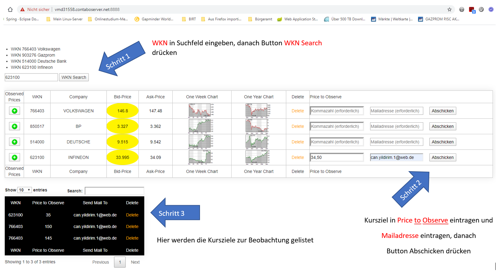

<h1>Beschreibung des Tools MyBrokerage</h1>

Es handelt sich hier um eine [Webapplikation](https://vmd31558.contaboserver.net:8888/), die zum Ziel hat, den Anwender über selbstdefinierte Aktienkursziele schnell zu informieren. Interessiert sich der Anwender nämlich für eine bestimmte Aktien, die im deutschen Wertpapierhandel über eine eindeutige Wertpapierkennnummer gehandelt wird, kann er bei Erreichen des von ihm vorgegeben Kurszieles darüber per Mail informiert werden. Zum Beispiel wird die Aktie der Firma Infineon, die auch im DAX gelistet ist, mit der WKN 623100 momentan um den Wert 31 Euro gehandelt. Der Anwender kann auf der Webseite eintragen, dass er nach Erreichen des Kurses 31,10 Euro oder Unterschreiten des Wertes von 29,90 Euro darüber informiert werden soll. Hierzu muss er erst einmal die Aktie mit seiner Wertpapierkennnummer(WKN) hinzufügen. Danach kann er die Kursziele definieren, für die er gerne eine Benachrichtigung erhalten möchte, siehe dazu die Anleitung der durchzuführenden Schitte anhand der unteren Grafik Abb. 1:

1.  Hinzufügen einer Wertpapierkennnummer

  1.1 WKN in Suchfeld eingeben

  1.2 Button WKN Search drücken

2.  Hinzufügen eines Kurszieles zur Benachrichtigung

  2.1 Kursziel in Price to Observe eintragen

  2.2 Mailadresse eintragen

  2.3 Button Abschicken drücken

3.  Darstellung aller Kusziele in einer Tabelle

Repositories_1_1.png
